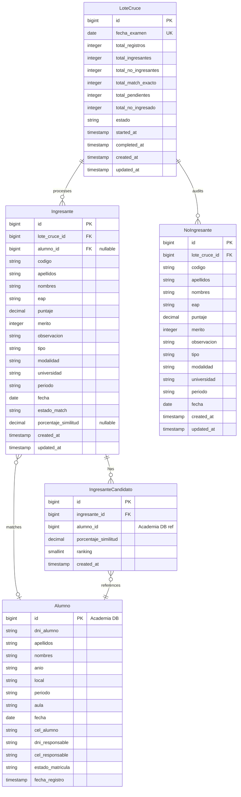

# Data Model: Motor de Cruce Automático de Ingresantes UNMSM

**Feature ID:** 001-motor-cruce-ingresantes
**Created:** 2026-06-24
**Status:** Under Review

---

## 1. Entity Relationship Diagram



---

## 2. Entity Definitions

### 2.1 Entity: LoteCruce

**Description:** Represents a processed CSV batch grouped by exam date.

**Table:** `lotes_cruce`

| Column | Type | Constraints | Description |
|--------|------|-------------|-------------|
| `id` | BIGINT | PK, AUTO_INCREMENT | Unique identifier |
| `fecha_examen` | DATE | NOT NULL, UNIQUE | Exam date of the loaded batch |
| `total_registros` | INTEGER | NOT NULL | Total CSV rows processed |
| `total_ingresantes` | INTEGER | NOT NULL | Total persisted in `ingresantes` |
| `total_no_ingresantes` | INTEGER | NOT NULL | Total persisted in `no_ingresantes` |
| `total_match_exacto` | INTEGER | NOT NULL | Total auto-confirmed matches |
| `total_pendientes` | INTEGER | NOT NULL | Total needing manual resolution |
| `total_no_ingresado` | INTEGER | NOT NULL | Total resolved as no match |
| `estado` | VARCHAR | NOT NULL | Batch status (processing, completed, paused, error) |
| `started_at` | TIMESTAMP | NULL | Queue job start timestamp |
| `completed_at` | TIMESTAMP | NULL | Queue job end timestamp |
| `created_at` | TIMESTAMP | NOT NULL, DEFAULT NOW() | Record creation |
| `updated_at` | TIMESTAMP | NOT NULL | Last update |

**Indexes:**
- `idx_lotes_cruce_fecha_examen` - UNIQUE index on `fecha_examen`.

**Relationships:**
- `ingresantes` → `ingresantes` (type: 1:N)
- `no_ingresantes` → `no_ingresantes` (type: 1:N)

### 2.2 Entity: Ingresante

**Description:** Represents an applicant who passed the exam (`ALCANZO VACANTE`) and matches or requires matching.

**Table:** `ingresantes`

| Column | Type | Constraints | Description |
|--------|------|-------------|-------------|
| `id` | BIGINT | PK, AUTO_INCREMENT | Unique identifier |
| `lote_cruce_id` | BIGINT | FK, NOT NULL | Reference to `lotes_cruce` |
| `alumno_id` | BIGINT | NULLABLE | Reference to logical alumno |
| `codigo` | VARCHAR | NOT NULL | Applicant registration code (`CODIGO` from CSV) |
| `apellidos` | VARCHAR | NOT NULL | Normalized apellidos (`APELLIDOS` from CSV) |
| `nombres` | VARCHAR | NOT NULL | Normalized names (`NOMBRES` from CSV) |
| `eap` | VARCHAR | NOT NULL | Academic Professional School (`EAP` from CSV) |
| `puntaje` | DECIMAL(8,3) | NOT NULL | Score obtained (`PUNTAJE` from CSV) |
| `merito` | INTEGER | NOT NULL | Merit rank (`MERITO` from CSV) |
| `observacion` | VARCHAR | NOT NULL | Observation field (`OBSERVACION` from CSV) |
| `tipo` | VARCHAR | NOT NULL | Type of applicant (`TIPO` from CSV) |
| `modalidad` | VARCHAR | NOT NULL | Modality of exam (`MODALIDAD` from CSV) |
| `universidad` | VARCHAR | NOT NULL | Target university (`UNIVERSIDAD` from CSV) |
| `periodo` | VARCHAR | NOT NULL | Period (`PERIODO` from CSV) |
| `fecha` | DATE | NOT NULL | Exam date (`FECHA` from CSV) |
| `estado_match` | VARCHAR | NOT NULL | Match status enum |
| `porcentaje_similitud` | DECIMAL(5,2) | NULLABLE | Similitud metric percentage |
| `created_at` | TIMESTAMP | NOT NULL, DEFAULT NOW() | Record creation |
| `updated_at` | TIMESTAMP | NOT NULL | Last update |

**Indexes:**
- `idx_ingresantes_nombres_apellidos` - Composite search index: `(apellidos, nombres)`.
- `idx_ingresantes_lote_cruce_id` - FK index.

---

### 2.3 Entity: NoIngresante

**Description:** Audit log of CSV rows that did not pass the `ALCANZO VACANTE` filter.

**Table:** `no_ingresantes`

| Column | Type | Constraints | Description |
|--------|------|-------------|-------------|
| `id` | BIGINT | PK, AUTO_INCREMENT | Unique identifier |
| `lote_cruce_id` | BIGINT | FK, NOT NULL | Reference to `lotes_cruce` |
| `codigo` | VARCHAR | NOT NULL | Applicant registration code (`CODIGO` from CSV) |
| `apellidos` | VARCHAR | NOT NULL | Normalized apellidos (`APELLIDOS` from CSV) |
| `nombres` | VARCHAR | NOT NULL | Normalized names (`NOMBRES` from CSV) |
| `eap` | VARCHAR | NOT NULL | Academic Professional School (`EAP` from CSV) |
| `puntaje` | DECIMAL(8,3) | NOT NULL | Score obtained (`PUNTAJE` from CSV) |
| `merito` | INTEGER | NOT NULL | Merit rank (`MERITO` from CSV) |
| `observacion` | VARCHAR | NOT NULL | Observation field (`OBSERVACION` from CSV) |
| `tipo` | VARCHAR | NOT NULL | Type of applicant (`TIPO` from CSV) |
| `modalidad` | VARCHAR | NOT NULL | Modality of exam (`MODALIDAD` from CSV) |
| `universidad` | VARCHAR | NOT NULL | Target university (`UNIVERSIDAD` from CSV) |
| `periodo` | VARCHAR | NOT NULL | Period (`PERIODO` from CSV) |
| `fecha` | DATE | NOT NULL | Exam date (`FECHA` from CSV) |
| `created_at` | TIMESTAMP | NOT NULL, DEFAULT NOW() | Record creation |

**Indexes:**
- `idx_no_ingresantes_lote_cruce_id` - FK index.

---

### 2.4 Entity: IngresanteCandidato

**Description:** Lazy-computed cache of fuzzy match candidates for a `pendiente` ingresante. Populated on first call to `GET /cruce/ingresantes/{id}/candidatos`; subsequent calls return this cached data directly.

**Table:** `ingresante_candidatos`

| Column | Type | Constraints | Description |
|--------|------|-------------|-------------|
| `id` | BIGINT | PK, AUTO_INCREMENT | Unique identifier |
| `ingresante_id` | BIGINT | FK, NOT NULL | Reference to `ingresantes` |
| `alumno_id` | BIGINT | NOT NULL | Reference to `alumnos` in Academia DB (not a FK — cross-DB) |
| `porcentaje_similitud` | DECIMAL(5,2) | NOT NULL | Computed Levenshtein similarity percentage (≥ 30.00) |
| `ranking` | SMALLINT | NOT NULL, CHECK (1–5) | Position in the ordered candidate list for this ingresante |
| `created_at` | TIMESTAMP | NOT NULL, DEFAULT NOW() | Record creation (when first computed) |

**Indexes:**
- `idx_ingresante_candidatos_ingresante_id` - FK index on `ingresante_id`.
- `idx_ingresante_candidatos_ranking` - Composite index on `(ingresante_id, ranking)` for ordered lookups.

**Relationships:**
- `ingresante_id` → `ingresantes` (type: N:1, ON DELETE CASCADE)
- `alumno_id` → `alumnos` in Academia DB (logical reference only — no DB-level FK across connections)

**Notes:**
- A given `ingresante_id` will have at most 5 rows (one per ranking position).
- If no candidates exceed the 30% threshold, zero rows are inserted and the endpoint returns an empty array.
- Rows are never updated — if a re-computation is needed, delete and re-insert.

---

### 2.5 Entity: Alumno (Base de Datos Academia)

**Description:** Represents logical student records in the secondary Academia DB, queried during matching.

**Logical Structure:**

| Column | Type | Description |
|--------|------|-------------|
| `dni_alumno` | VARCHAR | Student's national identity card number |
| `apellidos` | VARCHAR | Student's surnames |
| `nombres` | VARCHAR | Student's given names |
| `anio` | VARCHAR | Year of academic cycle |
| `local` | VARCHAR | Sede / branch campus (e.g. Presencial Lima) |
| `periodo` | VARCHAR | Ciclo / academic period (e.g. Verano 2026) |
| `aula` | VARCHAR | Assigned classroom |
| `fecha` | DATE | Enrollment or registration date |
| `cel_alumno` | VARCHAR | Student's cell phone number |
| `dni_responsable` | VARCHAR | Responsible person's DNI |
| `cel_responsable` | VARCHAR | Responsible person's cell phone number |
| `estado_matricula` | VARCHAR | Matriculation status (MATRICULADO, RETIRADO, etc.) |
| `fecha_registro` | TIMESTAMP | Full registration timestamp |

---


## 3. Enumerations

### 3.1 BatchStatus

**Used in:** `lotes_cruce.estado`

| Value | Description |
|-------|-------------|
| `processing` | CSV currently being parsed and cross-matched in queue |
| `completed` | Batch successfully processed and ready for verification |
| `paused` | Process paused due to connectivity issues |
| `error` | Processing failed unexpectedly |

### 3.2 MatchStatus

**Used in:** `ingresantes.estado_match`

| Value | Description |
|-------|-------------|
| `pendiente` | Awaiting review in UI |
| `confirmado_automatico` | Resolved automatically via exact matching |
| `confirmado_manual` | Resolved manually by user selection |
| `no_ingresado` | Declared a non-student |

---

## 4. Data Validation Rules

| Entity | Field | Rule | Error Message |
|--------|-------|------|---------------|
| `LoteCruce` | `fecha_examen` | Must be a valid ISO-8601 date, and not exist in `lotes_cruce` | "La fecha de examen ya fue procesada en un lote anterior." |
| `Ingresante` | `codigo` | Must not be empty | "El código del postulante es obligatorio." |

---

## 5. Migration Plan

### 5.1 New Tables

```sql
-- Migration: Create lotes_cruce, ingresantes, no_ingresantes
CREATE TABLE lotes_cruce (
    id BIGSERIAL PRIMARY KEY,
    fecha_examen DATE NOT NULL UNIQUE,
    total_registros INT NOT NULL DEFAULT 0,
    total_ingresantes INT NOT NULL DEFAULT 0,
    total_no_ingresantes INT NOT NULL DEFAULT 0,
    total_match_exacto INT NOT NULL DEFAULT 0,
    total_pendientes INT NOT NULL DEFAULT 0,
    total_no_ingresado INT NOT NULL DEFAULT 0,
    estado VARCHAR(50) NOT NULL DEFAULT 'processing',
    started_at TIMESTAMP NULL,
    completed_at TIMESTAMP NULL,
    created_at TIMESTAMP NOT NULL DEFAULT NOW(),
    updated_at TIMESTAMP NOT NULL DEFAULT NOW()
);

CREATE TABLE ingresantes (
    id BIGSERIAL PRIMARY KEY,
    lote_cruce_id BIGINT NOT NULL REFERENCES lotes_cruce(id) ON DELETE CASCADE,
    alumno_id BIGINT NULL, -- References logical Alumno
    codigo VARCHAR(50) NOT NULL,
    apellidos VARCHAR(255) NOT NULL,
    nombres VARCHAR(255) NOT NULL,
    eap VARCHAR(255) NOT NULL,
    puntaje DECIMAL(8,3) NOT NULL,
    merito INT NOT NULL,
    observacion VARCHAR(255) NOT NULL,
    tipo VARCHAR(100) NOT NULL,
    modalidad VARCHAR(100) NOT NULL,
    universidad VARCHAR(100) NOT NULL,
    periodo VARCHAR(50) NOT NULL,
    fecha DATE NOT NULL,
    estado_match VARCHAR(50) NOT NULL DEFAULT 'pendiente',
    porcentaje_similitud DECIMAL(5,2) NULL,
    created_at TIMESTAMP NOT NULL DEFAULT NOW(),
    updated_at TIMESTAMP NOT NULL DEFAULT NOW()
);

CREATE INDEX idx_ingresantes_search ON ingresantes(apellidos, nombres);
CREATE INDEX idx_ingresantes_lote ON ingresantes(lote_cruce_id);

CREATE TABLE no_ingresantes (
    id BIGSERIAL PRIMARY KEY,
    lote_cruce_id BIGINT NOT NULL REFERENCES lotes_cruce(id) ON DELETE CASCADE,
    codigo VARCHAR(50) NOT NULL,
    apellidos VARCHAR(255) NOT NULL,
    nombres VARCHAR(255) NOT NULL,
    eap VARCHAR(255) NOT NULL,
    puntaje DECIMAL(8,3) NOT NULL,
    merito INT NOT NULL,
    observacion VARCHAR(255) NOT NULL,
    tipo VARCHAR(100) NOT NULL,
    modalidad VARCHAR(100) NOT NULL,
    universidad VARCHAR(100) NOT NULL,
    periodo VARCHAR(50) NOT NULL,
    fecha DATE NOT NULL,
    created_at TIMESTAMP NOT NULL DEFAULT NOW()
    -- no updated_at: INV-02 append-only, sin UPDATE permitido
);

CREATE INDEX idx_no_ingresantes_lote ON no_ingresantes(lote_cruce_id);

-- Trigger DDL que enforce INV-02: no_ingresantes es append-only.
-- Previene operaciones directas desde psql, herramientas externas o migraciones futuras
-- que no conozcan el invariante. El enforcement a nivel de modelo Eloquent (UPDATED_AT=null)
-- es complementario, no sustituto.
CREATE OR REPLACE FUNCTION prevent_no_ingresantes_mutation()
RETURNS TRIGGER AS $$
BEGIN
  RAISE EXCEPTION 'no_ingresantes is append-only (INV-02). DELETE and UPDATE are not permitted.';
END;
$$ LANGUAGE plpgsql;

CREATE TRIGGER trg_no_ingresantes_readonly
BEFORE UPDATE OR DELETE ON no_ingresantes
FOR EACH ROW
EXECUTE PROCEDURE prevent_no_ingresantes_mutation();

CREATE TABLE ingresante_candidatos (
    id BIGSERIAL PRIMARY KEY,
    ingresante_id BIGINT NOT NULL REFERENCES ingresantes(id) ON DELETE CASCADE,
    alumno_id BIGINT NOT NULL,
    porcentaje_similitud DECIMAL(5,2) NOT NULL CHECK (porcentaje_similitud >= 30.00),
    ranking SMALLINT NOT NULL CHECK (ranking BETWEEN 1 AND 5),
    created_at TIMESTAMP NOT NULL DEFAULT NOW(),
    UNIQUE (ingresante_id, ranking)
);

CREATE INDEX idx_ingresante_candidatos_ingresante_id ON ingresante_candidatos(ingresante_id);
CREATE INDEX idx_ingresante_candidatos_ranking ON ingresante_candidatos(ingresante_id, ranking);
```

---

## 6. Seed Data

No database seeds are required for production, as the engine dynamically processes CSV input batches. For test environments, standard factories will mock `alumnos` in the simulated Academia DB.

---

## 7. Performance Considerations

### 7.1 Expected Data Volume

| Table | Initial | Year 1 | Year 3 |
|-------|---------|--------|--------|
| `lotes_cruce` | 0 | 4 | 12 |
| `ingresantes` | 0 | ~12,000 | ~36,000 |
| `no_ingresantes` | 0 | ~96,000 | ~288,000 |
| `ingresante_candidatos` | 0 | ≤ 1,750 (5 × ~350 pendientes/año) | ≤ 5,250 |

### 7.2 Query Patterns

| Query | Frequency | Indexes Used |
|-------|-----------|--------------|
| Exact match lookup during CSV import | ~27,000 per batch | B-tree index on Academia DB names/apellidos |
| List pending ingresantes (paginated) | Per UI page request | `idx_ingresantes_lote` |
| First-time fuzzy candidate compute | Once per `pendiente` ingresante on UI open | Academia DB names index; result persisted to `ingresante_candidatos` |
| Subsequent candidatos fetch (cached) | Every subsequent UI open for same ingresante | `idx_ingresante_candidatos_ranking` on `ingresante_candidatos` — simple SELECT |

---

## 8. Data Privacy

### 8.1 PII Fields

| Table | Column | Classification | Handling |
|-------|--------|----------------|----------|
| `ingresantes` | `apellidos` | PII | Access restricted to role `admisiones` |
| `ingresantes` | `nombres` | PII | Access restricted to role `admisiones` |
| `ingresantes` | `codigo` | PII — identificador oficial de postulante UNMSM | Access restricted to role `admisiones` |
| `ingresantes` | `alumno_id` | PII reference — apunta a registro PII en BD `academia` | No exponer directamente; resolver nombre solo bajo rol `admisiones` |
| `no_ingresantes` | `apellidos` | PII | Read-only; acceso restringido a rol `admisiones` para auditoría |
| `no_ingresantes` | `nombres` | PII | Read-only; acceso restringido a rol `admisiones` para auditoría |
| `no_ingresantes` | `codigo` | PII — identificador oficial de postulante UNMSM | Read-only; acceso restringido a rol `admisiones` para auditoría |
| `ingresante_candidatos` | `alumno_id` | PII reference — apunta a registro en BD `academia` | No exponer sin validación de rol; solo accesible en contexto de resolución asistida |

> **Nota:** Los campos `dni_alumno`, `cel_alumno`, `cel_responsable` y `dni_responsable` provenientes de la BD `academia` NO se persisten en las tablas propias de este sistema. Solo se incluyen en el reporte Excel (columnas R y S de AC-014), cuyo acceso está restringido a roles `admin`, `admisiones` y `marketing`. Si en el futuro se decide persistir estos campos, deberán clasificarse como PII Sensible y requerir cifrado en reposo.

---

## 9. Sign-off

- [x] Data Architect: Renzo Santos - Date: 2026-06-25
- [x] DBA Review: Renzo Santos - Date: 2026-06-25
