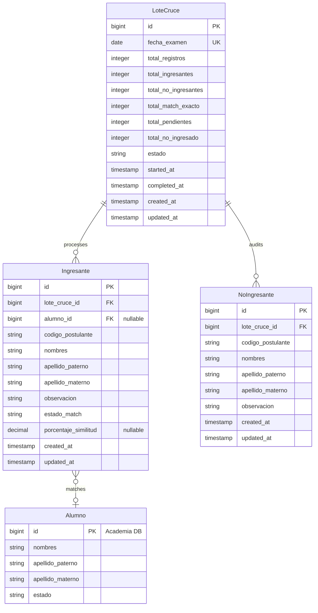

# Data Model: Motor de Cruce Automático de Ingresantes UNMSM

**Feature ID:** 001-motor-cruce-ingresantes
**Created:** 2026-06-24
**Status:** Under Review

---

## 1. Entity Relationship Diagram



---

## 2. Entity Definitions

### 2.1 Entity: LoteCruce

**Description:** Represents a processed CSV batch grouped by exam date.

**Table:** `lotes_cruce`

| Column | Type | Constraints | Description |
|--------|------|-------------|-------------|
| `id` | BIGINT | PK, AUTO_INCREMENT | Unique identifier |
| `fecha_examen` | DATE | NOT NULL, UNIQUE | Exam date of the loaded batch |
| `total_registros` | INTEGER | NOT NULL | Total CSV rows processed |
| `total_ingresantes` | INTEGER | NOT NULL | Total persisted in `ingresantes` |
| `total_no_ingresantes` | INTEGER | NOT NULL | Total persisted in `no_ingresantes` |
| `total_match_exacto` | INTEGER | NOT NULL | Total auto-confirmed matches |
| `total_pendientes` | INTEGER | NOT NULL | Total needing manual resolution |
| `total_no_ingresado` | INTEGER | NOT NULL | Total resolved as no match |
| `estado` | VARCHAR | NOT NULL | Batch status (processing, completed, paused, error) |
| `started_at` | TIMESTAMP | NULL | Queue job start timestamp |
| `completed_at` | TIMESTAMP | NULL | Queue job end timestamp |
| `created_at` | TIMESTAMP | NOT NULL, DEFAULT NOW() | Record creation |
| `updated_at` | TIMESTAMP | NOT NULL | Last update |

**Indexes:**
- `idx_lotes_cruce_fecha_examen` - UNIQUE index on `fecha_examen`.

**Relationships:**
- `ingresantes` → `ingresantes` (type: 1:N)
- `no_ingresantes` → `no_ingresantes` (type: 1:N)

### 2.2 Entity: Ingresante

**Description:** Represents an applicant who passed the exam (`ALCANZO VACANTE`) and matches or requires matching.

**Table:** `ingresantes`

| Column | Type | Constraints | Description |
|--------|------|-------------|-------------|
| `id` | BIGINT | PK, AUTO_INCREMENT | Unique identifier |
| `lote_cruce_id` | BIGINT | FK, NOT NULL | Reference to `lotes_cruce` |
| `alumno_id` | BIGINT | FK, NULLABLE | Reference to `alumnos` in Academia DB |
| `codigo_postulante` | VARCHAR | NOT NULL | Postulant registration code |
| `nombres` | VARCHAR | NOT NULL | Normalized names |
| `apellido_paterno` | VARCHAR | NOT NULL | Normalized father's name |
| `apellido_materno` | VARCHAR | NOT NULL | Normalized mother's name |
| `observacion` | VARCHAR | NOT NULL | Normalized observation field |
| `estado_match` | VARCHAR | NOT NULL | Match status enum |
| `porcentaje_similitud` | DECIMAL(5,2) | NULLABLE | Similitud metric percentage |
| `created_at` | TIMESTAMP | NOT NULL, DEFAULT NOW() | Record creation |
| `updated_at` | TIMESTAMP | NOT NULL | Last update |

**Indexes:**
- `idx_ingresantes_nombres_apellidos` - Composite search index: `(apellido_paterno, apellido_materno, nombres)`.
- `idx_ingresantes_lote_cruce_id` - FK index.

---

### 2.3 Entity: NoIngresante

**Description:** Audit log of CSV rows that did not pass the `ALCANZO VACANTE` filter.

**Table:** `no_ingresantes`

| Column | Type | Constraints | Description |
|--------|------|-------------|-------------|
| `id` | BIGINT | PK, AUTO_INCREMENT | Unique identifier |
| `lote_cruce_id` | BIGINT | FK, NOT NULL | Reference to `lotes_cruce` |
| `codigo_postulante` | VARCHAR | NOT NULL | Postulant registration code |
| `nombres` | VARCHAR | NOT NULL | Normalized names |
| `apellido_paterno` | VARCHAR | NOT NULL | Normalized father's name |
| `apellido_materno` | VARCHAR | NOT NULL | Normalized mother's name |
| `observacion` | VARCHAR | NOT NULL | Normalized observation field |
| `created_at` | TIMESTAMP | NOT NULL, DEFAULT NOW() | Record creation |

**Indexes:**
- `idx_no_ingresantes_lote_cruce_id` - FK index.

---

## 3. Enumerations

### 3.1 BatchStatus

**Used in:** `lotes_cruce.estado`

| Value | Description |
|-------|-------------|
| `processing` | CSV currently being parsed and cross-matched in queue |
| `completed` | Batch successfully processed and ready for verification |
| `paused` | Process paused due to connectivity issues |
| `error` | Processing failed unexpectedly |

### 3.2 MatchStatus

**Used in:** `ingresantes.estado_match`

| Value | Description |
|-------|-------------|
| `pendiente` | Awaiting review in UI |
| `confirmado_automatico` | Resolved automatically via exact matching |
| `confirmado_manual` | Resolved manually by user selection |
| `no_ingresado` | Declared a non-student |

---

## 4. Data Validation Rules

| Entity | Field | Rule | Error Message |
|--------|-------|------|---------------|
| `LoteCruce` | `fecha_examen` | Must be a valid ISO-8601 date, and not exist in `lotes_cruce` | "La fecha de examen ya fue procesada en un lote anterior." |
| `Ingresante` | `codigo_postulante` | Must not be empty | "El código del postulante es obligatorio." |

---

## 5. Migration Plan

### 5.1 New Tables

```sql
-- Migration: Create lotes_cruce, ingresantes, no_ingresantes
CREATE TABLE lotes_cruce (
    id BIGSERIAL PRIMARY KEY,
    fecha_examen DATE NOT NULL UNIQUE,
    total_registros INT NOT NULL DEFAULT 0,
    total_ingresantes INT NOT NULL DEFAULT 0,
    total_no_ingresantes INT NOT NULL DEFAULT 0,
    total_match_exacto INT NOT NULL DEFAULT 0,
    total_pendientes INT NOT NULL DEFAULT 0,
    total_no_ingresado INT NOT NULL DEFAULT 0,
    estado VARCHAR(50) NOT NULL DEFAULT 'processing',
    started_at TIMESTAMP NULL,
    completed_at TIMESTAMP NULL,
    created_at TIMESTAMP NOT NULL DEFAULT NOW(),
    updated_at TIMESTAMP NOT NULL DEFAULT NOW()
);

CREATE TABLE ingresantes (
    id BIGSERIAL PRIMARY KEY,
    lote_cruce_id BIGINT NOT NULL REFERENCES lotes_cruce(id) ON DELETE CASCADE,
    alumno_id BIGINT NULL, -- References Academia DB
    codigo_postulante VARCHAR(50) NOT NULL,
    nombres VARCHAR(255) NOT NULL,
    apellido_paterno VARCHAR(255) NOT NULL,
    apellido_materno VARCHAR(255) NOT NULL,
    observacion VARCHAR(255) NOT NULL,
    estado_match VARCHAR(50) NOT NULL DEFAULT 'pendiente',
    porcentaje_similitud DECIMAL(5,2) NULL,
    created_at TIMESTAMP NOT NULL DEFAULT NOW(),
    updated_at TIMESTAMP NOT NULL DEFAULT NOW()
);

CREATE INDEX idx_ingresantes_search ON ingresantes(apellido_paterno, apellido_materno, nombres);
CREATE INDEX idx_ingresantes_lote ON ingresantes(lote_cruce_id);

CREATE TABLE no_ingresantes (
    id BIGSERIAL PRIMARY KEY,
    lote_cruce_id BIGINT NOT NULL REFERENCES lotes_cruce(id) ON DELETE CASCADE,
    codigo_postulante VARCHAR(50) NOT NULL,
    nombres VARCHAR(255) NOT NULL,
    apellido_paterno VARCHAR(255) NOT NULL,
    apellido_materno VARCHAR(255) NOT NULL,
    observacion VARCHAR(255) NOT NULL,
    created_at TIMESTAMP NOT NULL DEFAULT NOW(),
    updated_at TIMESTAMP NOT NULL DEFAULT NOW()
);

CREATE INDEX idx_no_ingresantes_lote ON no_ingresantes(lote_cruce_id);
```

---

## 6. Seed Data

No database seeds are required for production, as the engine dynamically processes CSV input batches. For test environments, standard factories will mock `alumnos` in the simulated Academia DB.

---

## 7. Performance Considerations

### 7.1 Expected Data Volume

| Table | Initial | Year 1 | Year 3 |
|-------|---------|--------|--------|
| `lotes_cruce` | 0 | 4 | 12 |
| `ingresantes` | 0 | ~12,000 | ~36,000 |
| `no_ingresantes` | 0 | ~96,000 | ~288,000 |

### 7.2 Query Patterns

| Query | Frequency | Indexes Used |
|-------|-----------|--------------|
| Lookup match candidates | ~27,000 during CSV import | B-tree index on Academia DB names/apellidos |
| List unmatched candidates | Paginated requests in verification UI | `idx_ingresantes_lote` |

---

## 8. Data Privacy

### 8.1 PII Fields

| Table | Column | Classification | Handling |
|-------|--------|----------------|----------|
| `ingresantes` | `nombres` | PII | Access restricted to role `admisiones` |
| `ingresantes` | `apellido_paterno` | PII | Access restricted to role `admisiones` |
| `ingresantes` | `apellido_materno` | PII | Access restricted to role `admisiones` |

---

## 9. Sign-off

- [ ] Data Architect: _________________ Date: _______
- [ ] DBA Review: _________________ Date: _______
