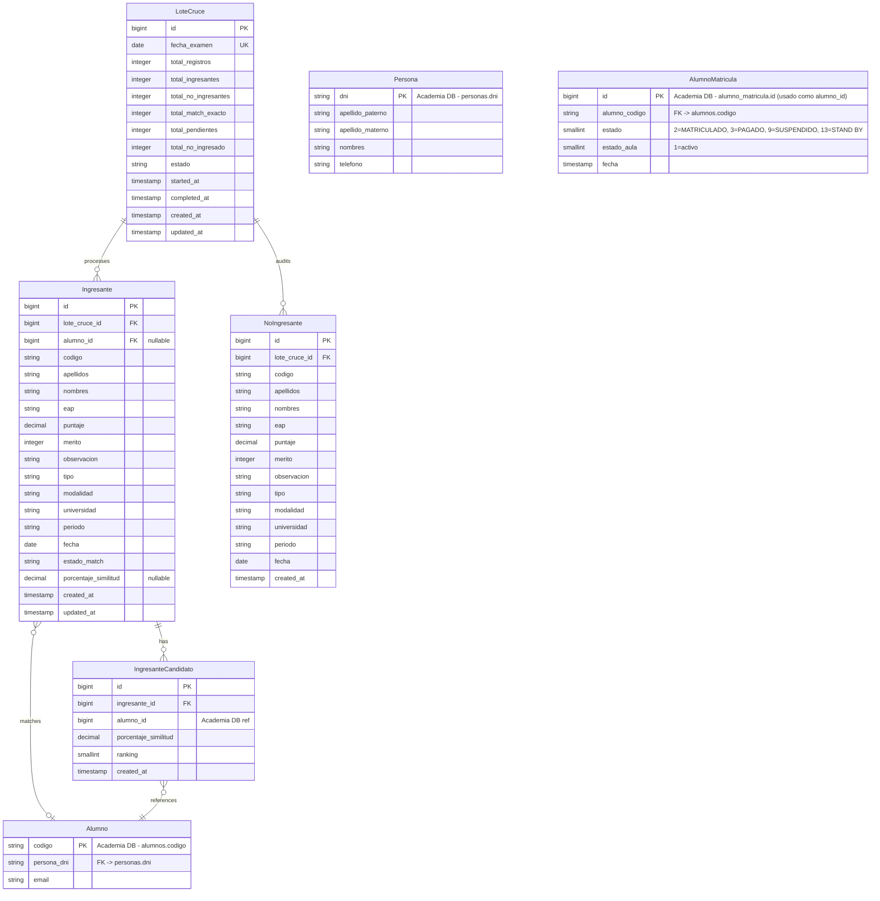

# Data Model: Motor de Cruce Automático de Ingresantes UNMSM

**Feature ID:** 001-motor-cruce-ingresantes
**Created:** 2026-06-24
**Status:** Under Review

---

## 1. Entity Relationship Diagram


```mermaid
erDiagram
    LoteCruce ||--o{ Ingresante : processes
    LoteCruce ||--o{ NoIngresante : audits
    Ingresante }o--o| Alumno : matches
    Ingresante ||--o{ IngresanteCandidato : has
    IngresanteCandidato }o--|| Alumno : references

    LoteCruce {
        bigint id PK
        date fecha_examen UK
        integer total_registros
        integer total_ingresantes
        integer total_no_ingresantes
        integer total_match_exacto
        integer total_pendientes
        integer total_no_ingresado
        string estado
        timestamp started_at
        timestamp completed_at
        timestamp created_at
        timestamp updated_at
    }
    
    Ingresante {
        bigint id PK
        bigint lote_cruce_id FK
        bigint alumno_id FK "nullable"
        string codigo
        string apellidos
        string nombres
        string eap
        decimal puntaje
        integer merito
        string observacion
        string tipo
        string modalidad
        string universidad
        string periodo
        date fecha
        string estado_match
        decimal porcentaje_similitud "nullable"
        timestamp created_at
        timestamp updated_at
    }
    
    NoIngresante {
        bigint id PK
        bigint lote_cruce_id FK
        string codigo
        string apellidos
        string nombres
        string eap
        decimal puntaje
        integer merito
        string observacion
        string tipo
        string modalidad
        string universidad
        string periodo
        date fecha
        timestamp created_at
    }

    IngresanteCandidato {
        bigint id PK
        bigint ingresante_id FK
        bigint alumno_id "Academia DB ref"
        decimal porcentaje_similitud
        smallint ranking
        timestamp created_at
    }

    Alumno {
        string codigo PK "Academia DB - alumnos.codigo"
        string persona_dni "FK -> personas.dni"
        string email
    }

    Persona {
        string dni PK "Academia DB - personas.dni"
        string apellido_paterno
        string apellido_materno
        string nombres
        string telefono
    }

    AlumnoMatricula {
        bigint id PK "Academia DB - alumno_matricula.id (usado como alumno_id)"
        string alumno_codigo "FK -> alumnos.codigo"
        smallint estado "2=MATRICULADO, 3=PAGADO, 9=SUSPENDIDO, 13=STAND BY"
        smallint estado_aula "1=activo"
        timestamp fecha
    }
```

> **Nota sobre el schema de academia:** La base `academia` no tiene una entidad `Alumnos` plana con todos los campos. En su lugar, los datos se distribuyen en 3 tablas relacionadas: `personas` (datos personales, PK = `dni`), `alumnos` (registro académico, PK = `codigo`, FK = `persona_dni`), y `alumno_matricula` (matrícula activa, PK = `id`, FK = `alumno_codigo`). El `alumno_id` que se almacena en la tabla `ingresantes` corresponde a `alumno_matricula.id`. Ver `context-bridge.md` para el detalle completo de tablas auxiliares (aulas, matriculas, ciclos).
```

---

## 2. Entity Definitions

### 2.1 Entity: LoteCruce

**Description:** Represents a processed CSV batch grouped by exam date.

**Table:** `lotes_cruce`

| Column | Type | Constraints | Description |
|--------|------|-------------|-------------|
| `id` | BIGINT | PK, AUTO_INCREMENT | Unique identifier |
| `fecha_examen` | DATE | NOT NULL, UNIQUE | Exam date of the loaded batch |
| `total_registros` | INTEGER | NOT NULL | Total CSV rows processed |
| `total_ingresantes` | INTEGER | NOT NULL | Total persisted in `ingresantes` |
| `total_no_ingresantes` | INTEGER | NOT NULL | Total persisted in `no_ingresantes` |
| `total_match_exacto` | INTEGER | NOT NULL | Total auto-confirmed matches |
| `total_pendientes` | INTEGER | NOT NULL | Total needing manual resolution |
| `total_no_ingresado` | INTEGER | NOT NULL | Total resolved as no match |
| `estado` | VARCHAR | NOT NULL | Batch status (processing, completed, paused, error) |
| `started_at` | TIMESTAMP | NULL | Queue job start timestamp |
| `completed_at` | TIMESTAMP | NULL | Queue job end timestamp |
| `created_at` | TIMESTAMP | NOT NULL, DEFAULT NOW() | Record creation |
| `updated_at` | TIMESTAMP | NOT NULL | Last update |

**Indexes:**
- `idx_lotes_cruce_fecha_examen` - UNIQUE index on `fecha_examen`.

**Relationships:**
- `ingresantes` → `ingresantes` (type: 1:N)
- `no_ingresantes` → `no_ingresantes` (type: 1:N)

### 2.2 Entity: Ingresante

**Description:** Represents an applicant who passed the exam (`ALCANZO VACANTE`) and matches or requires matching.

**Table:** `ingresantes`

| Column | Type | Constraints | Description |
|--------|------|-------------|-------------|
| `id` | BIGINT | PK, AUTO_INCREMENT | Unique identifier |
| `lote_cruce_id` | BIGINT | FK, NOT NULL | Reference to `lotes_cruce` |
| `alumno_id` | BIGINT | NULLABLE | Reference to logical alumno. **Invariant (DA-G3):** must be `NULL` when `estado_match ∈ {pendiente, no_ingresado}` and `NOT NULL` when `estado_match ∈ {confirmado_automatico, confirmado_manual}`. Value `0` is never valid. |
| `codigo` | VARCHAR | NOT NULL | Applicant registration code (`CODIGO` from CSV) |
| `apellidos` | VARCHAR | NOT NULL | Normalized apellidos, full string (`APELLIDOS` from CSV) |
| `apellido_paterno` | VARCHAR | NULLABLE | Normalized paternal surname, split from `apellidos` by `NormalizarTextoAction`. Used as a sort key in the `pendientes` list (DA-G1). |
| `apellido_materno` | VARCHAR | NULLABLE | Normalized maternal surname, split from `apellidos`. Used as a sort key in the `pendientes` list (DA-G1). |
| `nombres` | VARCHAR | NOT NULL | Normalized names (`NOMBRES` from CSV) |
| `eap` | VARCHAR | NOT NULL | Academic Professional School (`EAP` from CSV) |
| `puntaje` | DECIMAL(8,3) | NOT NULL | Score obtained (`PUNTAJE` from CSV) |
| `merito` | INTEGER | NOT NULL | Merit rank (`MERITO` from CSV) |
| `observacion` | VARCHAR | NOT NULL | Observation field (`OBSERVACION` from CSV) |
| `tipo` | VARCHAR | NOT NULL | Type of applicant (`TIPO` from CSV) |
| `modalidad` | VARCHAR | NOT NULL | Modality of exam (`MODALIDAD` from CSV) |
| `universidad` | VARCHAR | NOT NULL | Target university (`UNIVERSIDAD` from CSV) |
| `periodo` | VARCHAR | NOT NULL | Period (`PERIODO` from CSV) |
| `fecha` | DATE | NOT NULL | Exam date (`FECHA` from CSV) |
| `estado_match` | VARCHAR | NOT NULL | Match status enum |
| `porcentaje_similitud` | DECIMAL(5,2) | NULLABLE | Similitud metric percentage |
| `created_at` | TIMESTAMP | NOT NULL, DEFAULT NOW() | Record creation |
| `updated_at` | TIMESTAMP | NOT NULL | Last update |

**Indexes:**
- `idx_ingresantes_nombres_apellidos` - Composite search index: `(apellidos, nombres)`.
- `idx_ingresantes_paterno_materno_nombres` - Composite index `(apellido_paterno, apellido_materno, nombres)`; serves the tie-break sort of the `pendientes` list (DA-G1).
- `idx_ingresantes_lote_cruce_id` - FK index.

---

### 2.3 Entity: NoIngresante

**Description:** Audit log of CSV rows that did not pass the `ALCANZO VACANTE` filter.

**Table:** `no_ingresantes`

| Column | Type | Constraints | Description |
|--------|------|-------------|-------------|
| `id` | BIGINT | PK, AUTO_INCREMENT | Unique identifier |
| `lote_cruce_id` | BIGINT | FK, NOT NULL | Reference to `lotes_cruce` |
| `codigo` | VARCHAR | NOT NULL | Applicant registration code (`CODIGO` from CSV) |
| `apellidos` | VARCHAR | NOT NULL | Normalized apellidos (`APELLIDOS` from CSV) |
| `nombres` | VARCHAR | NOT NULL | Normalized names (`NOMBRES` from CSV) |
| `eap` | VARCHAR | NOT NULL | Academic Professional School (`EAP` from CSV) |
| `puntaje` | DECIMAL(8,3) | NOT NULL | Score obtained (`PUNTAJE` from CSV) |
| `merito` | INTEGER | NOT NULL | Merit rank (`MERITO` from CSV) |
| `observacion` | VARCHAR | NOT NULL | Observation field (`OBSERVACION` from CSV) |
| `tipo` | VARCHAR | NOT NULL | Type of applicant (`TIPO` from CSV) |
| `modalidad` | VARCHAR | NOT NULL | Modality of exam (`MODALIDAD` from CSV) |
| `universidad` | VARCHAR | NOT NULL | Target university (`UNIVERSIDAD` from CSV) |
| `periodo` | VARCHAR | NOT NULL | Period (`PERIODO` from CSV) |
| `fecha` | DATE | NOT NULL | Exam date (`FECHA` from CSV) |
| `created_at` | TIMESTAMP | NOT NULL, DEFAULT NOW() | Record creation |

**Indexes:**
- `idx_no_ingresantes_lote_cruce_id` - FK index.

---

### 2.4 Entity: IngresanteCandidato

**Description:** Fuzzy match candidates for a `pendiente` ingresante, computed **EAGER** inside `ProcessCsvBatchJob` immediately after the exact-match phase (see plan AD-001) and persisted via bulk `insert`. `GET /cruce/ingresantes/{id}/candidatos` is a pure SELECT — it never computes in the request.

**Table:** `ingresante_candidatos`

| Column | Type | Constraints | Description |
|--------|------|-------------|-------------|
| `id` | BIGINT | PK, AUTO_INCREMENT | Unique identifier |
| `ingresante_id` | BIGINT | FK, NOT NULL | Reference to `ingresantes` |
| `alumno_id` | BIGINT | NOT NULL | Reference to `alumnos` in Academia DB (not a FK — cross-DB) |
| `porcentaje_similitud` | DECIMAL(5,2) | NOT NULL | Computed Levenshtein similarity percentage (≥ 70.00) |
| `ranking` | SMALLINT | NOT NULL, CHECK (1–5) | Position in the ordered candidate list for this ingresante |
| `created_at` | TIMESTAMP | NOT NULL, DEFAULT NOW() | Record creation (when first computed) |

**Indexes:**
- `UNIQUE (ingresante_id, ranking)` — the composite unique constraint present in the deployed migration. Its `ingresante_id`-leading order also serves both the FK lookup and the correlated `COUNT`/`MAX` subqueries of the `pendientes` list (DA-G1), so a separate single-column FK index is redundant at the documented volume (§7.1).

> **⚠ Constraint drift (DA-G4 — confirmed 2026-07-07):** The **deployed** migration `2026_07_05_000004_create_ingresante_candidatos_table.php` does **not** implement the `CHECK (porcentaje_similitud >= 70.00)` or `CHECK (ranking BETWEEN 1 AND 5)` constraints shown in the DDL of §5.1 below, nor the two separate indexes originally documented here. A corrective data-integrity migration must add the two CHECK constraints (canonical floor = **70.00**, per plan Threshold Reconciliation). See plan.md DA-G4.

**Relationships:**
- `ingresante_id` → `ingresantes` (type: N:1, ON DELETE CASCADE)
- `alumno_id` → `alumnos` in Academia DB (logical reference only — no DB-level FK across connections)

**Notes:**
- A given `ingresante_id` will have at most 5 rows (one per ranking position).
- If no candidates exceed the 70% threshold, zero rows are inserted and the endpoint returns an empty array. Such an ingresante still appears in the `pendientes` list, sorted last (DA-G1).
- Rows are never updated — if a re-computation is needed, delete and re-insert.


---

### 2.5 Entity: Alumno (Base de Datos Academia)

**Description:** Represents student enrollment records in the secondary Academia DB, queried during matching. El schema real usa 3 tablas principales en lugar de una sola tabla `alumnos`.

**Estructura real (3 tablas):**

#### `personas` — datos personales

| Column | Type | PK | Description |
|--------|------|----|-------------|
| `dni` | VARCHAR | PK | Student's national identity card number |
| `nombres` | VARCHAR | | Student's given names |
| `apellido_paterno` | VARCHAR | | Student's first surname |
| `apellido_materno` | VARCHAR | | Student's second surname |
| `telefono` | VARCHAR | | Student's phone number |

#### `alumnos` — registro académico

| Column | Type | PK/FK | Description |
|--------|------|-------|-------------|
| `codigo` | VARCHAR | PK | Internal student code |
| `persona_dni` | VARCHAR | FK → personas.dni | Link to personal data |
| `email` | VARCHAR | | Student email |

#### `alumno_matricula` — matrícula activa

| Column | Type | PK/FK | Description |
|--------|------|-------|-------------|
| `id` | BIGINT | PK | Enrollment ID (usado como `alumno_id` en el cruce) |
| `alumno_codigo` | VARCHAR | FK → alumnos.codigo | Link to academic record |
| `aula_id` | BIGINT | FK → aulas.id | Assigned classroom |
| `estado` | SMALLINT | | Enrollment state (numeric in DB: 2=MATRICULADO, 3=PAGADO, 14=FINALIZADO, 9=SUSPENDIDO, 0=RETIRADO, 12=TRASLADADO, 13=STAND BY, 11=ANULADO) |
| `estado_aula` | SMALLINT | | 1 = active classroom |
| `fecha` | TIMESTAMP | | Enrollment date |
| `matricularegular_id` | BIGINT | NULLABLE | If set, this is a regular duplicate |

**Nota sobre la jerarquía de estados (INV-06):**
La jerarquía de estados completa en el schema de `academia` es:
- MATRICULADO (2) > PAGADO (3) > FINALIZADO (14) > SUSPENDIDO (9) > RETIRADO (0) > TRASLADADO (12) > STAND BY (13) > ANULADO (11)

El motor filtra solo los estados activos `estado IN (2, 3, 9, 13)` para el pool inicial del cruce, pero debe resolver la jerarquía completa al consolidar registros históricos.

---


## 3. Enumerations

### 3.1 BatchStatus

**Used in:** `lotes_cruce.estado`

| Value | Description |
|-------|-------------|
| `processing` | CSV currently being parsed and cross-matched in queue |
| `completed` | Batch successfully processed and ready for verification |
| `paused` | Process paused due to connectivity issues |
| `error` | Processing failed unexpectedly |

### 3.2 MatchStatus

**Used in:** `ingresantes.estado_match`

| Value | Description |
|-------|-------------|
| `pendiente` | Awaiting review in UI (`alumno_id` NULL) |
| `confirmado_automatico` | Resolved automatically via exact matching (`alumno_id` NOT NULL) |
| `confirmado_manual` | Resolved manually by user selection (`alumno_id` NOT NULL) |
| `no_ingresado` | Declared a non-student — the admin discarded all candidates (`alumno_id` NULL) |

> **Invariant (DA-G3):** the "Mark as No Match" flow resolves to `no_ingresado` with `alumno_id = NULL` — **no new enum value is required.** A `confirmado_*` state always carries a valid, existing `alumno_id`; the value `0` is never persisted. See plan.md DA-G3.

---

## 4. Data Validation Rules

| Entity | Field | Rule | Error Message |
|--------|-------|------|---------------|
| `LoteCruce` | `fecha_examen` | Must be a valid ISO-8601 date, and not exist in `lotes_cruce` | "La fecha de examen ya fue procesada en un lote anterior." |
| `Ingresante` | `codigo` | Must not be empty | "El código del postulante es obligatorio." |
| `Ingresante` | `alumno_id` | Must be `NULL` when `estado_match ∈ {pendiente, no_ingresado}`; must be a valid, existing academia `alumno_id` when `estado_match ∈ {confirmado_automatico, confirmado_manual}`. Never `0`. (DA-G3) | "El alumno seleccionado no existe en la base de datos." (HTTP 404, ERR-006) |
| `IngresanteCandidato` | `porcentaje_similitud` | `>= 70.00` (canonical floor; enforced by DB CHECK after DA-G4) | — (never inserted below threshold) |
| `IngresanteCandidato` | `ranking` | Integer `1..5` (enforced by DB CHECK after DA-G4) | — |

---

## 5. Migration Plan

### 5.1 New Tables

```sql
-- Migration: Create lotes_cruce, ingresantes, no_ingresantes
CREATE TABLE lotes_cruce (
    id BIGSERIAL PRIMARY KEY,
    fecha_examen DATE NOT NULL UNIQUE,
    total_registros INT NOT NULL DEFAULT 0,
    total_ingresantes INT NOT NULL DEFAULT 0,
    total_no_ingresantes INT NOT NULL DEFAULT 0,
    total_match_exacto INT NOT NULL DEFAULT 0,
    total_pendientes INT NOT NULL DEFAULT 0,
    total_no_ingresado INT NOT NULL DEFAULT 0,
    estado VARCHAR(50) NOT NULL DEFAULT 'processing',
    started_at TIMESTAMP NULL,
    completed_at TIMESTAMP NULL,
    created_at TIMESTAMP NOT NULL DEFAULT NOW(),
    updated_at TIMESTAMP NOT NULL DEFAULT NOW()
);

CREATE TABLE ingresantes (
    id BIGSERIAL PRIMARY KEY,
    lote_cruce_id BIGINT NOT NULL REFERENCES lotes_cruce(id) ON DELETE CASCADE,
    alumno_id BIGINT NULL, -- References logical Alumno
    codigo VARCHAR(50) NOT NULL,
    apellidos VARCHAR(255) NOT NULL,
    nombres VARCHAR(255) NOT NULL,
    eap VARCHAR(255) NOT NULL,
    puntaje DECIMAL(8,3) NOT NULL,
    merito INT NOT NULL,
    observacion VARCHAR(255) NOT NULL,
    tipo VARCHAR(100) NOT NULL,
    modalidad VARCHAR(100) NOT NULL,
    universidad VARCHAR(100) NOT NULL,
    periodo VARCHAR(50) NOT NULL,
    fecha DATE NOT NULL,
    estado_match VARCHAR(50) NOT NULL DEFAULT 'pendiente',
    porcentaje_similitud DECIMAL(5,2) NULL,
    created_at TIMESTAMP NOT NULL DEFAULT NOW(),
    updated_at TIMESTAMP NOT NULL DEFAULT NOW()
);

CREATE INDEX idx_ingresantes_search ON ingresantes(apellidos, nombres);
CREATE INDEX idx_ingresantes_lote ON ingresantes(lote_cruce_id);

CREATE TABLE no_ingresantes (
    id BIGSERIAL PRIMARY KEY,
    lote_cruce_id BIGINT NOT NULL REFERENCES lotes_cruce(id) ON DELETE CASCADE,
    codigo VARCHAR(50) NOT NULL,
    apellidos VARCHAR(255) NOT NULL,
    nombres VARCHAR(255) NOT NULL,
    eap VARCHAR(255) NOT NULL,
    puntaje DECIMAL(8,3) NOT NULL,
    merito INT NOT NULL,
    observacion VARCHAR(255) NOT NULL,
    tipo VARCHAR(100) NOT NULL,
    modalidad VARCHAR(100) NOT NULL,
    universidad VARCHAR(100) NOT NULL,
    periodo VARCHAR(50) NOT NULL,
    fecha DATE NOT NULL,
    created_at TIMESTAMP NOT NULL DEFAULT NOW()
    -- no updated_at: INV-02 append-only, sin UPDATE permitido
);

CREATE INDEX idx_no_ingresantes_lote ON no_ingresantes(lote_cruce_id);

-- Trigger DDL que enforce INV-02: no_ingresantes es append-only.
-- Previene operaciones directas desde psql, herramientas externas o migraciones futuras
-- que no conozcan el invariante. El enforcement a nivel de modelo Eloquent (UPDATED_AT=null)
-- es complementario, no sustituto.
CREATE OR REPLACE FUNCTION prevent_no_ingresantes_mutation()
RETURNS TRIGGER AS $$
BEGIN
  RAISE EXCEPTION 'no_ingresantes is append-only (INV-02). DELETE and UPDATE are not permitted.';
END;
$$ LANGUAGE plpgsql;

CREATE TRIGGER trg_no_ingresantes_readonly
BEFORE UPDATE OR DELETE ON no_ingresantes
FOR EACH ROW
EXECUTE PROCEDURE prevent_no_ingresantes_mutation();

CREATE TABLE ingresante_candidatos (
    id BIGSERIAL PRIMARY KEY,
    ingresante_id BIGINT NOT NULL REFERENCES ingresantes(id) ON DELETE CASCADE,
    alumno_id BIGINT NOT NULL,
    porcentaje_similitud DECIMAL(5,2) NOT NULL CHECK (porcentaje_similitud >= 70.00),
    ranking SMALLINT NOT NULL CHECK (ranking BETWEEN 1 AND 5),
    created_at TIMESTAMP NOT NULL DEFAULT NOW(),
    UNIQUE (ingresante_id, ranking)
);

CREATE INDEX idx_ingresante_candidatos_ingresante_id ON ingresante_candidatos(ingresante_id);
CREATE INDEX idx_ingresante_candidatos_ranking ON ingresante_candidatos(ingresante_id, ranking);
```

> **⚠ Deployed-migration drift (DA-G4, DA-G1 — confirmed 2026-07-07):** The DDL above is the *intended* target. The migration actually deployed (`2026_07_05_000004_...`) creates only `UNIQUE(ingresante_id, ranking)` and **omits** the two `CHECK` constraints and the two separate indexes shown here. The `UNIQUE(ingresante_id, ranking)` index alone is sufficient for lookups/subqueries at the documented volume; the missing piece requiring action is the two `CHECK` constraints (`porcentaje_similitud >= 70.00`, `ranking BETWEEN 1 AND 5`). A corrective migration adds them. See plan.md DA-G4.

---

## 6. Seed Data

No database seeds are required for production, as the engine dynamically processes CSV input batches. For test environments, standard factories will mock `alumnos` in the simulated Academia DB.

---

## 7. Performance Considerations

### 7.1 Expected Data Volume

| Table | Initial | Year 1 | Year 3 |
|-------|---------|--------|--------|
| `lotes_cruce` | 0 | 4 | 12 |
| `ingresantes` | 0 | ~12,000 | ~36,000 |
| `no_ingresantes` | 0 | ~96,000 | ~288,000 |
| `ingresante_candidatos` | 0 | ≤ 1,750 (5 × ~350 pendientes/año) | ≤ 5,250 |

### 7.2 Query Patterns

| Query | Frequency | Indexes Used |
|-------|-----------|--------------|
| Exact match lookup during CSV import | ~27,000 per batch | B-tree index on Academia DB names/apellidos |
| List pending ingresantes (paginated) | Per UI page request | `idx_ingresantes_lote` |
| First-time fuzzy candidate compute | Once per `pendiente` ingresante on UI open | Academia DB names index; result persisted to `ingresante_candidatos` |
| Subsequent candidatos fetch (cached) | Every subsequent UI open for same ingresante | `idx_ingresante_candidatos_ranking` on `ingresante_candidatos` — simple SELECT |

---

## 8. Data Privacy

### 8.1 PII Fields

| Table | Column | Classification | Handling |
|-------|--------|----------------|----------|
| `ingresantes` | `apellidos` | PII | Access restricted to role `admisiones` |
| `ingresantes` | `nombres` | PII | Access restricted to role `admisiones` |
| `ingresantes` | `codigo` | PII — identificador oficial de postulante UNMSM | Access restricted to role `admisiones` |
| `ingresantes` | `alumno_id` | PII reference — apunta a registro PII en BD `academia` | No exponer directamente; resolver nombre solo bajo rol `admisiones` |
| `no_ingresantes` | `apellidos` | PII | Read-only; acceso restringido a rol `admisiones` para auditoría |
| `no_ingresantes` | `nombres` | PII | Read-only; acceso restringido a rol `admisiones` para auditoría |
| `no_ingresantes` | `codigo` | PII — identificador oficial de postulante UNMSM | Read-only; acceso restringido a rol `admisiones` para auditoría |
| `ingresante_candidatos` | `alumno_id` | PII reference — apunta a registro en BD `academia` | No exponer sin validación de rol; solo accesible en contexto de resolución asistida |

> **Nota:** Los campos de la BD `academia` (nombres, apellidos, DNI, teléfonos) NO se persisten en las tablas propias de este sistema. Solo se incluyen en el reporte Excel (columnas B, R y S de AC-014), cuyo acceso está restringido a roles `admin`, `admisiones` y `marketing`. Si en el futuro se decide persistir estos campos, deberán clasificarse como PII Sensible y requerir cifrado en reposo.

---

## 9. Sign-off

- [x] Data Architect: Renzo Santos - Date: 2026-06-25
- [x] DBA Review: Renzo Santos - Date: 2026-06-25

---

## 10. Post-Implementation Gap Remediation — Data-Model Notes (2026-07-07)

Consolidated data-model impact of the gap remediation designed in plan.md "Design Addendum". Only the gaps with a data-model dimension are listed.

| Gap | Data-model impact | Change already reflected above |
|-----|-------------------|--------------------------------|
| **DA-G1** | `ingresantes.apellido_paterno` / `apellido_materno` are real columns (nullable) used as sort keys; the `pendientes` list must not exclude zero-candidate rows. | §2.2 columns + index added; §2.4 Notes clarified. |
| **DA-G3** | No new `MatchStatus` value. Invariant added: `no_ingresado ⇒ alumno_id NULL`; `confirmado_* ⇒ alumno_id NOT NULL`; `alumno_id = 0` is never valid. | §2.2 `alumno_id`, §3.2 note, §4 validation rows. |
| **DA-G4** | Two DB `CHECK` constraints missing from the deployed migration must be added by a corrective migration: `porcentaje_similitud >= 70.00` and `ranking BETWEEN 1 AND 5`. Canonical similarity floor = **70.00** (the `30.00` in tasks.md T001 is wrong). | §2.4 drift note, §4 validation rows, §5.1 drift note. |

**Canonical threshold (cross-artifact):** 70.00% is the single acceptance threshold for a candidate to be persisted. The 80% figure elsewhere is a *display* concern (disputed — see plan.md DA-G1), and the 30% figure in tasks.md T001 is an error to be reconciled.

**Not a data-model change:** DA-G2 (duplicate algorithm), DA-G5 (route auth), and DA-G6 (test anti-patterns) are code/architecture/security concerns with no schema impact; see plan.md.
