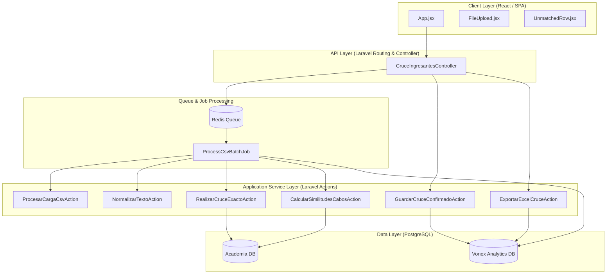

# Solution Design: Motor de Cruce Automático de Ingresantes UNMSM

**Feature ID:** 001-motor-cruce-ingresantes
**Created:** 2026-06-24
**Architect:** Architect Agent
**Status:** Under Review

---

## 1. Architecture Overview

### 1.1 High-Level Diagram



### 1.2 Architecture Decision Summary

| Decision | Choice | Rationale |
|----------|--------|-----------|
| **Pattern of Actions** | Service Actions (`app/Actions/Cruce/`) | Promotes SOLID principles, thin controllers, and testability of isolated business units. |
| **Async Processing** | Redis Queue via Laravel Queue Job | Handles large CSV uploads (~27k records) efficiently without triggering HTTP timeouts. |
| **Dual-Table Analytics Schema** | Split into `ingresantes` (matched) & `no_ingresantes` (audited) | Maintains high query performance for match resolution while preserving complete audit traceability. |
| **Two-Phase Matching** | 1. Strict Exact Match<br>2. Fuzzy Match (Levenshtein) | Avoids false positives for obvious matches and limits manual validation workload to ambiguous cases. |

---

### 1.3 Architectural Decisions

> Decisiones de diseño técnico migradas desde `context-bridge.md` — pertenecen aquí según los límites de artefactos SDD-Enterprise.

#### AD-001: Fuzzy match EAGER dentro del batch job

**Decisión:** El `ProcessCsvBatchJob` realiza normalize → filter → exact match → **fuzzy match (compute & persist)** → persist candidatos. El fuzzy match **CORRE dentro del job** para todos los ingresantes que quedan en estado `pendiente` después del exact match.

**Cuándo corre:** Inmediatamente después del exact match, dentro del mismo `ProcessCsvBatchJob`, como paso final del pipeline batch.

**Persistencia:** Los candidatos computados se guardan en la tabla `ingresante_candidatos` (ver data-model.md §2.4). El endpoint `GET /api/cruce/ingresantes/{id}/candidatos` solo hace un SELECT — nunca computa en el request HTTP.

**Razón:** El cambio a eager resuelve el NFR-002 de raíz: el endpoint de candidatos nunca necesita computar en caliente. Además, permite que la interfaz React muestre candidatos inmediatamente al listar pendientes, sin esperar a que cada `GET /candidatos` compute por primera vez. Los ~350 registros `pendiente` se procesan en el mismo job batch sin impactar el SLA de NFR-001 porque el bulk loading de alumnos de academia se hace una sola vez para todo el lote (ver T023), y el cómputo por ingresante es O(k) con k pequeño (top 5 candidatos).

**Consecuencia en data model:** Requiere la tabla `ingresante_candidatos` — definida en data-model.md §2.4. No hay cambios estructurales adicionales.

---

#### AD-002: `correlation_id` eliminado del contrato AsyncAPI

**Decisión:** El campo `correlation_id` fue removido del payload de `ProcessCsvBatchJob` en `asyncapi.yaml`.

**Razón:** Laravel asigna internamente un UUID a cada job en cola. El `lote_id` sirve como clave de correlación en los logs estructurados. Sin infraestructura de distributed tracing (Jaeger, Datadog, etc.), el campo no tiene consumidor real.

**Impacto:** El `lote_id` es el único identificador de correlación en logs y eventos.

**Applied:** correlation_id removed from asyncapi.yaml (ProcessCsvBatchJob, CruceBatchProcessedEvent, CruceBatchFailedEvent) — 2026-06-30.

---

## 2. Component Design

### 2.1 Backend Component: CsvImporter

**Responsibility:** Receives and validates uploaded CSV files, persists the file, and dispatches the async queue job for processing. Does NOT parse or process the CSV inline in the HTTP request.

**Interfaces:**
- `POST /api/cruce/upload` - Upload endpoint (returns immediately with lote_id).
- `ProcessCsvBatchJob` - Queue job that orchestrates full CSV processing (parse, normalize, split, match).

**Dependencies:**
- Laravel Queue (Redis) for async job dispatch.
- `ProcesarCargaCsvAction` (invoked by the Job, not the Controller).
- `NormalizarTextoAction` - Cleans text input.
- PostgreSQL database connections.

**Structure:**
```
app/
├── Http/Controllers/
│   └── CruceIngresantesController.php
├── Jobs/
│   └── ProcessCsvBatchJob.php
└── Actions/Cruce/
    ├── NormalizarTextoAction.php
    └── ProcesarCargaCsvAction.php
```

### 2.2 Backend Component: MatchEngine

**Responsibility:** Performs exact matching using strict filters, and calculates Levenshtein distances for fuzzy candidate matches.

**Interfaces:**
- `RealizarCruceExactoAction` - Processes automatic matches.
- `CalcularSimilitudesCabosAction` - Computes candidate list.

**Dependencies:**
- PostgreSQL database `academia` connection.
- `NormalizarTextoAction` for query normalization.

**Structure:**
```
app/Actions/Cruce/
├── RealizarCruceExactoAction.php
└── CalcularSimilitudesCabosAction.php
```

### 2.3 Frontend Component: Verification Dashboard

**Responsibility:** React interface for uploading files, displaying job progress, listing unmatched students, and resolving matches.

**Structure:**
```
frontend/src/
├── components/
│   ├── FileUpload.jsx
│   └── UnmatchedRow.jsx
├── services/
│   └── api.js
└── App.jsx
```

### 2.4 Backend Component: ReportGenerator

**Responsibility:** Generates the final Excel report with 24 columns, applying business calculations for Lists (L1, L2, L3) and EAP-to-Area resolution.

**Structure:**
```
app/Actions/Cruce/
└── ExportarExcelCruceAction.php
```

**Algorithm Details:**
- **LISTA - 1 (L1):** Check if `periodo` in academic DB starts with or is lexicographically >= "Verano 2024" (e.g. Verano 2024, Anual 2024, Repaso 2025, Verano 2026, etc.). Set cell to `1` if true, otherwise `0`.
- **LISTA - 2 (L2):** Check if `periodo` matches "Verano 2026", "Repaso 2026", or contains "OCTUBRE 2025", or represents a cycle active in Feb 2026. Includes status `RETIRADO` and `SUSPENDIDO`. Set cell to `1` if true, otherwise `0`.
- **LISTA - 3 (L3):** Check if the enrollment is active (i.e. status is `MATRICULADO`, `PAGADO`, or `FINALIZADO` and not `RETIRADO`, `SUSPENDIDO`, `ANULADO`) in presencial/virtual cycles as of Feb 27, 2026. Set cell to `1` if true, otherwise `0`.
- **AREA:** Map the `EAP` string using standard keyword rules to resolve to Area A, B, C, D, or E.

---

## 3. Data Model

See: [data-model.md](./data-model.md)

### 3.1 Summary

| Entity | Description | Key Relationships |
|--------|-------------|-------------------|
| `LoteCruce` | Tracks metadata and statistics of an uploaded CSV batch. | One-to-Many with `Ingresante` and `NoIngresante`. |
| `Ingresante` | Stores UNMSM applicants who met the `ALCANZO VACANTE` filter. | Belongs to `LoteCruce`. Optionally belongs to `Alumno` (Academia DB). |
| `NoIngresante` | Stores applicants who did not meet the filter (audit only). | Belongs to `LoteCruce`. |

---

## 4. API Design

### 4.1 Endpoints Summary

| Method | Path | Description | Auth Required |
|--------|------|-------------|---------------|
| `GET` | `/api/cruce/health` | Health check endpoint (queue status, DB connections) | No |
| `POST` | `/api/cruce/upload` | Upload CSV and dispatch queue job | Yes |
| `GET` | `/api/cruce/lotes` | Retrieve list of upload batches | Yes |
| `GET` | `/api/cruce/lotes/{lote_id}/status` | Retrieve status & stats of job | Yes |
| `GET` | `/api/cruce/lotes/{lote_id}/pendientes` | List unmatched applicants (paginated) | Yes |
| `GET` | `/api/cruce/ingresantes/{id}/candidatos` | Get pre-computed fuzzy match candidates for an ingresante | Yes |
| `POST` | `/api/cruce/ingresantes/{id}/confirmar` | Save manual match or mark as no_ingresado | Yes |
| `GET` | `/api/cruce/lotes/{lote_id}/exportar` | Export final Excel spreadsheet | Yes |
| `GET` | `/api/cruce/academia/alumnos` | List active alumnos from academia DB (paginated, searchable) | Yes |
| `DELETE` | `/api/cruce/limpiar` | Wipe all cruce data (lotes + ingresantes + candidatos) for fresh start | Yes |
| `POST` | `/api/cruce/lotes/{lote_id}/reprocesar` | Re-process a batch (queue:clear + dispatch new job) | Yes |

---

## 5. Security Considerations

### 5.1 Authentication

- **Method:** Laravel Session / Sanctum API Token.
- **Token Location:** Authorization Header (`Bearer token`) or Secure HTTP-only Cookie.
- **Expiration:** 2 Hours.

### 5.2 Authorization

| Resource | Action | Required Role/Permission |
|----------|--------|-------------------------|
| `/api/cruce/upload` | Write | `admin`, `admisiones` |
| `/api/cruce/ingresantes/*` | Write | `admin`, `admisiones` |
| `/api/cruce/lotes/*/exportar` | Read | `admin`, `admisiones`, `marketing` |

### 5.3 Data Protection

- **Encryption at Rest:** Sensitive parameters encrypted in PostgreSQL using native encryption features where required.
- **Encryption in Transit:** TLS 1.3 forced on all connections.
- **PII Fields:** `nombres`, `apellido_paterno`, `apellido_materno`, `codigo_postulante`. Standard data practices ensure minimal logging of full names.

### 5.4 Security Threats

| Threat | Mitigation |
|--------|------------|
| SQL Injection in Fuzzy Search | Use parameterized query parameters and strict Eloquent query builder constraints. |
| CSV Injection (Formula Injection) | Sanitize CSV fields prior to Excel exporting (escape `=`, `+`, `-`, `@`). |
| Environment Variable Leakage | Store database passwords strictly in server environment variable configuration, never commit `.env`. |

---

## 6. Performance Considerations

### 6.1 Performance Requirements

| Metric | Target | Strategy |
|--------|--------|----------|
| CSV Processing (27k rows) | ≤ 50 seconds | Queue batching via Redis, bulk DB insertions, and database transactions. |
| Fuzzy Search API Response (p95) | ≤ 300 ms | PostgreSQL indexes on normalized name columns and limit candidates to top 5. |
| CSV File Size Support | Up to 20 MB | Streamed CSV parsing on worker side; web server limit set to 25MB. |

### 6.2 Optimization Strategies

- **Database Indexes:** B-tree composite index on `(apellidos, nombres)` — los campos se almacenan pre-normalizados en MAYÚSCULAS por `NormalizarTextoAction`, por lo que un índice funcional con `LOWER()` es incorrecto e innecesario.
- **Redis Queue:** Process records asynchronously using Laravel's queue worker infrastructure.
- **Excel Generation:** Use streaming writer in PhpSpreadsheet to prevent memory exhaustion during export.

---

## 7. Integration Points

### 7.1 External Services

| Service | Purpose | Integration Method | Error Handling |
|---------|---------|-------------------|----------------|
| **Academia DB** | Lookup student enrollment records | Database Connection (Secondary PostgreSQL schema) via 3-table join (`alumno_matricula` → `alumnos` → `personas`). Ver `context-bridge.md` para el schema detallado. | Retry with exponential backoff; pause batch if database is unreachable. |

---

## 8. Error Handling

### 8.1 Error Categories

> **Distinción semántica de estados de lote (CQ-003):** `paused` = fallo recuperable (puede reintentarse sin duplicar datos); `error` = fallo catastrófico (requiere diagnóstico antes de reintentar).

| Category | HTTP Code | Lote Estado | Handling |
|----------|-----------|-------------|----------|
| Validation | 400 | — (sin lote creado) | Return CSV schema / column errors |
| File Size | 413 | — (sin lote creado) | Web server level rejection |
| Unprocessable | 422 | — (sin lote creado) | Empty CSV after filtering |
| Academia Connection Failure | — (async) | `paused` | Pause job, preserve already-processed records, log connection error, notify administrator. Retryable. |
| Unexpected Job Exception | — (async) | `error` | Move job to `failed_jobs`, log full stack trace, notify administrator. Requires diagnosis before retry. |

---

## 9. Testing Strategy

### 9.1 Test Levels

| Level | Scope | Coverage Target |
|-------|-------|-----------------|
| Unit | Actions (`NormalizarTextoAction`, `RealizarCruceExactoAction`) | 100% |
| Integration | Queue Job batch workflow & API endpoints | 90% |
| E2E | React verification interface using Playwright | Happy path and edge case resolution |

### 9.2 Test Data

- **Fixtures:** `tests/Fixtures/unmsm_sample.csv` (contains mock applicants with special characters and duplicates).
- **Factories:** `LoteCruceFactory`, `IngresanteFactory`, `AlumnoFactory`.

---

## 10. Deployment Considerations

### 10.1 Environment Variables

| Variable | Description | Required |
|----------|-------------|----------|
| `DB_ACADEMIA_HOST` | Host address for academia database | Yes |
| `DB_ACADEMIA_DATABASE` | Database name for academia | Yes |
| `QUEUE_CONNECTION` | Must be set to `redis` | Yes |

---

## 11. Observability

### 11.1 Logging

| Event | Level | Data |
|-------|-------|------|
| Batch Started | INFO | `lote_cruce_id`, `filename` |
| Row Process Error | WARNING | `lote_cruce_id`, `row_number`, `error` |
| Connection Failure | ERROR | `db_name`, `error_message` |

---

## 12. Open Issues

| ID | Issue | Resolution Path | Owner |
|----|-------|-----------------|-------|
| 1. | ~~Optimal Levenshtein threshold~~ | **RESOLVED:** Threshold confirmed at 70% minimum similarity (AC-009, confirmed by PO). No action required. | Tech Lead |

---

## 13. Synthesis Assessment

### Generalization
> Reusable text normalization pattern from `NormalizarTextoAction` can be extracted as a generic string helper/trait for other analytical pipelines in the Vonex project.

### Build-vs-Adopt
> Build custom SQL-based matching engine to leverage database index optimizations, but adopt PhpSpreadsheet for Excel report production to save development costs.

### Simplification
> Maintain dual-table structure strictly at database level instead of caching intermediate results in Redis, ensuring transaction safety and simple queries.

---

## 14. Sign-off

- [x] Tech Lead: Renzo Santos - Date: 2026-06-25
- [x] Security Review: Diego Castillo y Yerson - Date: 2026-06-25
- [x] Architecture Review: Renzo Santos - Date: 2026-06-25

---

## External References

| Source | Access Date | Relevant Section | Notes |
|--------|:-----------:|-----------------|-------|
| [constitution.md](../../memory/constitution.md) | 2026-06-24 | Art. 2-7 | Stack standards, quality metrics, and matching principles |
