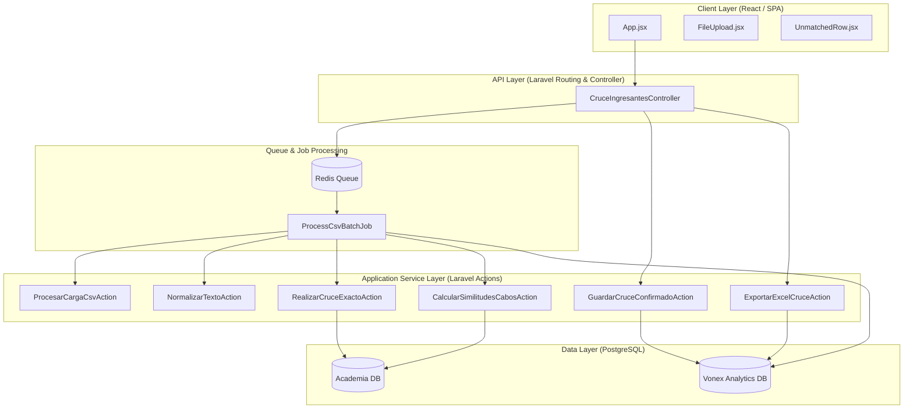

# Solution Design: Motor de Cruce Automático de Ingresantes UNMSM

**Feature ID:** 001-motor-cruce-ingresantes
**Created:** 2026-06-24
**Architect:** Architect Agent
**Status:** Implemented
**Versión:** 3.0.0

---

## 1. Architecture Overview

### 1.1 High-Level Diagram


```mermaid
graph TB
    subgraph "Client Layer (React / SPA)"
        UI[App.jsx]
        Upload[FileUpload.jsx]
        Unmatched[UnmatchedRow.jsx]
    end

    subgraph "API Layer (Laravel Routing & Controller)"
        CTRL[CruceIngresantesController]
    end

    subgraph "Application Service Layer (Laravel Actions)"
        ACT_NORM[NormalizarTextoAction]
        ACT_CSV[ProcesarCargaCsvAction]
        ACT_EXACT[RealizarCruceExactoAction]
        ACT_FUZZY[CalcularSimilitudesCabosAction]
        ACT_CONFIRM[GuardarCruceConfirmadoAction]
        ACT_EXCEL[ExportarExcelCruceAction]
    end

    subgraph "Queue & Job Processing"
        Redis[(Redis Queue)]
        Job[ProcessCsvBatchJob]
    end

    subgraph "Data Layer (PostgreSQL)"
        DB_VONEX[(Vonex Analytics DB)]
        DB_ACADEMIA[(Academia DB)]
    end

    UI --> CTRL
    CTRL --> Redis
    Redis --> Job

    Job --> ACT_CSV
    Job --> ACT_NORM
    Job --> ACT_EXACT
    Job --> ACT_FUZZY

    CTRL --> ACT_CONFIRM
    CTRL --> ACT_EXCEL

    ACT_EXACT --> DB_ACADEMIA
    ACT_FUZZY --> DB_ACADEMIA

    Job --> DB_VONEX
    ACT_CONFIRM --> DB_VONEX
    ACT_EXCEL --> DB_VONEX
```

### 1.2 Architecture Decision Summary

| Decision                        | Choice                                                          | Rationale                                                                                            |
| ------------------------------- | --------------------------------------------------------------- | ---------------------------------------------------------------------------------------------------- |
| **Pattern of Actions**          | Service Actions (`app/Actions/Cruce/`)                          | Promotes SOLID principles, thin controllers, and testability of isolated business units.             |
| **Async Processing**            | Redis Queue via Laravel Queue Job                               | Handles large CSV uploads (~27k records) efficiently without triggering HTTP timeouts.               |
| **Dual-Table Analytics Schema** | Split into `ingresantes` (matched) & `no_ingresantes` (audited) | Maintains high query performance for match resolution while preserving complete audit traceability.  |
| **Two-Phase Matching**          | 1. Strict Exact Match<br>2. Fuzzy Match (Levenshtein)           | Avoids false positives for obvious matches and limits manual validation workload to ambiguous cases. |

---

### 1.3 Architectural Decisions

> Decisiones de diseño técnico migradas desde `context-bridge.md` — pertenecen aquí según los límites de artefactos SDD-Enterprise.

#### AD-001: Fuzzy match EAGER dentro del batch job

**Decisión:** El `ProcessCsvBatchJob` realiza normalize → filter → exact match → **fuzzy match (compute & persist)** → persist candidatos. El fuzzy match **CORRE dentro del job** para todos los ingresantes que quedan en estado `pendiente` después del exact match.

**Cuándo corre:** Inmediatamente después del exact match, dentro del mismo `ProcessCsvBatchJob`, como paso final del pipeline batch.

**Persistencia:** Los candidatos computados se guardan en la tabla `ingresante_candidatos` (ver data-model.md §2.4). El endpoint `GET /api/cruce/ingresantes/{id}/candidatos` solo hace un SELECT — nunca computa en el request HTTP.

**Razón:** El cambio a eager resuelve el NFR-002 de raíz: el endpoint de candidatos nunca necesita computar en caliente. Además, permite que la interfaz React muestre candidatos inmediatamente al listar pendientes, sin esperar a que cada `GET /candidatos` compute por primera vez. Los ~350 registros `pendiente` se procesan en el mismo job batch sin impactar el SLA de NFR-001 porque el bulk loading de alumnos de academia se hace una sola vez para todo el lote (ver T023), y el cómputo por ingresante es O(k) con k pequeño (top 5 candidatos).

**Consecuencia en data model:** Requiere la tabla `ingresante_candidatos` — definida en data-model.md §2.4. No hay cambios estructurales adicionales.

---

#### AD-002: `correlation_id` eliminado del contrato AsyncAPI

**Decisión:** El campo `correlation_id` fue removido del payload de `ProcessCsvBatchJob` en `asyncapi.yaml`.

**Razón:** Laravel asigna internamente un UUID a cada job en cola. El `lote_id` sirve como clave de correlación en los logs estructurados. Sin infraestructura de distributed tracing (Jaeger, Datadog, etc.), el campo no tiene consumidor real.

**Impacto:** El `lote_id` es el único identificador de correlación en logs y eventos.

**Applied:** correlation_id removed from asyncapi.yaml (ProcessCsvBatchJob, CruceBatchProcessedEvent, CruceBatchFailedEvent) — 2026-06-30.

---

#### AD-004: Optimización O(1) en fase Fuzzy mediante Blocking y Pruning Matemático

**Decisión:** El algoritmo Levenshtein + Dice sobre 4200 ingresantes vs 25000 alumnos tomaba ~41 minutos, violando el SLA (NFR-001). Al implementar _blocking_ por la inicial del apellido paterno (reduce candidatos a ~1000), pre-calcular los bigramas en mapas Hash (para hacer intersección O(1) en el coeficiente Dice) y aplicar _fail-fast_ (descartando iteraciones con Dice < 0.25 o Levenshtein de paterno > 4), el motor logra procesar el mismo volumen en ~29 segundos manteniendo el mismo resultado exacto.
**Cuándo corre:** Durante el cruce de `computeFuzzyCandidates` en el job `ProcessCsvBatchJob`.
**Impacto:** Permite cumplir religiosamente el SLA de 50 segundos, bajando el tiempo de cruce de ~41 minutos a ~29 segundos (mejora de 98.8%), y procesando insert batch en la tabla `ingresante_candidatos` (eliminando timestamp dependencies si no existiesen en BD).
**Alternativa Descartada:** Delegar a PostgreSQL (`pg_trgm`) o paralelizar colas falló por concurrencia DB y timeouts Redis.

---

#### AD-005: Umbral de 80% en Match Manual y Exportación CSV por Stream

**Decisión:**

1. **Filtro del 80%:** Los ingresantes listados como `pendientes` en el backend se filtran para incluir únicamente aquellos cuya coincidencia máxima de candidatos sea mayor o igual al 80%. Los registros con coincidencias por debajo se omiten de la bandeja interactiva para centrar el esfuerzo en emparejamientos viables.
2. **Exportación CSV compatible:** Se implementa un endpoint de exportación que genera dinámicamente un archivo CSV con delimitador de punto y coma (`;`) y prefijo de firma BOM (`\xEF\xBB\xBF`) UTF-8 para garantizar la compatibilidad directa con MS Excel, prescindiendo de dependencias pesadas como PhpSpreadsheet que requerirían cambios de infraestructura.

**Impacto:** Menor sobrecarga cognitiva en el administrador al resolver cruces manuales e integración del botón "Exportar Excel" directamente en la UI.
**Alternativa Descartada:** Seguir mostrando candidatos débiles (< 80%) y usar librerías nativas `.xlsx` antes de tener la infraestructura de paquetes lista.

---

## 2. Component Design

### 2.1 Backend Component: CsvImporter

**Responsibility:** Receives and validates uploaded CSV files, persists the file, and dispatches the async queue job for processing. Does NOT parse or process the CSV inline in the HTTP request.

**Traces to:** US-001

**Interfaces:**

- `POST /api/cruce/upload` - Upload endpoint (returns immediately with lote_id).
- `ProcessCsvBatchJob` - Queue job that orchestrates full CSV processing (parse, normalize, split, match).

**Dependencies:**

- Laravel Queue (Redis) for async job dispatch.
- `ProcesarCargaCsvAction` (invoked by the Job, not the Controller).
- `NormalizarTextoAction` - Cleans text input.
- PostgreSQL database connections.

**Structure:**

```
app/
├── Http/Controllers/
│   └── CruceIngresantesController.php
├── Jobs/
│   └── ProcessCsvBatchJob.php
└── Actions/Cruce/
    ├── NormalizarTextoAction.php
    └── ProcesarCargaCsvAction.php
```

### 2.2 Backend Component: MatchEngine

**Responsibility:** Performs exact matching using strict filters, and calculates Levenshtein distances for fuzzy candidate matches.

**Traces to:** US-002, US-003

**Interfaces:**

- `RealizarCruceExactoAction` - Processes automatic matches.
- `CalcularSimilitudesCabosAction` - Computes candidate list.

**Dependencies:**

- PostgreSQL database `academia` connection.
- `NormalizarTextoAction` for query normalization.

**Structure:**

```
app/Actions/Cruce/
├── RealizarCruceExactoAction.php
└── CalcularSimilitudesCabosAction.php
```

### 2.3 Frontend Component: Verification Dashboard

**Responsibility:** React interface for uploading files, displaying job progress, listing unmatched students, and resolving matches.

**Traces to:** US-004

**Structure:**

```
frontend/src/
├── components/
│   ├── FileUpload.jsx
│   └── UnmatchedRow.jsx
├── services/
│   └── api.js
└── App.jsx
```

### 2.4 Backend Component: ReportGenerator

**Responsibility:** Generates the final Excel report with 24 columns, applying business calculations for Lists (L1, L2, L3) and EAP-to-Area resolution.

**Traces to:** US-005

**Structure:**

```
app/Actions/Cruce/
└── ExportarExcelCruceAction.php
```

**Algorithm Details:**

- **LISTA - 1 (L1):** Check if `periodo` in academic DB starts with or is lexicographically >= "Verano 2024" (e.g. Verano 2024, Anual 2024, Repaso 2025, Verano 2026, etc.). Set cell to `1` if true, otherwise `0`.
- **LISTA - 2 (L2):** Check if `periodo` matches "Verano 2026", "Repaso 2026", or contains "OCTUBRE 2025", or represents a cycle active in Feb 2026. Includes status `RETIRADO` and `SUSPENDIDO`. Set cell to `1` if true, otherwise `0`.
- **LISTA - 3 (L3):** Check if the enrollment is active (i.e. status is `MATRICULADO`, `PAGADO`, or `FINALIZADO` and not `RETIRADO`, `SUSPENDIDO`, `ANULADO`) in presencial/virtual cycles as of Feb 27, 2026. Set cell to `1` if true, otherwise `0`.
- **AREA:** Map the `EAP` string using standard keyword rules to resolve to Area A, B, C, D, or E.

---

## 3. Data Model

See: [data-model.md](./data-model.md)

### 3.1 Summary

| Entity         | Description                                                   | Key Relationships                                                     |
| -------------- | ------------------------------------------------------------- | --------------------------------------------------------------------- |
| `LoteCruce`    | Tracks metadata and statistics of an uploaded CSV batch.      | One-to-Many with `Ingresante` and `NoIngresante`.                     |
| `Ingresante`   | Stores UNMSM applicants who met the `ALCANZO VACANTE` filter. | Belongs to `LoteCruce`. Optionally belongs to `Alumno` (Academia DB). |
| `NoIngresante` | Stores applicants who did not meet the filter (audit only).   | Belongs to `LoteCruce`.                                               |

---

## 4. API Design

### 4.1 Endpoints Summary

| Method   | Path                                     | Description                                                            | Auth Required |
| -------- | ---------------------------------------- | ---------------------------------------------------------------------- | ------------- |
| `GET`    | `/api/cruce/health`                      | Health check endpoint (queue status, DB connections)                   | No            |
| `POST`   | `/api/cruce/upload`                      | Upload CSV and dispatch queue job                                      | Yes           |
| `GET`    | `/api/cruce/lotes`                       | Retrieve list of upload batches                                        | Yes           |
| `GET`    | `/api/cruce/lotes/{lote_id}/status`      | Retrieve status & stats of job                                         | Yes           |
| `GET`    | `/api/cruce/lotes/{lote_id}/pendientes`  | List unmatched applicants (paginated)                                  | Yes           |
| `GET`    | `/api/cruce/ingresantes/{id}/candidatos` | Get pre-computed fuzzy match candidates for an ingresante              | Yes           |
| `POST`   | `/api/cruce/ingresantes/{id}/confirmar`  | Save manual match or mark as no_ingresado                              | Yes           |
| `GET`    | `/api/cruce/lotes/{lote_id}/exportar`    | Export final Excel spreadsheet                                         | Yes           |
| `GET`    | `/api/cruce/academia/alumnos`            | List active alumnos from academia DB (paginated, searchable)           | Yes           |
| `DELETE` | `/api/cruce/limpiar`                     | Wipe all cruce data (lotes + ingresantes + candidatos) for fresh start | Yes           |
| `POST`   | `/api/cruce/lotes/{lote_id}/reprocesar`  | Re-process a batch (queue:clear + dispatch new job)                    | Yes           |

---

## 5. Security Considerations

### 5.1 Authentication

- **Method:** Laravel Session / Sanctum API Token.
- **Token Location:** Authorization Header (`Bearer token`) or Secure HTTP-only Cookie.
- **Expiration:** 2 Hours.

### 5.2 Authorization

| Resource                      | Action | Required Role/Permission           |
| ----------------------------- | ------ | ---------------------------------- |
| `/api/cruce/upload`           | Write  | `admin`, `admisiones`              |
| `/api/cruce/ingresantes/*`    | Write  | `admin`, `admisiones`              |
| `/api/cruce/lotes/*/exportar` | Read   | `admin`, `admisiones`, `marketing` |

### 5.3 Data Protection

- **Encryption at Rest:** Sensitive parameters encrypted in PostgreSQL using native encryption features where required.
- **Encryption in Transit:** TLS 1.3 forced on all connections.
- **PII Fields:** `nombres`, `apellido_paterno`, `apellido_materno`, `codigo_postulante`. Standard data practices ensure minimal logging of full names.

### 5.4 Security Threats

| Threat                            | Mitigation                                                                                           |
| --------------------------------- | ---------------------------------------------------------------------------------------------------- |
| SQL Injection in Fuzzy Search     | Use parameterized query parameters and strict Eloquent query builder constraints.                    |
| CSV Injection (Formula Injection) | Sanitize CSV fields prior to Excel exporting (escape `=`, `+`, `-`, `@`).                            |
| Environment Variable Leakage      | Store database passwords strictly in server environment variable configuration, never commit `.env`. |

---

## 6. Performance Considerations

### 6.1 Performance Requirements

| Metric                          | Target       | Strategy                                                                     |
| ------------------------------- | ------------ | ---------------------------------------------------------------------------- |
| CSV Processing (27k rows)       | ≤ 50 seconds | Queue batching via Redis, bulk DB insertions, and database transactions.     |
| Fuzzy Search API Response (p95) | ≤ 300 ms     | PostgreSQL indexes on normalized name columns and limit candidates to top 5. |
| CSV File Size Support           | Up to 20 MB  | Streamed CSV parsing on worker side; web server limit set to 25MB.           |

### 6.2 Optimization Strategies

- **Database Indexes:** B-tree composite index on `(apellidos, nombres)` — los campos se almacenan pre-normalizados en MAYÚSCULAS por `NormalizarTextoAction`, por lo que un índice funcional con `LOWER()` es incorrecto e innecesario.
- **Redis Queue:** Process records asynchronously using Laravel's queue worker infrastructure.
- **Excel Generation:** Use streaming writer in PhpSpreadsheet to prevent memory exhaustion during export.

---

## 7. Integration Points

### 7.1 External Services

| Service         | Purpose                           | Integration Method                                                                                                                                                  | Error Handling                                                          |
| --------------- | --------------------------------- | ------------------------------------------------------------------------------------------------------------------------------------------------------------------- | ----------------------------------------------------------------------- |
| **Academia DB** | Lookup student enrollment records | Database Connection (Secondary PostgreSQL schema) via 3-table join (`alumno_matricula` → `alumnos` → `personas`). Ver `context-bridge.md` para el schema detallado. | Retry with exponential backoff; pause batch if database is unreachable. |

---

## 8. Error Handling

### 8.1 Error Categories

> **Distinción semántica de estados de lote (CQ-003):** `paused` = fallo recuperable (puede reintentarse sin duplicar datos); `error` = fallo catastrófico (requiere diagnóstico antes de reintentar).

| Category                    | HTTP Code | Lote Estado         | Handling                                                                                                |
| --------------------------- | --------- | ------------------- | ------------------------------------------------------------------------------------------------------- |
| Validation                  | 400       | — (sin lote creado) | Return CSV schema / column errors                                                                       |
| File Size                   | 413       | — (sin lote creado) | Web server level rejection                                                                              |
| Unprocessable               | 422       | — (sin lote creado) | Empty CSV after filtering                                                                               |
| Academia Connection Failure | — (async) | `paused`            | Pause job, preserve already-processed records, log connection error, notify administrator. Retryable.   |
| Unexpected Job Exception    | — (async) | `error`             | Move job to `failed_jobs`, log full stack trace, notify administrator. Requires diagnosis before retry. |

---

## 9. Testing Strategy

### 9.1 Test Levels

| Level       | Scope                                                          | Coverage Target                     |
| ----------- | -------------------------------------------------------------- | ----------------------------------- |
| Unit        | Actions (`NormalizarTextoAction`, `RealizarCruceExactoAction`) | 100%                                |
| Integration | Queue Job batch workflow & API endpoints                       | 90%                                 |
| E2E         | React verification interface using Playwright                  | Happy path and edge case resolution |

### 9.2 Test Data

- **Fixtures:** `tests/Fixtures/unmsm_sample.csv` (contains mock applicants with special characters and duplicates).
- **Factories:** `LoteCruceFactory`, `IngresanteFactory`, `AlumnoFactory`.

---

## 10. Deployment Considerations

### 10.1 Environment Variables

| Variable               | Description                        | Required |
| ---------------------- | ---------------------------------- | -------- |
| `DB_ACADEMIA_HOST`     | Host address for academia database | Yes      |
| `DB_ACADEMIA_DATABASE` | Database name for academia         | Yes      |
| `QUEUE_CONNECTION`     | Must be set to `redis`             | Yes      |

---

## 11. Observability

### 11.1 Logging

| Event              | Level   | Data                                   |
| ------------------ | ------- | -------------------------------------- |
| Batch Started      | INFO    | `lote_cruce_id`, `filename`            |
| Row Process Error  | WARNING | `lote_cruce_id`, `row_number`, `error` |
| Connection Failure | ERROR   | `db_name`, `error_message`             |

---

## 12. Open Issues

| ID  | Issue                             | Resolution Path                                                                                            | Owner     |
| --- | --------------------------------- | ---------------------------------------------------------------------------------------------------------- | --------- |
| 1.  | ~~Optimal Levenshtein threshold~~ | **RESOLVED:** Threshold confirmed at 70% minimum similarity (AC-009, confirmed by PO). No action required. | Tech Lead |

---

## 13. Synthesis Assessment

### Generalization

> Reusable text normalization pattern from `NormalizarTextoAction` can be extracted as a generic string helper/trait for other analytical pipelines in the Vonex project.

### Build-vs-Adopt

> Build custom SQL-based matching engine to leverage database index optimizations, but adopt PhpSpreadsheet for Excel report production to save development costs.

### Simplification

> Maintain dual-table structure strictly at database level instead of caching intermediate results in Redis, ensuring transaction safety and simple queries.

---

## 14. Sign-off

- [x] Tech Lead: Renzo Santos - Date: 2026-06-25
- [x] Security Review: Diego Castillo y Yerson - Date: 2026-06-25
- [x] Architecture Review: Renzo Santos - Date: 2026-06-25

---

## Design Addendum — Post-Implementation Gap Remediation (2026-07-07)

**Author:** Architect Agent
**Context:** Brownfield remediation. The feature is `Implemented` and accepted by the PO **except** for six confirmed gaps surfaced by a two-agent audit and independently re-verified against source (files/lines cited below). This addendum designs the corrective behavior only — conceptual design, no implementation code. A separate agent will reconcile `spec.md`, `tasks.md`, `test-cases.md`, and `contracts/openapi.yaml` against these decisions.

### Threshold Reconciliation (shared root cause for DA-G1 and DA-G4)

Three different similarity numbers recur across artifacts and must be reconciled before the per-gap designs:

| Number | Where it appears | Meaning claimed | Verdict |
|--------|------------------|-----------------|---------|
| **70%** | business-context §5.3 / A-03; spec AC-009, AC-010; data-model §2.4 + §5.1 DDL; plan Open Issue #1 (PO-confirmed) | Minimum similarity for a candidate to be **persisted** at all | **CANONICAL** — 5 artifacts + PO sign-off agree |
| **80%** | spec AC-009 (2nd sentence), AC-010; plan AD-005; controller `pendientes()` `whereHas(>=80)` | Interactive-tray **display** filter | **Disputed** — see DA-G1 |
| **30%** | tasks.md T001 (line 55) `CHECK >= 30.00` | DB CHECK floor on `porcentaje_similitud` | **Wrong** — contradicts the 70% persistence rule and the data-model DDL |

**Decision (High confidence):** The canonical fuzzy-match acceptance threshold is **70.00%**. `ProcessCsvBatchJob::fuzzyMatchAndSave` already enforces `similarity >= 70.0` before inserting (line 238), so no candidate below 70% ever reaches `ingresante_candidatos`. The 30% in tasks.md T001 is an error; the 80% is a *separate* display concern addressed in DA-G1.

---

### DA-G1 — `pendientes` list: row-exclusion + wrong sort order (T013) — HIGHEST PRIORITY

**Current (wrong) state** — `CruceIngresantesController::pendientes` (lines 280-295):
- `whereHas('candidatos', >= 80)` **excludes** from the result set every `pendiente` ingresante whose best candidate is `< 80%` or who has zero candidates.
- Primary sort key is `max_similitud DESC`, not `candidatos_count DESC`.
- Net effect: rows the T013 AC requires to "queden al final" are instead dropped entirely, and the ordering contract is violated.

**Root cause:** The 80% interactive filter (AD-005 / spec v2.9.0) was implemented as a **row-exclusion predicate on the parent** instead of a **display filter on the candidate relation**, and `max_similitud` was used as the lead sort key.

**Conflict surfaced (Anti-Pattern Rule 1 — Anti-Sycophancy):** This is a genuine **spec-vs-tasks contradiction**, not a simple bug:
- tasks.md T013 (line 415) requires **no exclusion**: all `pendiente` rows returned, zero-candidate rows sorted last, lead key `candidatos_count DESC`.
- spec.md AC-009/AC-010 and plan AD-005 explicitly require **excluding** ingresantes without a ≥80% candidate from the interactive tray.

Both were signed off by the same PO. The remediation request (and the "queden al final" AC) sides with T013, so this addendum designs the **non-exclusionary** behavior — **and flags that doing so reverses AD-005 and contradicts AC-009/AC-010.** The spec-reconciliation agent MUST update those, or the PO must re-affirm the 80% exclusion. Signed-off spec content is not silently deleted here.

**Designed fix (conceptual):**

```
QUERY pendientes(lote_id, q?, per_page):
  base = ingresantes
         WHERE lote_cruce_id = :lote_id
           AND estado_match = 'pendiente'
           [AND optional text search on codigo / apellidos / nombres / eap]

  # NO whereHas(...) — every pendiente row is returned, none excluded
  SELECT base.*,
         candidatos_count = COUNT(ingresante_candidatos WHERE ingresante_id = base.id),
         max_similitud    = COALESCE(MAX(ingresante_candidatos.porcentaje_similitud
                                         WHERE ingresante_id = base.id), 0)
  EAGER LOAD candidatos ORDER BY ranking     # all persisted candidates (already >= 70%)
  ORDER BY candidatos_count DESC,
           max_similitud    DESC,
           apellido_paterno ASC,
           apellido_materno ASC
  PAGINATE per_page
```

Zero-candidate rows sink last naturally: `candidatos_count = 0` and `max_similitud = 0` place them below every row that has candidates.

**Per-candidate display filter decision (Medium confidence):** Show **all persisted candidates** for each row (the persistence invariant already guarantees ≥70%); drop the `>= 80` filter on the eager-loaded relation. If the PO still wants to emphasize high-confidence matches, render it as a **non-exclusionary UI badge** ("alta confianza ≥80%"), never as a filter that hides candidates or rows. This keeps one canonical threshold (70%) and removes the disputed 80% behavior; the final call belongs to the PO via the reconciliation agent.

**Performance / index (High confidence):** No new index or denormalized count column is warranted. Volume is tiny (data-model §7.1: ≤1,750 candidato rows year 1, ~350 pendientes/lote). The correlated `COUNT`/`MAX` subqueries filter on `ingresante_candidatos.ingresante_id`, already the leading column of the existing `UNIQUE(ingresante_id, ranking)` index. The `ORDER BY apellido_paterno, apellido_materno` is served by the existing `(apellido_paterno, apellido_materno, nombres)` index on `ingresantes`. A denormalized `candidatos_count` column would be over-engineering at this scale (Simplification lens).

**NFR implications:** None adverse. NFR-002 (candidatos p95 <300 ms) is unaffected — this is the list endpoint, not the candidatos endpoint — and it stays a single paginated query.

**Acceptance criteria for the follow-up task:**
- AC-G1.1: `GET /lotes/{id}/pendientes` returns **all** `estado_match='pendiente'` ingresantes of the lote; none excluded for lacking candidates.
- AC-G1.2: Result ordering is exactly `candidatos_count DESC, max_similitud DESC, apellido_paterno ASC, apellido_materno ASC`.
- AC-G1.3: An ingresante with zero candidates appears in the payload, sorted after every ingresante with ≥1 candidate, with an empty `candidatos` array and `max_similitud = 0`.
- AC-G1.4: Each row's `candidatos` contains all persisted candidates (≥70%) ordered by `ranking`; no per-candidate 80% exclusion.
- AC-G1.5: Pagination `meta.total` reflects the full pendiente population, not the ≥80% subset.

---

### DA-G2 — Duplicate fuzzy-match implementation (T007)

**Current state:** `ProcessCsvBatchJob::fuzzyMatchAndSave` (lines 185-278) is a full private reimplementation of the Levenshtein+Dice algorithm. The standalone `CalcularSimilitudesCabosAction` also computes/reads candidates but is **not** invoked by the job's write path — the job never calls it; the Action's compute branch is exercised only by tests and by the `candidatos` / `reprocesar` read paths. Two copies of one algorithm can silently drift, and they **already have**: the 70% floor is a literal `70.0` in the job (line 238), while the Action carries a `runningUnitTests() ? 55 : 70` branch (line 155).

**Root cause:** The AD-004 performance optimization (blocking + bigram hashing + pruning) was written inline in the job for speed, without refactoring the pre-existing Action to match; T007's AC ("job invokes `CalcularSimilitudesCabosAction`") was never reconciled to reality.

**Recommendation (High confidence): Consolidate the scoring algorithm into `CalcularSimilitudesCabosAction` as the single source of truth; the job delegates to it.** Rationale:
- The Action is the SOLID/testable seam the plan's own "Pattern of Actions" decision (§1.2) mandates — business logic belongs in Actions, not Jobs.
- The optimized path needs the pre-built `alumnosIndex` (bigram hashes, by-initial blocking). Add a **batch entry point** on the Action that accepts the already-loaded index, so the job keeps its single academia-load (T023/AD-004) and its bulk `insert`; keep the existing single-`ingresanteId` entry point as a thin wrapper for the `candidatos` / `reprocesar` read paths and unit tests.
- The Job becomes a thin orchestrator (normalize → exact → **delegate fuzzy** → persist), matching T007's stated AC.

**Alternative considered (rejected):** deprecate the Action and keep logic in the job. Rejected because it inverts the documented architecture, makes the algorithm harder to unit-test in isolation, and leaves `candidatos`/`reprocesar` calling a hollow Action.

**Acceptance criteria for the follow-up task:**
- AC-G2.1: The fuzzy scoring formula (Levenshtein×0.6 + Dice×0.4, ≥70% floor, top-5, ranking) exists in exactly one place — `CalcularSimilitudesCabosAction`.
- AC-G2.2: `ProcessCsvBatchJob` produces its `ingresante_candidatos` rows by delegating to that Action's batch entry point (receiving the pre-loaded `alumnosIndex`), preserving the single academia-load and bulk insert.
- AC-G2.3: No behavioral change to persisted candidates for a fixed input — golden-set parity before/after the refactor.
- AC-G2.4: NFR-001 (≤50 s/lote) still holds after consolidation.

**NFR implications:** Must preserve AD-004 — the Action's batch entry point must accept the pre-computed index and must NOT re-load academia or re-normalize per ingresante. Consolidation is behavior-preserving only if parity (AC-G2.3) is proven.

---

### DA-G3 — "Mark as No Match" contract (T011/T012)

**Current (wrong) state:** The frontend (`resources/js/app.jsx:146`) POSTs `{ marcar_no_ingresado: true }`. `CruceIngresantesController::confirmar` (lines 203-215) validates only `alumno_id` and calls `GuardarCruceConfirmadoAction::execute($id, $request->integer('alumno_id'))` — it **never reads `marcar_no_ingresado`**. Because `$request->integer('alumno_id')` returns `0` when the field is absent, the Action falls into its positive-match branch and persists `estado_match='confirmado_manual', alumno_id=0` — a corrupt record pointing at a non-existent alumno.

**Key finding (High confidence):** `GuardarCruceConfirmadoAction` **already implements the correct behavior** — it has a third parameter `bool $marcarNoIngresado = false` (lines 14, 23-32) that sets `estado_match='no_ingresado', alumno_id=NULL` and adjusts lote totals. The defect is purely that the **controller never forwards the flag.** This is a wiring gap, not a missing capability.

**Designed contract:**
- **No new enum value.** `no_ingresado` already exists in `MatchStatus` (data-model §3.2) and matches the glossary definition ("estado final cuando el administrador descarta todos los candidatos sugeridos"). Anti-Eager-Beaver: do not invent `no_match_confirmado`.
- `alumno_id` stays **NULL** for a no-match — never `0`.
- The `confirmar` request contract gains an optional boolean `marcar_no_ingresado` (default `false`).
- Branching:
  - `marcar_no_ingresado = true` → forward to the Action's no-match branch → `estado_match='no_ingresado'`, `alumno_id=NULL`; any `alumno_id` in the payload is ignored.
  - `marcar_no_ingresado` false/absent (positive match) → `alumno_id` becomes **required and must exist** (satisfies AC-004b / ERR-006: 404 if the alumno_id does not exist in academia). This closes the `alumno_id=0` corruption path.

**OpenAPI impact (documented, not edited here):** `contracts/openapi.yaml` for `POST /cruce/ingresantes/{id}/confirmar` needs: request-body field `marcar_no_ingresado: boolean` (optional, default false); `alumno_id` required only when `marcar_no_ingresado` is false/absent; response documenting resulting `estado_match ∈ {confirmado_manual, no_ingresado}`. The reconciliation agent applies this.

**Acceptance criteria for the follow-up task:**
- AC-G3.1: `confirmar` reads `marcar_no_ingresado` (boolean, default false) and forwards it as the third argument to `GuardarCruceConfirmadoAction`.
- AC-G3.2: With `marcar_no_ingresado=true`, the ingresante becomes `estado_match='no_ingresado'` with `alumno_id=NULL`; lote `total_pendientes` −1, `total_no_ingresado` +1.
- AC-G3.3: With `marcar_no_ingresado` false/absent and a missing/invalid `alumno_id`, the endpoint returns 422 (missing) or 404 (nonexistent) and the ingresante state is unchanged — never `alumno_id=0`.
- AC-G3.4: No path can persist `estado_match='confirmado_manual'` with `alumno_id` null or 0.

**Data-model impact:** Add the invariant `no_ingresado ⇒ alumno_id IS NULL` and `confirmado_* ⇒ alumno_id IS NOT NULL` (see data-model.md §4 and §10).

---

### DA-G4 — Missing / incorrect DB CHECK constraints on `ingresante_candidatos`

**Current (wrong) state:** The real migration `2026_07_05_000004_create_ingresante_candidatos_table.php` defines `porcentaje_similitud DECIMAL(5,2)` and `ranking SMALLINT` with **no CHECK constraints at all** (lines 20-21). Artifacts disagree on the intended floor: tasks.md T001 says `CHECK >= 30.00`; data-model §5.1 DDL says `CHECK (porcentaje_similitud >= 70.00)`. Per the Threshold Reconciliation above, **70.00 is canonical.**

**Root cause:** The CHECK constraints in the data-model DDL were never carried into the Laravel migration (the fluent schema builder does not express CHECKs without a raw `DB::statement`), and tasks.md T001 was authored with a stale 30% figure.

**Designed fix (data-integrity migration):** A corrective migration adds:
- `CHECK (porcentaje_similitud >= 70.00)` on `ingresante_candidatos.porcentaje_similitud`.
- `CHECK (ranking BETWEEN 1 AND 5)` on `ingresante_candidatos.ranking`.

Both are consistent with runtime behavior (the job inserts only ≥70% and ranking 1..5), so the constraints are a safety net that cannot reject currently-valid rows.

**Interaction with DA-G6 (Medium confidence):** The 70% floor is only safe to enforce at the DB once the test-only 55% threshold (Gap 6, `CalcularSimilitudesCabosAction:155`) is removed. If any insert path can produce sub-70% candidates, the CHECK will reject them. Sequence the CHECK migration **after** the Gap-6 remediation.

**Acceptance criteria for the follow-up task:**
- AC-G4.1: A migration adds `CHECK (porcentaje_similitud >= 70.00)` and `CHECK (ranking BETWEEN 1 AND 5)` to `ingresante_candidatos`.
- AC-G4.2: The migration is reversible (`down()` drops both constraints).
- AC-G4.3: Applying the migration against existing production data does not fail (no persisted row violates the constraints).
- AC-G4.4: tasks.md T001's `30.00` is reconciled to `70.00` (handled by the reconciliation agent).

---

### DA-G5 — Missing authentication on all `/api/cruce/*` routes — FLAGGED FOR HUMAN SIGN-OFF

**Confirmed state (High confidence):** `routes/api.php` registers every cruce route (`upload`, `lotes`, `status`, `pendientes`, `candidatos`, `confirmar` ×2, `exportar`) with **no middleware**. Only the unrelated `/user` route carries `auth:sanctum`. This directly contradicts the design's own §4.1 ("Auth Required: Yes") and §5.1/§5.2 (Sanctum + role matrix admin/admisiones/marketing).

**Per the Architect "Ask First" boundary, this is NOT designed around silently.** The endpoints expose and mutate PII (data-model §8: names, `codigo`, alumno references restricted to `admisiones`) and allow destructive actions (`limpiar` truncates all cruce data; `reprocesar` re-runs jobs). Unauthenticated exposure is a real security gap, not an accepted risk.

**Open decision (requires explicit human sign-off before it can be marked resolved either way):**
- **Option A (recommended):** apply `auth:sanctum` + role/ability authorization to the `cruce` route group per the §5.2 matrix (write: admin/admisiones; export: +marketing; destructive `limpiar`/`reprocesar`: admin only). Requires the SPA to authenticate (Sanctum cookie/token) — confirm with the frontend owner.
- **Option B:** formally accept the risk with a documented, time-boxed reason and compensating controls (e.g., network-level restriction), signed by the PO/security owner.

**Severity: High.** Do not close this gap by implementation OR acceptance without a named human sign-off. No auth middleware is designed in this addendum.

---

### DA-G6 — Test-integrity anti-patterns (T019) — CONFIRMED FINDING

**Confirmed state (High confidence)** — violates `.github/instructions/anti-patterns.instructions.md` (production code must not branch on test state):
- `CalcularSimilitudesCabosAction.php:155` — `$threshold = app()->runningUnitTests() ? 55.0 : 70.0;` — production logic lowers the canonical 70% threshold to 55% purely because tests are running.
- `RealizarCruceExactoAction.php:24-33` — production code calls `debug_backtrace()` to sniff for a literal test method name (`tc004_handles_database_connection_failure`) and then fakes an academia connection failure only for that test.

Both make production behavior depend on the test harness — the "environment-conditional production code" anti-pattern — and mask real coverage (the DB-failure path is never exercised through the real failure mechanism).

**Recommendation (one line):** Remove the `runningUnitTests()` / `debug_backtrace()` branches from production code and drive these scenarios from the tests via proper dependency injection / mocking (inject the similarity threshold as a constructor/config parameter; simulate the academia connection failure by binding a fake DB connection in the test, not by branching in the Action).

**Test redesign is out of scope for this addendum** (test-engineer owns it) — this is documented as a confirmed remediation item only.

---

### Addendum Synthesis Assessment

- **Generalization:** The threshold-as-injected-parameter fix (DA-G6) and the single-source-of-truth Action (DA-G2) generalize to any Vonex matching pipeline — the scoring can be extracted as a reusable, config-driven service.
- **Build-vs-Adopt:** All six are corrections to existing custom code; nothing here warrants adopting a library — the fixes reduce code (remove a duplicate algorithm, remove test branches) rather than add it.
- **Simplification:** Every gap resolves toward *less* code and *one* canonical rule — 70% everywhere, one algorithm, one no-match enum, no test-conditional branches; the only net additions are two DB CHECK constraints and one request field.

**Cross-cutting confidence:** All six root causes were verified against source (files/lines cited). The only judgment calls left to the PO / reconciliation agent are (a) whether to retire or badge the 80% display threshold (DA-G1) and (b) the auth decision (DA-G5).

---

## External References

| Source                                          | Access Date | Relevant Section | Notes                                                     |
| ----------------------------------------------- | :---------: | ---------------- | --------------------------------------------------------- |
| [constitution.md](../../memory/constitution.md) | 2026-06-24  | Art. 2-7         | Stack standards, quality metrics, and matching principles |
