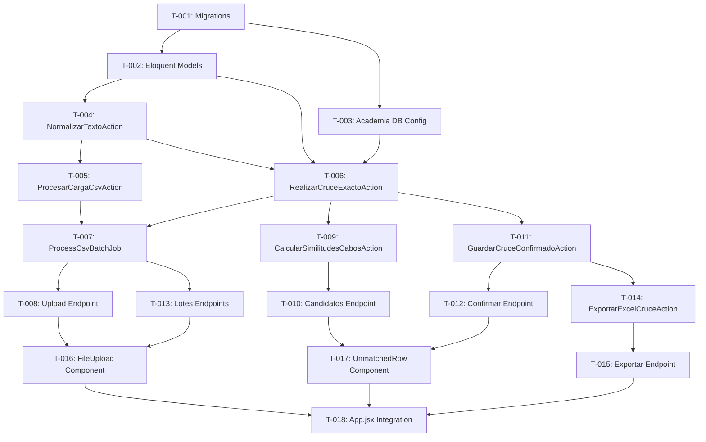

# Tasks: Motor de Cruce Automático de Ingresantes UNMSM

**Feature ID:** 001-motor-cruce-ingresantes
**Created:** 2026-06-25
**Author:** Antigravity (Architect Agent)
**Status:** Ready for Implementation
**Traces to:** spec.md v2.6.0, plan.md, data-model.md, context-bridge.md, test-cases.md

---

## Dependency Graph



---

## Sprint 1: Foundation (Database + Models + Config)

### T-001: Database Migrations

- [ ] **Status:** Not Started
- **Priority:** P0
- **Story Points:** 3
- **Traces to:** data-model.md §5.1, INV-02, INV-03

**Description:**
Create Laravel migrations for the 4 new tables in the Vonex analytics DB.

**Acceptance Criteria:**
- [ ] Migration `create_lotes_cruce_table`: BIGSERIAL PK, `fecha_examen DATE NOT NULL UNIQUE`, 7 integer counters, `estado VARCHAR(50) DEFAULT 'processing'`, timestamps `started_at`, `completed_at`, `created_at`, `updated_at`.
- [ ] Migration `create_ingresantes_table`: BIGSERIAL PK, FK `lote_cruce_id` (CASCADE), nullable `alumno_id`, 12 CSV-derived columns (`codigo`, `apellidos`, `nombres`, `eap`, `puntaje DECIMAL(8,3)`, `merito INT`, `observacion`, `tipo`, `modalidad`, `universidad`, `periodo`, `fecha DATE`), `estado_match VARCHAR(50) DEFAULT 'pendiente'`, nullable `porcentaje_similitud DECIMAL(5,2)`, timestamps. Composite index on `(apellidos, nombres)`.
- [ ] Migration `create_no_ingresantes_table`: Same 12 CSV columns as `ingresantes` + FK `lote_cruce_id` (CASCADE). **NO `updated_at` column** — this table is append-only per INV-02. Only `created_at`.
- [ ] Migration `create_ingresante_candidatos_table`: FK `ingresante_id` (CASCADE), `alumno_id BIGINT NOT NULL` (logical ref, no FK), `porcentaje_similitud DECIMAL(5,2) CHECK >= 30.00`, `ranking SMALLINT CHECK 1-5`, `UNIQUE(ingresante_id, ranking)`, only `created_at`.
- [ ] All migrations use `BIGSERIAL` (PostgreSQL) and `declare(strict_types=1)`.
- [ ] Migration `no_ingresantes`: incluir la creación del trigger `trg_no_ingresantes_readonly` que enforce INV-02 a nivel de base de datos (ver data-model.md §5.1 para el SQL del trigger). Este enforcement es independiente del modelo Eloquent.

**Files:**
```
database/migrations/
├── xxxx_create_lotes_cruce_table.php
├── xxxx_create_ingresantes_table.php
├── xxxx_create_no_ingresantes_table.php
└── xxxx_create_ingresante_candidatos_table.php
```

**Tests:** Run `php artisan migrate` on clean DB. Verify with `\d+ <table>` in psql.

---

### T-002: Eloquent Models

- [ ] **Status:** Not Started
- **Priority:** P0
- **Story Points:** 2
- **Traces to:** data-model.md §2, context-bridge.md Bounded Contexts

**Description:**
Create Eloquent models with relationships, casts, fillables, and enums.

**Acceptance Criteria:**
- [ ] `LoteCruce` model: `hasMany(Ingresante)`, `hasMany(NoIngresante)`. Cast `fecha_examen` to date, `started_at`/`completed_at` to datetime. Enum constants for `BatchStatus` (`processing`, `completed`, `paused`, `error`).
- [ ] `Ingresante` model: `belongsTo(LoteCruce)`, `hasMany(IngresanteCandidato)`. Cast `puntaje` to decimal, `fecha` to date, `porcentaje_similitud` to decimal. Enum constants for `MatchStatus` (`pendiente`, `confirmado_automatico`, `confirmado_manual`, `no_ingresado`). Accessor for logical `alumno` (cross-DB, no FK relation).
- [ ] `NoIngresante` model: `belongsTo(LoteCruce)`. Cast same fields. **No `updated_at`** — set `const UPDATED_AT = null;` per INV-02.
- [ ] `IngresanteCandidato` model: `belongsTo(Ingresante)`. Cast `porcentaje_similitud` to decimal. **No `updated_at`** — set `const UPDATED_AT = null;`.
- [ ] All models: `declare(strict_types=1)`, explicit `$fillable`, `$table` property set.

**Files:**
```
app/Models/
├── LoteCruce.php
├── Ingresante.php
├── NoIngresante.php
└── IngresanteCandidato.php
```

**Tests:** TC-032 (verify model relationships and casts via factory).

---

### T-003: Academia Database Connection Config

- [ ] **Status:** Not Started
- **Priority:** P0
- **Story Points:** 1
- **Traces to:** US-002 AC-005, INV-07, INV-08, NFR-004

**Description:**
Configure the secondary PostgreSQL connection for the read-only Academia database.

**Acceptance Criteria:**
- [ ] Add `academia` connection to `config/database.php` using env vars: `DB_ACADEMIA_HOST`, `DB_ACADEMIA_PORT`, `DB_ACADEMIA_DATABASE`, `DB_ACADEMIA_USERNAME`, `DB_ACADEMIA_PASSWORD`.
- [ ] Update `.env.example` with all `DB_ACADEMIA_*` variables (no real values).
- [ ] Verify no hardcoded credentials exist (INV-08).
- [ ] Connection is read-only: no Eloquent model with `$connection = 'academia'` may have write operations.

**Files:**
```
config/database.php
.env.example
```

**Tests:** TC-031 (credentials not in repo), TC-005 (connection validation).

---

## Sprint 2: Core Actions (Normalize + CSV Processing)

### T-004: NormalizarTextoAction

- [ ] **Status:** Not Started
- **Priority:** P0
- **Story Points:** 2
- **Traces to:** US-001 AC-002, AC-003, INV-05, context-bridge.md ACL

**Description:**
Implement the text normalization action that serves as the Anti-Corruption Layer.

**Acceptance Criteria:**
- [ ] Converts all text to UPPERCASE.
- [ ] Removes all accents: á→A, é→E, í→I, ó→O, ú→U (and uppercase variants).
- [ ] Replaces `Ñ`/`ñ` with `N` strictly, no exceptions.
- [ ] Handles compound surnames correctly (AC-003): recognizes `DE LA`, `DEL`, `DE LOS`, `SAN` as surname prefixes.
- [ ] Returns a DTO or array with: `apellido_paterno`, `apellido_materno`, `nombres` (logically separated from single `APELLIDOS` input).
- [ ] `declare(strict_types=1)`.

**Files:**
```
app/Actions/Cruce/NormalizarTextoAction.php
```

**Tests:** TC-002 (normalization), TC-003 (compound surname parsing).

---

### T-005: ProcesarCargaCsvAction

- [ ] **Status:** Not Started
- **Priority:** P0
- **Story Points:** 5
- **Traces to:** US-001 AC-001, AC-001a, AC-004, CQ-001, CQ-002, INV-03, INV-04, INV-05

**Description:**
Parse, validate, deduplicate, and split the uploaded CSV by exam date.

**Acceptance Criteria:**
- [ ] Validate CSV encoding (UTF-8 or ISO-8859-1 only, reject others with ERR-002).
- [ ] Validate exactly 12 required headers: `CODIGO`, `APELLIDOS`, `NOMBRES`, `EAP`, `PUNTAJE`, `MERITO`, `OBSERVACION`, `TIPO`, `MODALIDAD`, `UNIVERSIDAD`, `PERIODO`, `FECHA` (AC-001a). Abort with ERR-001 if any are missing/wrong.
- [ ] Deduplicate identical rows within the same CSV (CQ-002, INV-04). Key = all 12 fields.
- [ ] Group rows by `FECHA` value.
- [ ] For each unique date: check `lotes_cruce` for existing record. If exists, skip silently and log the skip (INV-03).
- [ ] Normalize `OBSERVACION` field FIRST, then route: `ALCANZO VACANTE` → `ingresantes`, everything else → `no_ingresantes` (AC-004, CQ-001, INV-05).
- [ ] All inserts linked to same `lote_cruce_id`. Record totals per group.
- [ ] Rows with empty `NOMBRES` or `APELLIDOS`: log error with row number and continue (EC-001).
- [ ] If CSV has zero rows matching `ALCANZO VACANTE` after normalization: reject with ERR-004.
- [ ] Use bulk inserts (performance for ~27k rows).
- [ ] `declare(strict_types=1)`.

**Files:**
```
app/Actions/Cruce/ProcesarCargaCsvAction.php
```

**Tests:** TC-001 (multi-date + dedup), TC-004 (OBSERVACION filter), TC-013 (empty name), TC-014/TC-021 (missing columns), TC-016 (date already processed), TC-018/TC-022 (encoding), TC-024 (empty after filter).

---

## Sprint 3: Match Engine

### T-006: RealizarCruceExactoAction

- [ ] **Status:** Not Started
- **Priority:** P0
- **Story Points:** 5
- **Traces to:** US-002 AC-005/AC-005a/AC-006/AC-007, US-003 AC-008, INV-01, INV-06, INV-07

**Description:**
Perform exact matching (2 surnames + 1 name) against the Academia database.

**Acceptance Criteria:**
- [ ] Validate connection to `academia` DB before any query (AC-005). Abort with ERR-003 if fails.
- [ ] Query exactly the 13 fields specified in AC-005a: `dni_alumno`, `apellidos`, `nombres`, `anio`, `local`, `periodo`, `aula`, `fecha`, `cel_alumno`, `dni_responsable`, `cel_responsable`, `estado_matricula`, `fecha_registro`.
- [ ] Fetch alumni in ALL 8 valid states — no filtering on `estado_matricula` during extraction (AC-006).
- [ ] Normalize academia data via `NormalizarTextoAction` before comparison (context-bridge ACL).
- [ ] Match criteria: 2 exact surnames + at least 1 exact first name (AC-008).
- [ ] On match: set `alumno_id`, `estado_match = 'confirmado_automatico'`, `porcentaje_similitud = 100.00`.
- [ ] **INVARIANT INV-01:** This action is the ONLY code path that may assign `confirmado_automatico`. No other action, job, or controller may set this value.
- [ ] For alumni with multiple historical records: resolve state using hierarchy INV-06 (MATRICULADO > PAGADO > FINALIZADO > SUSPENDIDO > RETIRADO > TRASLADADO > STAND BY > ANULADO).
- [ ] Zero write operations to `academia` connection (INV-07).
- [ ] `declare(strict_types=1)`.

**Files:**
```
app/Actions/Cruce/RealizarCruceExactoAction.php
```

**Tests:** TC-005 (connection + hierarchy), TC-006 (exact match), TC-019/TC-023 (connection failure).

---

### T-007: ProcessCsvBatchJob

- [ ] **Status:** Not Started
- **Priority:** P0
- **Story Points:** 3
- **Traces to:** US-001 Technical Notes, NFR-001, NFR-006, AD-001

**Description:**
Laravel Queue Job that orchestrates the CSV processing pipeline.

**Acceptance Criteria:**
- [ ] Dispatched to `cruce` queue on Redis (`QUEUE_CONNECTION=redis`).
- [ ] Pipeline: `ProcesarCargaCsvAction` → `RealizarCruceExactoAction` → persist results.
- [ ] **Does NOT invoke `CalcularSimilitudesCabosAction`** — fuzzy match is lazy/on-demand per AD-001.
- [ ] Updates `lotes_cruce.estado` to `completed` on success, `error` on failure.
- [ ] Records `started_at` and `completed_at` timestamps.
- [ ] Updates all counter fields in `lotes_cruce` (`total_registros`, `total_ingresantes`, etc.).
- [ ] On failure: job moves to `failed_jobs`; lote stays in `processing` or moves to `error`; no data loss of already-inserted records (EC-008).
- [ ] On connection failure to Academia mid-process: pause batch, mark `estado = 'paused'`, alert admin (EC-007).
- [ ] Performance: process ~27k rows in ≤ 50 seconds (NFR-001).
- [ ] `declare(strict_types=1)`.

**Files:**
```
app/Jobs/ProcessCsvBatchJob.php
```

**Tests:** TC-020/TC-027 (job failure), TC-028 (performance ≤ 50s), TC-033 (Redis resilience).

---

### T-009: CalcularSimilitudesCabosAction

- [ ] **Status:** Not Started
- **Priority:** P1
- **Story Points:** 5
- **Traces to:** US-003 AC-009, AC-010, AD-001, EC-005

**Description:**
Compute fuzzy match candidates lazily on first API call for a `pendiente` ingresante.

**Acceptance Criteria:**
- [ ] Compute Levenshtein distance + letter frequency similarity against academia alumni.
- [ ] Return up to 5 candidates sorted by descending similarity (AC-009).
- [ ] Only include candidates with similarity ≥ 30% (AC-010). If none, return empty array.
- [ ] On tie (equal similarity): break tie by alphabetical order of `apellidos` (EC-005).
- [ ] Persist computed candidates to `ingresante_candidatos` table (lazy persistence per AD-001).
- [ ] Subsequent calls: return cached data from `ingresante_candidatos` (no re-computation).
- [ ] Normalize academia data via `NormalizarTextoAction` before comparison.
- [ ] Response time ≤ 300ms p95 for cached calls (NFR-002).
- [ ] `declare(strict_types=1)`.

**Files:**
```
app/Actions/Cruce/CalcularSimilitudesCabosAction.php
```

**Tests:** TC-007 (fuzzy candidates), TC-008/TC-015 (no candidates above threshold), TC-017 (tie-break), TC-029 (p95 ≤ 300ms).

---

### T-011: GuardarCruceConfirmadoAction

- [ ] **Status:** Not Started
- **Priority:** P1
- **Story Points:** 2
- **Traces to:** US-004 AC-012, AC-013, ERR-006

**Description:**
Save manual match confirmation or mark as `no_ingresado`.

**Acceptance Criteria:**
- [ ] Accept `ingresante_id` and optional `alumno_id`.
- [ ] If `alumno_id` provided: validate it exists in `academia` DB. If not, return ERR-006 (HTTP 404).
- [ ] On valid match: set `estado_match = 'confirmado_manual'`, `alumno_id`, and update `porcentaje_similitud` from selected candidate.
- [ ] On `no_ingresado`: set `estado_match = 'no_ingresado'`, `alumno_id = null`.
- [ ] Update `lotes_cruce` counters (`total_pendientes`, `total_no_ingresado`).
- [ ] `declare(strict_types=1)`.

**Files:**
```
app/Actions/Cruce/GuardarCruceConfirmadoAction.php
```

**Tests:** TC-009 (manual confirm), TC-010 (no_ingresado), TC-026 (invalid alumno_id).

---

## Sprint 4: API Layer — Core Endpoints (MVP)

### T-008: Upload Endpoint

- [ ] **Status:** Not Started
- **Priority:** P0
- **Story Points:** 2
- **Traces to:** US-001, plan.md §4.1 `POST /api/cruce/upload`, NFR-003, ERR-005

**Description:**
Controller method to receive CSV upload and dispatch queue job.

**Acceptance Criteria:**
- [ ] `POST /api/cruce/upload` — accepts multipart file upload.
- [ ] Validate file size ≤ 20 MB (ERR-005 → HTTP 413).
- [ ] Validate file is CSV (Content-Type or extension check).
- [ ] Dispatch `ProcessCsvBatchJob` to Redis queue.
- [ ] Return immediately with HTTP 202: `{ lote_id, estado: "procesando" }`.
- [ ] Auth: roles `admin` or `admisiones`.
- [ ] `declare(strict_types=1)`.

**Files:**
```
app/Http/Controllers/CruceIngresantesController.php (store method)
routes/api.php
```

**Tests:** TC-025 (file too large), TC-001 (successful upload).

---

### T-010: Candidatos Endpoint

- [ ] **Status:** Not Started
- **Priority:** P1
- **Story Points:** 2
- **Traces to:** US-003 AC-009, AD-001, NFR-002

**Description:**
Endpoint to retrieve (or lazily compute) fuzzy match candidates.

**Acceptance Criteria:**
- [ ] `GET /api/cruce/ingresantes/{id}/candidatos`.
- [ ] If candidates already computed (rows in `ingresante_candidatos`): return cached data.
- [ ] If not computed: invoke `CalcularSimilitudesCabosAction`, persist, return.
- [ ] Response format: array of `{ alumno_id, nombre_completo, porcentaje_similitud, ranking }`.
- [ ] Auth: roles `admin` or `admisiones`.
- [ ] `declare(strict_types=1)`.

**Files:**
```
app/Http/Controllers/CruceIngresantesController.php (candidatos method)
```

**Tests:** TC-007 (candidates list), TC-029 (response time).

---

### T-012: Confirmar Endpoint

- [ ] **Status:** Not Started
- **Priority:** P1
- **Story Points:** 1
- **Traces to:** US-004 AC-012, AC-013

**Description:**
Endpoint to confirm a manual match or mark as no_ingresado.

**Acceptance Criteria:**
- [ ] `POST /api/cruce/ingresantes/{id}/confirmar`.
- [ ] Accept body: `{ alumno_id: int|null }`. Null = no_ingresado.
- [ ] Delegate to `GuardarCruceConfirmadoAction`.
- [ ] Return HTTP 200 with updated ingresante state.
- [ ] Auth: roles `admin` or `admisiones`.

**Files:**
```
app/Http/Controllers/CruceIngresantesController.php (confirmar method)
```

**Tests:** TC-009, TC-010, TC-026.

---

### T-013: Lotes Endpoints

- [ ] **Status:** Not Started
- **Priority:** P1
- **Story Points:** 2
- **Traces to:** plan.md §4.1, NFR-005

**Description:**
CRUD-like endpoints for batch listing, status, and pending ingresantes.

**Acceptance Criteria:**
- [ ] `GET /api/cruce/lotes` — paginated list of batches with counters.
- [ ] `GET /api/cruce/lotes/{lote_id}/status` — batch status with all counter fields.
- [ ] `GET /api/cruce/lotes/{lote_id}/pendientes` — paginated list of `estado_match = 'pendiente'` ingresantes.
- [ ] Auth: roles `admin`, `admisiones`, `marketing` (read-only endpoints).

**Files:**
```
app/Http/Controllers/CruceIngresantesController.php (index, show, pendientes methods)
```

**Tests:** TC-032 (lote metadata).

---

## Sprint 5: Frontend (React) — Core MVP

### T-016: FileUpload Component

- [ ] **Status:** Not Started
- **Priority:** P1
- **Story Points:** 3
- **Traces to:** US-001 UI/UX Notes, US-004

**Description:**
React component for CSV file upload with progress indicator.

**Acceptance Criteria:**
- [ ] File input accepting only `.csv` files.
- [ ] Progress indicator during upload and async processing.
- [ ] Post-processing summary: total records, filtered by OBSERVACION, loaded into batch, skipped dates.
- [ ] Error display for ERR-001 through ERR-005.

**Files:**
```
frontend/src/components/FileUpload.jsx
frontend/src/services/api.js
```

---

### T-017: UnmatchedRow Component

- [ ] **Status:** Not Started
- **Priority:** P1
- **Story Points:** 3
- **Traces to:** US-004 AC-011, AC-012, AC-013

**Description:**
React component for resolving pending ingresantes.

**Acceptance Criteria:**
- [ ] Display ingresante data (apellidos, nombres, fecha de examen).
- [ ] `<select>` dropdown with candidates sorted by descending similarity, showing name + percentage badge.
- [ ] First option: non-selectable placeholder "Selecciona un alumno...".
- [ ] "Sin coincidencias encontradas — Marcar como No Ingresado" option visually differentiated (red/warning).
- [ ] "Confirmar Match" button with spinner + success/error feedback, no page reload.
- [ ] After confirmation: row visually updates to reflect new state.

**Files:**
```
frontend/src/components/UnmatchedRow.jsx
```

**Tests:** TC-009 (E2E confirm), TC-010 (E2E no_ingresado).

---

### T-018: App.jsx Integration

- [ ] **Status:** Not Started
- **Priority:** P2
- **Story Points:** 2
- **Traces to:** plan.md §2.3

**Description:**
Orchestrate the full frontend flow: upload → status → pending list → resolution.

**Acceptance Criteria:**
- [ ] Integrates `FileUpload` and `UnmatchedRow` components.
- [ ] Polling or WebSocket for batch status after upload.
- [ ] Paginated list of pending ingresantes per batch.

**Files:**
```
frontend/src/App.jsx
```

---

## Sprint 6: Phase 2 — Deferred (FR-05 Nice to Have)

> **Nota de prioridad:** Las tareas de este sprint corresponden a FR-05 (Nice to Have) del `business-context.md §5.1`. Son independientes del MVP y no deben bloquear el lanzamiento de Sprints 1–5. Se implementan en una iteración posterior según disponibilidad del equipo y validación de la necesidad del stakeholder.

### T-014: ExportarExcelCruceAction

- [ ] **Status:** Deferred (Phase 2)
- **Priority:** P2 (Nice to Have — FR-05)
- **Story Points:** 5
- **Traces to:** US-005 AC-014, AC-015, plan.md §2.4

**Description:**
Generate the consolidated Excel report with 24 columns and analytics charts.

**Acceptance Criteria:**
- [ ] **Sheet 1:** Exactly 24 columns (A–X) in strict order per AC-014:
  - A: CODIGO, B: DNI, C: APELLIDOS, D: NOMBRES, E: EAP, F: PUNTAJE, G: MERITO, H: OBSERVACION, I: TIPO, J: MODALIDAD, K: UNIVERSIDAD, L: PERIODO, M: FECHA, N: ANIO, O: SEDE, P: CICLO, Q: F-MATRICULA, R: CEL-ALUMNO, S: CEL-APODERADO, T: ESTADO, U: LISTA-1, V: LISTA-2, W: LISTA-3, X: AREA.
- [ ] **LISTA-1 (L1):** `1` if `periodo` ≥ "Verano 2024" cycle; `0` otherwise.
- [ ] **LISTA-2 (L2):** `1` if enrolled in cycle active as of Feb 2026, or Verano/Repaso 2026, or OCTUBRE 2025 (includes RETIRADO/SUSPENDIDO); `0` otherwise.
- [ ] **LISTA-3 (L3):** `1` if active (MATRICULADO, PAGADO, FINALIZADO) as of Feb 27, 2026; `0` otherwise.
- [ ] **AREA:** Map `EAP` to Areas A-E per spec.md keyword rules. Empty if no match.
- [ ] **ESTADO (T):** Resolved via hierarchy INV-06 for alumni with multiple records.
- [ ] **Sheet 2:** Pre-built charts (distribution by estado, sede, ciclo) with date slicers (AC-015).
- [ ] Use streaming writer (PhpSpreadsheet) to prevent memory exhaustion.
- [ ] Sanitize CSV fields for formula injection (`=`, `+`, `-`, `@`).
- [ ] `declare(strict_types=1)`.

**Files:**
```
app/Actions/Cruce/ExportarExcelCruceAction.php
```

**Tests:** TC-011 (Sheet 1 structure), TC-012 (Sheet 2 charts), TC-034 (AREA mapping), TC-035 (24 columns validation), TC-036 (L1), TC-037 (L2), TC-038 (L3).

---

### T-015: Exportar Endpoint

- [ ] **Status:** Deferred (Phase 2)
- **Priority:** P2 (Nice to Have — FR-05)
- **Story Points:** 1
- **Traces to:** plan.md §4.1 `GET /api/cruce/lotes/{lote_id}/exportar`

**Description:**
Endpoint to download the generated Excel file.

**Acceptance Criteria:**
- [ ] `GET /api/cruce/lotes/{lote_id}/exportar`.
- [ ] Returns binary Excel download (Content-Type: `application/vnd.openxmlformats-officedocument.spreadsheetml.sheet`).
- [ ] Auth: roles `admin`, `admisiones`, `marketing`.

**Files:**
```
app/Http/Controllers/CruceIngresantesController.php (exportar method)
```

**Tests:** TC-011.

---

## Summary

| Sprint | Tasks | Total SP | Dependencies | Scope |
|--------|-------|----------|-------------|-------|
| 1: Foundation | T-001, T-002, T-003 | 6 | None | MVP |
| 2: Core Actions | T-004, T-005 | 7 | Sprint 1 | MVP |
| 3: Match Engine | T-006, T-007, T-009, T-011 | 15 | Sprint 2 | MVP |
| 4: API Layer (Core) | T-008, T-010, T-012, T-013 | 7 | Sprint 3 | MVP |
| 5: Frontend | T-016, T-017, T-018 | 8 | Sprint 4 | MVP |
| 6: Phase 2 (Deferred) | T-014, T-015 | 6 | Sprint 3 | FR-05 Nice to Have |
| **Total MVP** | **15 tasks** | **43 SP** | | |
| **Total con Phase 2** | **17 tasks** | **49 SP** | | |

---

## Sign-off

- [x] Tech Lead: Renzo Santos - Date: 2026-06-25
- [x] Dev Lead: Renzo Santos - Date: 2026-06-25
- [x] QA Lead: Diego Castillo y Yerson - Date: 2026-06-25
