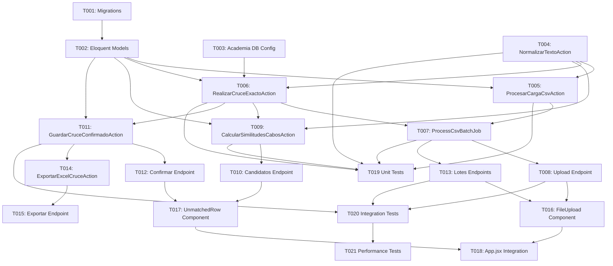

# Tasks: Motor de Cruce Automático de Ingresantes UNMSM

**Feature ID:** 001-motor-cruce-ingresantes
**Created:** 2026-06-25
**Status:** Planning

---

## Summary

| Phase | Tasks | Estimated Hours | Status |
|-------|-------|-----------------|--------|
| Phase 1: Foundation | 4 | 16h | Not Started |
| Phase 2: Core Implementation | 9 | 46h | Not Started |
| Phase 3: Frontend & Integration | 3 | 16h | Not Started |
| Phase 4: Phase 2 / Deferred | 2 | 12h | Not Started |
| Test Tasks [T] | 3 | 24h | Not Started |
| **Total** | **21** | **114h** | |

**Legend:**
- `[P]` = Parallel-safe (can run with other [P] tasks)
- `[S]` = Sequential (depends on previous tasks)
- `[T]` = Test task (can run parallel to feature tasks)
- `_Boundary:_` = Component/module/layer this task may touch (for review boundary-violation detection)
- `_Depends:_` = Prerequisite task IDs that must complete first

---

## Phase 1: Foundation

### T001 [P] - Database Schema Setup

_Boundary: Database, Migrations_
_Depends: —_

**Priority:** P0
**Estimated:** 6h
**Assignee:** Developer
**Status:** Not Started

**Description:**
Create Laravel migrations for the 4 new tables in the Vonex analytics DB.

**Files to Create/Modify:**
- `database/migrations/xxxx_create_lotes_cruce_table.php` [NEW]
- `database/migrations/xxxx_create_ingresantes_table.php` [NEW]
- `database/migrations/xxxx_create_no_ingresantes_table.php` [NEW]
- `database/migrations/xxxx_create_ingresante_candidatos_table.php` [NEW]

**Acceptance Criteria:**
- [ ] Migration `create_lotes_cruce_table`: BIGSERIAL PK, `fecha_examen DATE NOT NULL UNIQUE`, 7 integer counters, `estado VARCHAR(50) DEFAULT 'processing'`, timestamps `started_at`, `completed_at`, `created_at`, `updated_at`.
- [ ] Migration `create_ingresantes_table`: BIGSERIAL PK, FK `lote_cruce_id` (CASCADE), nullable `alumno_id`, 12 CSV-derived columns (`codigo`, `apellidos`, `nombres`, `eap`, `puntaje DECIMAL(8,3)`, `merito INT`, `observacion`, `tipo`, `modalidad`, `universidad`, `periodo`, `fecha DATE`), `estado_match VARCHAR(50) DEFAULT 'pendiente'`, nullable `porcentaje_similitud DECIMAL(5,2)`, timestamps. Composite index on `(apellidos, nombres)`.
- [ ] Migration `create_no_ingresantes_table`: Same 12 CSV columns as `ingresantes` + FK `lote_cruce_id` (CASCADE). **NO `updated_at` column** — this table is append-only per INV-02. Only `created_at`.
- [ ] Migration `create_ingresante_candidatos_table`: FK `ingresante_id` (CASCADE), `alumno_id BIGINT NOT NULL` (logical ref, no FK), `porcentaje_similitud DECIMAL(5,2) CHECK >= 30.00`, `ranking SMALLINT CHECK 1-5`, `UNIQUE(ingresante_id, ranking)`, only `created_at`.
- [ ] All migrations use `BIGSERIAL` (PostgreSQL) and `declare(strict_types=1)`.
- [ ] Migration `no_ingresantes`: incluir la creación del trigger `trg_no_ingresantes_readonly` que enforce INV-02 a nivel de base de datos.
- [ ] Verified via `php artisan migrate` on clean DB.

**Traces To:** data-model.md §5.1, INV-02, INV-03

---

### T002 [P] - Eloquent Models

_Boundary: EloquentModels_
_Depends: T001_

**Priority:** P0
**Estimated:** 4h
**Assignee:** Developer
**Status:** Not Started

**Description:**
Create Eloquent models with relationships, casts, fillables, and enums.

**Files to Create/Modify:**
- `app/Models/LoteCruce.php` [NEW]
- `app/Models/Ingresante.php` [NEW]
- `app/Models/NoIngresante.php` [NEW]
- `app/Models/IngresanteCandidato.php` [NEW]

**Acceptance Criteria:**
- [ ] `LoteCruce` model: `hasMany(Ingresante)`, `hasMany(NoIngresante)`. Cast `fecha_examen` to date, `started_at`/`completed_at` to datetime. Enum constants for `BatchStatus` (`processing`, `completed`, `paused`, `error`).
- [ ] `Ingresante` model: `belongsTo(LoteCruce)`, `hasMany(IngresanteCandidato)`. Cast `puntaje` to decimal, `fecha` to date, `porcentaje_similitud` to decimal. Enum constants for `MatchStatus` (`pendiente`, `confirmado_automatico`, `confirmado_manual`, `no_ingresado`). Accessor for logical `alumno` (cross-DB, no FK relation).
- [ ] `NoIngresante` model: `belongsTo(LoteCruce)`. Cast same fields. **No `updated_at`** — set `const UPDATED_AT = null;` per INV-02.
- [ ] `IngresanteCandidato` model: `belongsTo(Ingresante)`. Cast `porcentaje_similitud` to decimal. **No `updated_at`** — set `const UPDATED_AT = null;`.
- [ ] All models: `declare(strict_types=1)`, explicit `$fillable`, `$table` property set.
- [ ] Verify model relationships and casts via factory/tests.

**Traces To:** data-model.md §2, context-bridge.md Bounded Contexts

---

### T003 [P] - Academia Database Connection Config

_Boundary: DatabaseConfig_
_Depends: —_

**Priority:** P0
**Estimated:** 2h
**Assignee:** Developer
**Status:** Not Started

**Description:**
Configure the secondary PostgreSQL connection for the read-only Academia database.

**Files to Create/Modify:**
- `config/database.php` [MODIFY]
- `.env.example` [MODIFY]

**Acceptance Criteria:**
- [ ] Add `academia` connection to `config/database.php` using env vars: `DB_ACADEMIA_HOST`, `DB_ACADEMIA_PORT`, `DB_ACADEMIA_DATABASE`, `DB_ACADEMIA_USERNAME`, `DB_ACADEMIA_PASSWORD`.
- [ ] Update `.env.example` with all `DB_ACADEMIA_*` variables (no real values).
- [ ] Verify no hardcoded credentials exist (INV-08).
- [ ] Connection is read-only: no Eloquent model with `$connection = 'academia'` may have write operations.

**Traces To:** US-002 AC-005, INV-07, INV-08, NFR-004

---

### T004 [P] - NormalizarTextoAction

_Boundary: Actions_
_Depends: —_

**Priority:** P0
**Estimated:** 4h
**Assignee:** Developer
**Status:** Not Started

**Description:**
Implement the text normalization action that serves as the Anti-Corruption Layer.

**Files to Create/Modify:**
- `app/Actions/Cruce/NormalizarTextoAction.php` [NEW]

**Acceptance Criteria:**
- [ ] Converts all text to UPPERCASE.
- [ ] Removes all accents: á→A, é→E, í→I, ó→O, ú→U (and uppercase variants).
- [ ] Replaces `Ñ`/`ñ` with `N` strictly, no exceptions.
- [ ] Handles compound surnames correctly (AC-003): recognizes `DE LA`, `DEL`, `DE LOS`, `SAN` as surname prefixes.
- [ ] Returns a DTO or array with: `apellido_paterno`, `apellido_materno`, `nombres` (logically separated from single `APELLIDOS` input).
- [ ] `declare(strict_types=1)`.

**Traces To:** US-001 AC-002, AC-003, INV-05, context-bridge.md ACL

---

## Phase 2: Core Implementation

### T005 [P] - ProcesarCargaCsvAction

_Boundary: Actions_
_Depends: T002, T004_

**Priority:** P0
**Estimated:** 10h
**Assignee:** Developer
**Status:** Not Started

**Description:**
Parse, validate, deduplicate, and split the uploaded CSV by exam date.

**Files to Create/Modify:**
- `app/Actions/Cruce/ProcesarCargaCsvAction.php` [NEW]

**Acceptance Criteria:**
- [ ] Validate CSV encoding (UTF-8 or ISO-8859-1 only, reject others with ERR-002).
- [ ] Validate exactly 12 required headers: `CODIGO`, `APELLIDOS`, `NOMBRES`, `EAP`, `PUNTAJE`, `MERITO`, `OBSERVACION`, `TIPO`, `MODALIDAD`, `UNIVERSIDAD`, `PERIODO`, `FECHA` (AC-001a). Abort with ERR-001 if any are missing/wrong.
- [ ] Deduplicate identical rows within the same CSV (CQ-002, INV-04). Key = all 12 fields.
- [ ] Group rows by `FECHA` value.
- [ ] For each unique date: check `lotes_cruce` for existing record. If exists, skip silently and log the skip (INV-03).
- [ ] Normalize `OBSERVACION` field FIRST, then route: `ALCANZO VACANTE` → `ingresantes`, everything else → `no_ingresantes` (AC-004, CQ-001, INV-05).
- [ ] All inserts linked to same `lote_cruce_id`. Record totals per group.
- [ ] Rows with empty `NOMBRES` or `APELLIDOS`: log error with row number and continue (EC-001).
- [ ] If CSV has zero rows matching `ALCANZO VACANTE` after normalization: reject with ERR-004.
- [ ] Use bulk inserts (performance for ~27k rows).
- [ ] `declare(strict_types=1)`.

**Traces To:** US-001 AC-001, AC-001a, AC-004, CQ-001, CQ-002, INV-03, INV-04, INV-05

---

### T006 [S] - RealizarCruceExactoAction

_Boundary: Actions_
_Depends: T002, T003, T004_

**Priority:** P0
**Estimated:** 10h
**Assignee:** Developer
**Status:** Not Started

**Description:**
Perform exact matching (2 surnames + 1 name) against the Academia database.

**Files to Create/Modify:**
- `app/Actions/Cruce/RealizarCruceExactoAction.php` [NEW]

**Acceptance Criteria:**
- [ ] Validate connection to `academia` DB before any query (AC-005). Abort with ERR-003 if fails.
- [ ] Query the 3-table join (`alumno_matricula` → `alumnos` → `personas`) para obtener los campos de matching: `alumno_matricula.id` (usado como `alumno_id`), `personas.apellido_paterno`, `personas.apellido_materno`, `personas.nombres`, `alumno_matricula.estado` (numérico). Los campos adicionales para el reporte Excel (DNI, teléfonos, etc.) se obtienen bajo demanda.
- [ ] Fetch only active enrolled students: `estado IN (2, 3, 9, 13)`, `estado_aula = 1`, active ciclo (`ciclos.fecha_fin >= hoy`), exclude regular duplicates (`matricularegular_id IS NOT NULL`).
- [ ] Normalize academia data via `NormalizarTextoAction` before comparison (context-bridge ACL).
- [ ] Match criteria: 2 exact surnames + at least 1 exact first name (AC-008).
- [ ] On match: set `alumno_id`, `estado_match = 'confirmado_automatico'`, `porcentaje_similitud = 100.00`.
- [ ] **INVARIANT INV-01:** This action is the ONLY code path that may assign `confirmado_automatico`. No other action, job, or controller may set this value.
- [ ] For alumni with multiple historical records: resolve state using hierarchy INV-06 (MATRICULADO > PAGADO > FINALIZADO > SUSPENDIDO > RETIRADO > TRASLADADO > STAND BY > ANULADO).
- [ ] Zero write operations to `academia` connection (INV-07).
- [ ] `declare(strict_types=1)`.

**Traces To:** US-002 AC-005/AC-005a/AC-006/AC-007, US-003 AC-008, INV-01, INV-06, INV-07

---

### T007 [S] - ProcessCsvBatchJob

_Boundary: Jobs_
_Depends: T005, T006_

**Priority:** P0
**Estimated:** 6h
**Assignee:** Developer
**Status:** Not Started

**Description:**
Laravel Queue Job that orchestrates the CSV processing pipeline.

**Files to Create/Modify:**
- `app/Jobs/ProcessCsvBatchJob.php` [NEW]

**Acceptance Criteria:**
- [ ] Dispatched to `cruce` queue on Redis (`QUEUE_CONNECTION=redis`).
- [ ] Pipeline: `ProcesarCargaCsvAction` → `RealizarCruceExactoAction` → persist results.
- [ ] **Does NOT invoke `CalcularSimilitudesCabosAction`** — fuzzy match is lazy/on-demand per AD-001.
- [ ] Updates `lotes_cruce.estado` to `completed` on success, `error` on failure.
- [ ] Records `started_at` and `completed_at` timestamps.
- [ ] Updates all counter fields in `lotes_cruce` (`total_registros`, `total_ingresantes`, etc.).
- [ ] On failure: job moves to `failed_jobs`; lote stays in `processing` or moves to `error`; no data loss of already-inserted records (EC-008).
- [ ] On connection failure to Academia mid-process: pause batch, mark `estado = 'paused'`, alert admin (EC-007).
- [ ] On batch processing success: dispatches `CruceBatchProcessedEvent` with `lote_id`, `total_registros`, `total_ingresantes`, `total_no_ingresantes`. Verifiable via `Event::fake()` in tests. References: asyncapi.yaml CruceBatchProcessedEvent, TC-050.
- [ ] On batch processing failure: dispatches `CruceBatchFailedEvent` with `lote_id` and error details. Verifiable via `Event::fake()` in tests. References: asyncapi.yaml CruceBatchFailedEvent, TC-051.
- [ ] Performance: process ~27k rows in ≤ 50 seconds (NFR-001).
- [ ] `declare(strict_types=1)`.

**Traces To:** US-001 Technical Notes, NFR-001, NFR-006, AD-001

---

### T008 [S] - Upload Endpoint

_Boundary: Controllers_
_Depends: T007_

**Priority:** P0
**Estimated:** 4h
**Assignee:** Developer
**Status:** Not Started

**Description:**
Controller method to receive CSV upload and dispatch queue job.

**Files to Create/Modify:**
- `app/Http/Controllers/CruceIngresantesController.php` [NEW]
- `routes/api.php` [MODIFY]

**Acceptance Criteria:**
- [ ] `POST /api/cruce/upload` — accepts multipart file upload.
- [ ] Validate file size ≤ 20 MB (ERR-005 → HTTP 413).
- [ ] Validate file is CSV (Content-Type or extension check).
- [ ] Dispatch `ProcessCsvBatchJob` to Redis queue.
- [ ] Return immediately with HTTP 202: `{ lote_id, estado: "processing" }`.
- [ ] Auth: roles `admin` or `admisiones`.
- [ ] `declare(strict_types=1)`.

**Traces To:** US-001, plan.md §4.1 `POST /api/cruce/upload`, NFR-003, ERR-005

---

### T009 [P] - CalcularSimilitudesCabosAction

_Boundary: Actions_
_Depends: T002, T004, T006_

**Priority:** P1
**Estimated:** 10h
**Assignee:** Developer
**Status:** Not Started

**Description:**
Compute fuzzy match candidates lazily on first API call for a `pendiente` ingresante.

**Files to Create/Modify:**
- `app/Actions/Cruce/CalcularSimilitudesCabosAction.php` [NEW]

**Acceptance Criteria:**
- [ ] Compute similarity against academia alumni using Dice coefficient sobre bigramas de caracteres + Levenshtein distance. Formula: `similitud = Levenshtein × 0.6 + Dice_bigramas × 0.4`.
- [ ] Return up to 5 candidates sorted by descending similarity (AC-009).
- [ ] Only include candidates with similarity ≥ 30% (AC-010). If none, return empty array.
- [ ] On tie (equal similarity): break tie by alphabetical order of `apellidos` (EC-005).
- [ ] Persist computed candidates to `ingresante_candidatos` table (lazy persistence per AD-001).
- [ ] Subsequent calls: return cached data from `ingresante_candidatos` (no re-computation).
- [ ] Normalize academia data via `NormalizarTextoAction` before comparison.
- [ ] Response time ≤ 300ms p95 for cached calls (NFR-002).
- [ ] `declare(strict_types=1)`.

**Traces To:** US-003 AC-009, AC-010, AD-001, EC-005

---

### T010 [S] - Candidatos Endpoint

_Boundary: Controllers_
_Depends: T009_

**Priority:** P1
**Estimated:** 4h
**Assignee:** Developer
**Status:** Not Started

**Description:**
Endpoint to retrieve (or lazily compute) fuzzy match candidates.

**Files to Create/Modify:**
- `app/Http/Controllers/CruceIngresantesController.php` [MODIFY]

**Acceptance Criteria:**
- [ ] `GET /api/cruce/ingresantes/{id}/candidatos`.
- [ ] If candidates already computed (rows in `ingresante_candidatos`): return cached data.
- [ ] If not computed: invoke `CalcularSimilitudesCabosAction`, persist, return.
- [ ] Response format: array of `{ alumno_id, nombre_completo, porcentaje_similitud, estado_academia }`. Schema: openapi.yaml CandidatoMatch
- [ ] Auth: roles `admin` or `admisiones`.
- [ ] `declare(strict_types=1)`.

**Traces To:** US-003 AC-009, AD-001, NFR-002

---

### T011 [P] - GuardarCruceConfirmadoAction

_Boundary: Actions_
_Depends: T002, T006_

**Priority:** P1
**Estimated:** 4h
**Assignee:** Developer
**Status:** Not Started

**Description:**
Save manual match confirmation or mark as `no_ingresado`.

**Files to Create/Modify:**
- `app/Actions/Cruce/GuardarCruceConfirmadoAction.php` [NEW]

**Acceptance Criteria:**
- [ ] Accept `ingresante_id` and optional `alumno_id`.
- [ ] If `alumno_id` provided: validate it exists in `academia` DB. If not, return ERR-006 (HTTP 404).
- [ ] On valid match: set `estado_match = 'confirmado_manual'`, `alumno_id`, and update `porcentaje_similitud` from selected candidate.
- [ ] On `no_ingresado`: set `estado_match = 'no_ingresado'`, `alumno_id = null`.
- [ ] Update `lotes_cruce` counters (`total_pendientes`, `total_no_ingresado`).
- [ ] `declare(strict_types=1)`.

**Traces To:** US-004 AC-012, AC-013, ERR-006

---

### T012 [S] - Confirmar Endpoint

_Boundary: Controllers_
_Depends: T011_

**Priority:** P1
**Estimated:** 2h
**Assignee:** Developer
**Status:** Not Started

**Description:**
Endpoint to confirm a manual match or mark as no_ingresado.

**Files to Create/Modify:**
- `app/Http/Controllers/CruceIngresantesController.php` [MODIFY]

**Acceptance Criteria:**
- [ ] `POST /api/cruce/ingresantes/{id}/confirmar`.
- [ ] Accept body: `{ alumno_id: int|null }`. Null = no_ingresado.
- [ ] Delegate to `GuardarCruceConfirmadoAction`.
- [ ] Return HTTP 200 with updated ingresante state.
- [ ] Auth: roles `admin` or `admisiones`.

**Traces To:** US-004 AC-012, AC-013

---

### T013 [S] - Lotes Endpoints

_Boundary: Controllers_
_Depends: T007_

**Priority:** P1
**Estimated:** 4h
**Assignee:** Developer
**Status:** Not Started

**Description:**
CRUD-like endpoints for batch listing, status, and pending ingresantes.

**Files to Create/Modify:**
- `app/Http/Controllers/CruceIngresantesController.php` [MODIFY]

**Acceptance Criteria:**
- [ ] `GET /api/cruce/lotes` — paginated list of batches with counters.
- [ ] `GET /api/cruce/lotes/{lote_id}/status` — batch status with all counter fields.
- [ ] `GET /api/cruce/lotes/{lote_id}/pendientes` — paginated list of `estado_match = 'pendiente'` ingresantes.
- [ ] Auth: roles `admin`, `admisiones`, `marketing` (read-only endpoints).

**Traces To:** plan.md §4.1, NFR-005

---

## Phase 3: Frontend & Integration

### T016 [P] - FileUpload Component

_Boundary: ReactComponents_
_Depends: T008, T013_

**Priority:** P1
**Estimated:** 6h
**Assignee:** Developer
**Status:** Not Started

**Description:**
React component for CSV file upload with progress indicator.

**Files to Create/Modify:**
- `frontend/src/components/FileUpload.jsx` [NEW]
- `frontend/src/services/api.js` [NEW]

**Acceptance Criteria:**
- [ ] File input accepting only `.csv` files.
- [ ] Progress indicator during upload and async processing.
- [ ] Post-processing summary: total records, filtered by OBSERVACION, loaded into batch, skipped dates.
- [ ] Error display for ERR-001 through ERR-005.

**Traces To:** US-001 UI/UX Notes, US-004

---

### T017 [P] - UnmatchedRow Component

_Boundary: ReactComponents_
_Depends: T010, T012_

**Priority:** P1
**Estimated:** 6h
**Assignee:** Developer
**Status:** Not Started

**Description:**
React component for resolving pending ingresantes.

**Files to Create/Modify:**
- `frontend/src/components/UnmatchedRow.jsx` [NEW]

**Acceptance Criteria:**
- [ ] Display ingresante data (apellidos, nombres, fecha de examen).
- [ ] `<select>` dropdown with candidates sorted by descending similarity, showing name + percentage badge.
- [ ] First option: non-selectable placeholder "Selecciona un alumno...".
- [ ] "Sin coincidencias encontradas — Marcar como No Ingresado" option visually differentiated (red/warning).
- [ ] "Confirmar Match" button with spinner + success/error feedback, no page reload.
- [ ] After confirmation: row visually updates to reflect new state.

**Traces To:** US-004 AC-011, AC-012, AC-013

---

### T018 [S] - App.jsx Integration

_Boundary: ReactComponents_
_Depends: T016, T017_
_Note: T015 (exportar endpoint) removed from deps — Phase 3 UI does not require export integration to close._

**Priority:** P2
**Estimated:** 4h
**Assignee:** Developer
**Status:** Not Started

**Description:**
Orchestrate the full frontend flow: upload → status → pending list → resolution.

**Files to Create/Modify:**
- `frontend/src/App.jsx` [MODIFY]

**Acceptance Criteria:**
- [ ] Integrates `FileUpload` and `UnmatchedRow` components.
- [ ] Polling or WebSocket for batch status after upload.
- [ ] Paginated list of pending ingresantes per batch.

**Traces To:** plan.md §2.3

---

## Phase 4: Phase 2 / Deferred (FR-05 Nice to Have)

### T014 [S] - ExportarExcelCruceAction

_Boundary: Actions_
_Depends: T011_

**Priority:** P2
**Estimated:** 10h
**Assignee:** Developer
**Status:** Not Started

**Description:**
Generate the consolidated Excel report with 24 columns and analytics charts.

**Files to Create/Modify:**
- `app/Actions/Cruce/ExportarExcelCruceAction.php` [NEW]

**Acceptance Criteria:**
- [ ] **Sheet 1:** Exactly 24 columns (A–X) in strict order per AC-014:
  - A: CODIGO, B: DNI, C: APELLIDOS, D: NOMBRES, E: EAP, F: PUNTAJE, G: MERITO, H: OBSERVACION, I: TIPO, J: MODALIDAD, K: UNIVERSIDAD, L: PERIODO, M: FECHA, N: ANIO, O: SEDE, P: CICLO, Q: F-MATRICULA, R: CEL-ALUMNO, S: CEL-APODERADO, T: ESTADO, U: LISTA-1, V: LISTA-2, W: LISTA-3, X: AREA.
- [ ] **LISTA-1 (L1):** `1` if `periodo` ≥ "Verano 2024" cycle; `0` otherwise.
- [ ] **LISTA-2 (L2):** `1` if enrolled in cycle active as of Feb 2026, or Verano/Repaso 2026, or OCTUBRE 2025 (includes RETIRADO/SUSPENDIDO); `0` otherwise.
- [ ] **LISTA-3 (L3):** `1` if active (MATRICULADO, PAGADO, FINALIZADO) as of Feb 27, 2026; `0` otherwise.
- [ ] **AREA:** Map `EAP` to Areas A-E per spec.md keyword rules. Empty if no match.
- [ ] **ESTADO (T):** Resolved via hierarchy INV-06 for alumni with multiple records.
- [ ] **Sheet 2:** Pre-built charts (distribution by estado, sede, ciclo) with date slicers (AC-015).
- [ ] Use streaming writer (PhpSpreadsheet) to prevent memory exhaustion.
- [ ] Sanitize CSV fields for formula injection (`=`, `+`, `-`, `@`).
- [ ] `declare(strict_types=1)`.

**Traces To:** US-005 AC-014, AC-015, plan.md §2.4

---

### T015 [S] - Exportar Endpoint

_Boundary: Controllers_
_Depends: T014_

**Priority:** P2
**Estimated:** 2h
**Assignee:** Developer
**Status:** Not Started

**Description:**
Endpoint to download the generated Excel file.

**Files to Create/Modify:**
- `app/Http/Controllers/CruceIngresantesController.php` [MODIFY]

**Acceptance Criteria:**
- [ ] `GET /api/cruce/lotes/{lote_id}/exportar`.
- [ ] Returns binary Excel download (Content-Type: `application/vnd.openxmlformats-officedocument.spreadsheetml.sheet`).
- [ ] Auth: roles `admin`, `admisiones`, `marketing`.

**Traces To:** plan.md §4.1 `GET /api/cruce/lotes/{lote_id}/exportar`

---

## T019 [T] Unit Tests — Core Domain Actions

_Boundary: Tests_
_Depends: T004, T005, T006, T007, T009_

**Phase:** 1 (parallel to feature tasks)
**Priority:** P1
**Estimated:** 8h
**Assignee:** Developer
**Status:** Not Started

**Traces To:** US-001, US-002, US-003 — all unit-testable actions

**Scope:** Unit tests for: NormalizarTextoAction, ProcesarCargaCsvAction, RealizarCruceExactoAction, CalcularSimilitudesCabosAction

**Coverage:** TC-002, TC-003, TC-006, TC-007, TC-008

**Type:** PHPUnit unit tests, no DB

---

## T020 [T] Integration Tests — API Endpoints + Queue

_Boundary: Tests_
_Depends: T008, T011, T013_

**Phase:** 2 (after T008, T011, T013)
**Priority:** P1
**Estimated:** 10h
**Assignee:** Developer
**Status:** Not Started

**Traces To:** US-001, US-002, US-004, NFR-005, NFR-006

**Scope:** Feature tests for all HTTP endpoints + Redis queue job dispatch/processing

**Coverage:** TC-001, TC-004, TC-005, TC-009, TC-010, TC-015, TC-023, TC-025, TC-026, TC-027, TC-028, TC-029, TC-030, TC-031, TC-032, TC-033, TC-047, TC-048, TC-049, TC-050, TC-051

**Type:** Laravel feature tests with RefreshDatabase + Redis fake

---

## T021 [T] Performance + Security Tests

_Boundary: Tests_
_Depends: T020_

**Phase:** 3 (after T020)
**Priority:** P1
**Estimated:** 6h
**Assignee:** Developer
**Status:** Not Started

**Traces To:** NFR-001, NFR-002, NFR-003, NFR-004, NFR-006, INV-07, INV-08

**Scope:** Load tests for NFR-001/NFR-002, credential scan, 20 MB upload validation

**Coverage:** TC-028, TC-029, TC-030, TC-031, TC-041, TC-046

**Type:** k6 / Artillery for load; truffleHog/gitleaks for credential scan

---

## Dependencies Graph

---

## Progress Tracking

| Task | Status | Started | Completed | Notes |
|------|--------|---------|-----------|-------|
| T001 | Not Started | | | |
| T002 | Not Started | | | |
| T003 | Not Started | | | |
| T004 | Not Started | | | |
| T005 | Not Started | | | |
| T006 | Not Started | | | |
| T007 | Not Started | | | |
| T008 | Not Started | | | |
| T009 | Not Started | | | |
| T010 | Not Started | | | |
| T011 | Not Started | | | |
| T012 | Not Started | | | |
| T013 | Not Started | | | |
| T016 | Not Started | | | |
| T017 | Not Started | | | |
| T018 | Not Started | | | |
| T014 | Not Started | | | |
| T015 | Not Started | | | |
| T019 | Not Started | | | |
| T020 | Not Started | | | |
| T021 | Not Started | | | |
