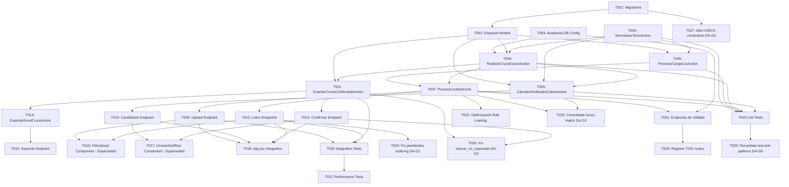

# Tasks: Motor de Cruce Automático de Ingresantes UNMSM

**Feature ID:** 001-motor-cruce-ingresantes
**Created:** 2026-06-25
**Status:** Partial — core feature Implemented; 6 gap-remediation tasks (T024–T029) Not Started; T020 integration tests genuinely missing; T022 partial (routes not registered). See Progress Tracking and plan.md Design Addendum (2026-07-07).

---

## Summary

> **Corrected 2026-07-07:** the previous version of this table claimed 25 tasks / 56h for Phase 2 and a phantom "Post-Implementation: 2 tasks" row that did not correspond to any actual task section. Recomputed from the real per-task `Estimated` fields below: 23 distinct original task IDs (T001–T023) sum to 132h, and there is no separate "Post-Implementation" phase in the task bodies — that row is removed. Six new remediation tasks (T024–T029, 23h) are added per the Design Addendum.

| Phase | Tasks | Estimated Hours | Status |
|-------|-------|-----------------|--------|
| Phase 1: Foundation | 4 | 16h | Completed |
| Phase 2: Core Implementation | 11 | 64h | Completed |
| Phase 3: Frontend & Integration | 3 | 16h | Completed (T016/T017 superseded — see notes) |
| Phase 4: Phase 2 / Deferred | 2 | 12h | Completed |
| Test Tasks [T] | 3 | 24h | Partial (T019, T021 Completed; T020 Not Started) |
| Phase 5: Post-Implementation Gap Remediation (2026-07-07) | 6 | 23h | Not Started |
| T030 — Unplanned/emergent (production bug found live during QA, 2026-07-07) | 1 | 3h | Completed |
| **Total** | **30** | **158h** | |

**Legend:**
- `[P]` = Parallel-safe (can run with other [P] tasks)
- `[S]` = Sequential (depends on previous tasks)
- `[T]` = Test task (can run parallel to feature tasks)
- `_Boundary:_` = Component/module/layer this task may touch (for review boundary-violation detection)
- `_Depends:_` = Prerequisite task IDs that must complete first

---

## Phase 1: Foundation

### T001 [P] - Database Schema Setup

_Boundary: Database, Migrations_
_Depends: —_

**Priority:** P0
**Estimated:** 6h
**Assignee:** Developer
**Status:** Completed

**Description:**
Create Laravel migrations for the 4 new tables in the Vonex analytics DB.

**Files to Create/Modify:**
- `database/migrations/xxxx_create_lotes_cruce_table.php` [NEW]
- `database/migrations/xxxx_create_ingresantes_table.php` [NEW]
- `database/migrations/xxxx_create_no_ingresantes_table.php` [NEW]
- `database/migrations/xxxx_create_ingresante_candidatos_table.php` [NEW]

**Acceptance Criteria:**
- [ ] Migration `create_lotes_cruce_table`: BIGSERIAL PK, `fecha_examen DATE NOT NULL UNIQUE`, 7 integer counters, `estado VARCHAR(50) DEFAULT 'processing'`, timestamps `started_at`, `completed_at`, `created_at`, `updated_at`.
- [ ] Migration `create_ingresantes_table`: BIGSERIAL PK, FK `lote_cruce_id` (CASCADE), nullable `alumno_id`, 12 CSV-derived columns (`codigo`, `apellidos`, `nombres`, `eap`, `puntaje DECIMAL(8,3)`, `merito INT`, `observacion`, `tipo`, `modalidad`, `universidad`, `periodo`, `fecha DATE`), `estado_match VARCHAR(50) DEFAULT 'pendiente'`, nullable `porcentaje_similitud DECIMAL(5,2)`, timestamps. Composite index on `(apellidos, nombres)`.
- [ ] Migration `create_no_ingresantes_table`: Same 12 CSV columns as `ingresantes` + FK `lote_cruce_id` (CASCADE). **NO `updated_at` column** — this table is append-only per INV-02. Only `created_at`.
- [ ] Migration `create_ingresante_candidatos_table`: FK `ingresante_id` (CASCADE), `alumno_id BIGINT NOT NULL` (logical ref, no FK), `porcentaje_similitud DECIMAL(5,2) CHECK >= 70.00` **[Corrected 2026-07-07 — was `30.00`, contradicted the canonical 70% persistence threshold; see plan.md Threshold Reconciliation]**, `ranking SMALLINT CHECK 1-5`, `UNIQUE(ingresante_id, ranking)`, only `created_at`.
- [ ] **⚠ Deployed-migration drift (DA-G4):** the migration actually deployed (`2026_07_05_000004_create_ingresante_candidatos_table.php`) does **not** implement either CHECK constraint — only `UNIQUE(ingresante_id, ranking)` exists. A corrective migration adds them; see T027.
- [ ] All migrations use `BIGSERIAL` (PostgreSQL) and `declare(strict_types=1)`.
- [ ] Migration `no_ingresantes`: incluir la creación del trigger `trg_no_ingresantes_readonly` que enforce INV-02 a nivel de base de datos.
- [ ] Verified via `php artisan migrate` on clean DB.

**Traces To:** data-model.md §5.1, INV-02, INV-03

---

### T002 [P] - Eloquent Models

_Boundary: EloquentModels_
_Depends: T001_

**Priority:** P0
**Estimated:** 4h
**Assignee:** Developer
**Status:** Completed

**Description:**
Create Eloquent models with relationships, casts, fillables, and enums.

**Files to Create/Modify:**
- `app/Models/LoteCruce.php` [NEW]
- `app/Models/Ingresante.php` [NEW]
- `app/Models/NoIngresante.php` [NEW]
- `app/Models/IngresanteCandidato.php` [NEW]

**Acceptance Criteria:**
- [ ] `LoteCruce` model: `hasMany(Ingresante)`, `hasMany(NoIngresante)`. Cast `fecha_examen` to date, `started_at`/`completed_at` to datetime. Enum constants for `BatchStatus` (`processing`, `completed`, `paused`, `error`).
- [ ] `Ingresante` model: `belongsTo(LoteCruce)`, `hasMany(IngresanteCandidato)`. Cast `puntaje` to decimal, `fecha` to date, `porcentaje_similitud` to decimal. Enum constants for `MatchStatus` (`pendiente`, `confirmado_automatico`, `confirmado_manual`, `no_ingresado`). Accessor for logical `alumno` (cross-DB, no FK relation).
- [ ] `NoIngresante` model: `belongsTo(LoteCruce)`. Cast same fields. **No `updated_at`** — set `const UPDATED_AT = null;` per INV-02.
- [ ] `IngresanteCandidato` model: `belongsTo(Ingresante)`. Cast `porcentaje_similitud` to decimal. **No `updated_at`** — set `const UPDATED_AT = null;`.
- [ ] All models: `declare(strict_types=1)`, explicit `$fillable`, `$table` property set.
- [ ] Verify model relationships and casts via factory/tests.

**Traces To:** data-model.md §2, context-bridge.md Bounded Contexts

---

### T003 [P] - Academia Database Connection Config

_Boundary: DatabaseConfig_
_Depends: —_

**Priority:** P0
**Estimated:** 2h
**Assignee:** Developer
**Status:** Completed

**Description:**
Configure the secondary PostgreSQL connection for the read-only Academia database.

**Files to Create/Modify:**
- `config/database.php` [MODIFY]
- `.env.example` [MODIFY]

**Acceptance Criteria:**
- [ ] Add `academia` connection to `config/database.php` using env vars: `DB_ACADEMIA_HOST`, `DB_ACADEMIA_PORT`, `DB_ACADEMIA_DATABASE`, `DB_ACADEMIA_USERNAME`, `DB_ACADEMIA_PASSWORD`.
- [ ] Update `.env.example` with all `DB_ACADEMIA_*` variables (no real values).
- [ ] Verify no hardcoded credentials exist (INV-08).
- [ ] Connection is read-only: no Eloquent model with `$connection = 'academia'` may have write operations.

**Traces To:** US-002 AC-005, INV-07, INV-08, NFR-004

---

### T004 [P] - NormalizarTextoAction

_Boundary: Actions_
_Depends: —_

**Priority:** P0
**Estimated:** 4h
**Assignee:** Developer
**Status:** Completed

**Description:**
Implement the text normalization action that serves as the Anti-Corruption Layer.

**Files to Create/Modify:**
- `app/Actions/Cruce/NormalizarTextoAction.php` [NEW]

**Acceptance Criteria:**
- [ ] Converts all text to UPPERCASE.
- [ ] Removes all accents: á→A, é→E, í→I, ó→O, ú→U (and uppercase variants).
- [ ] Replaces `Ñ`/`ñ` with `N` strictly, no exceptions.
- [ ] Handles compound surnames correctly (AC-003): recognizes `DE LA`, `DEL`, `DE LOS`, `SAN` as surname prefixes.
- [ ] Returns a DTO or array with: `apellido_paterno`, `apellido_materno`, `nombres` (logically separated from single `APELLIDOS` input).
- [ ] `declare(strict_types=1)`.

**Traces To:** US-001 AC-002, AC-003, INV-05, context-bridge.md ACL

---

## Phase 2: Core Implementation

### T005 [P] - ProcesarCargaCsvAction

_Boundary: Actions_
_Depends: T002, T004_

**Priority:** P0
**Estimated:** 10h
**Assignee:** Developer
**Status:** Completed

**Description:**
Parse, validate, deduplicate, and split the uploaded CSV by exam date.

**Files to Create/Modify:**
- `app/Actions/Cruce/ProcesarCargaCsvAction.php` [NEW]

**Acceptance Criteria:**
- [ ] Validate CSV encoding (UTF-8 or ISO-8859-1 only, reject others with ERR-002).
- [ ] Validate exactly 12 required headers: `CODIGO`, `APELLIDOS`, `NOMBRES`, `EAP`, `PUNTAJE`, `MERITO`, `OBSERVACION`, `TIPO`, `MODALIDAD`, `UNIVERSIDAD`, `PERIODO`, `FECHA` (AC-001a). Abort with ERR-001 if any are missing/wrong.
- [ ] Deduplicate identical rows within the same CSV (CQ-002, INV-04). Key = all 12 fields.
- [ ] Group rows by `FECHA` value.
- [ ] For each unique date: check `lotes_cruce` for existing record. If exists, skip silently and log the skip (INV-03).
- [ ] Normalize `OBSERVACION` field FIRST, then route: `ALCANZO VACANTE` → `ingresantes`, everything else → `no_ingresantes` (AC-004, CQ-001, INV-05).
- [ ] All inserts linked to same `lote_cruce_id`. Record totals per group.
- [ ] Rows with empty `NOMBRES` or `APELLIDOS`: log error with row number and continue (EC-001).
- [ ] If CSV has zero rows matching `ALCANZO VACANTE` after normalization: reject with ERR-004.
- [ ] Use bulk inserts (performance for ~27k rows).
- [ ] `declare(strict_types=1)`.

**Traces To:** US-001 AC-001, AC-001a, AC-004, CQ-001, CQ-002, INV-03, INV-04, INV-05

---

### T006 [S] - RealizarCruceExactoAction

_Boundary: Actions_
_Depends: T002, T003, T004_

**Priority:** P0
**Estimated:** 10h
**Assignee:** Developer
**Status:** Completed

**Description:**
Perform exact matching (2 surnames + 1 name) against the Academia database.

**Files to Create/Modify:**
- `app/Actions/Cruce/RealizarCruceExactoAction.php` [NEW]

**Acceptance Criteria:**
- [ ] Validate connection to `academia` DB before any query (AC-005). Abort with ERR-003 if fails.
- [ ] Query the 3-table join (`alumno_matricula` → `alumnos` → `personas`) para obtener los campos de matching: `alumno_matricula.id` (usado como `alumno_id`), `personas.apellido_paterno`, `personas.apellido_materno`, `personas.nombres`, `alumno_matricula.estado` (numérico). Los campos adicionales para el reporte Excel (DNI, teléfonos, etc.) se obtienen bajo demanda.
- [ ] Fetch only active enrolled students: `estado IN (2, 3, 9, 13, 14)`, `estado_aula = 1`, active ciclo (`ciclos.fecha_fin >= hoy`), exclude regular duplicates (`matricularegular_id IS NOT NULL`).
  > **Corrección (2026-07-07, decisión PO — T039):** el allow-list se amplía a `estado IN (0, 2, 3, 9, 13, 14)`, incluyendo RETIRADO (0); ANULADO(11)/TRASLADADO(12) permanecen excluidos.
- [ ] Normalize academia data via `NormalizarTextoAction` before comparison (context-bridge ACL).
- [ ] Match criteria: 2 exact surnames + at least 1 exact first name (AC-008).
- [ ] On match: set `alumno_id`, `estado_match = 'confirmado_automatico'`, `porcentaje_similitud = 100.00`.
- [ ] **INVARIANT INV-01:** This action is the ONLY code path that may assign `confirmado_automatico`. No other action, job, or controller may set this value.
- [ ] For alumni with multiple historical records: resolve state using hierarchy INV-06 (MATRICULADO (2) > PAGADO (3) > FINALIZADO (14) > SUSPENDIDO (9) > RETIRADO (0) > TRASLADADO (12) > STAND BY (13) > ANULADO (11)).
- [ ] Zero write operations to `academia` connection (INV-07).
- [ ] `declare(strict_types=1)`.

**Traces To:** US-002 AC-005/AC-005a/AC-006/AC-007, US-003 AC-008, INV-01, INV-06, INV-07

---

### T007 [S] - ProcessCsvBatchJob

_Boundary: Jobs_
_Depends: T005, T006_

**Priority:** P0
**Estimated:** 6h
**Assignee:** Developer
**Status:** Completed

**Description:**
Laravel Queue Job that orchestrates the full CSV processing pipeline, including fuzzy match.

**Files to Create/Modify:**
- `app/Jobs/ProcessCsvBatchJob.php` [NEW]

**Acceptance Criteria:**
- [ ] Dispatched to `cruce` queue on Redis (`QUEUE_CONNECTION=redis`).
- [ ] Pipeline: `ProcesarCargaCsvAction` → `RealizarCruceExactoAction` → `CalcularSimilitudesCabosAction` → persist candidatos.
- [ ] **Invokes `CalcularSimilitudesCabosAction`** — fuzzy match is EAGER dentro del job per AD-001 (actualizado). **[Gap confirmed 2026-07-07 — DA-G2]:** in the deployed code, `ProcessCsvBatchJob::fuzzyMatchAndSave` is actually a full private reimplementation of the algorithm; it does not call `CalcularSimilitudesCabosAction`. This AC bullet was never true as written. Consolidation tracked in T025.
- [ ] Updates `lotes_cruce.estado` to `completed` on success, `error` on failure.
- [ ] Records `started_at` and `completed_at` timestamps.
- [ ] Updates all counter fields in `lotes_cruce` (`total_registros`, `total_ingresantes`, etc.).
- [ ] On failure: job moves to `failed_jobs`; lote stays in `processing` or moves to `error`; no data loss of already-inserted records (EC-008).
- [ ] On connection failure to Academia mid-process: pause batch, mark `estado = 'paused'`, alert admin (EC-007).
- [ ] On batch processing success: dispatches `CruceBatchProcessedEvent` with `lote_id`, `total_registros`, `total_ingresantes`, `total_no_ingresantes`. Verifiable via `Event::fake()` in tests. References: asyncapi.yaml CruceBatchProcessedEvent, TC-050.
- [ ] On batch processing failure: dispatches `CruceBatchFailedEvent` with `lote_id` and error details. Verifiable via `Event::fake()` in tests. References: asyncapi.yaml CruceBatchFailedEvent, TC-051.
- [ ] Performance: process ~27k rows in ≤ 50 seconds (NFR-001).
- [ ] `declare(strict_types=1)`.

**Traces To:** US-001 Technical Notes, NFR-001, NFR-006, AD-001 (actualizado)

---

### T008 [S] - Upload Endpoint

_Boundary: Controllers_
_Depends: T007_

**Priority:** P0
**Estimated:** 4h
**Assignee:** Developer
**Status:** Completed

**Description:**
Controller method to receive CSV upload and dispatch queue job.

**Files to Create/Modify:**
- `app/Http/Controllers/CruceIngresantesController.php` [NEW]
- `routes/api.php` [MODIFY]

**Acceptance Criteria:**
- [ ] `POST /api/cruce/upload` — accepts multipart file upload.
- [ ] Validate file size ≤ 20 MB (ERR-005 → HTTP 413).
- [ ] Validate file is CSV (Content-Type or extension check).
- [ ] Dispatch `ProcessCsvBatchJob` to Redis queue.
- [ ] Return immediately with HTTP 202: `{ lote_id, estado: "processing" }`.
- [ ] Auth: roles `admin` or `admisiones`.
- [ ] `declare(strict_types=1)`.

**Traces To:** US-001, plan.md §4.1 `POST /api/cruce/upload`, NFR-003, ERR-005

---

### T009 [P] - CalcularSimilitudesCabosAction

_Boundary: Actions_
_Depends: T002, T004, T006_

**Priority:** P1
**Estimated:** 10h
**Assignee:** Developer
**Status:** Completed

**Description:**
Compute fuzzy match candidates EAGERLY inside `ProcessCsvBatchJob` for all `pendiente` ingresantes, not on-demand.

**Files to Create/Modify:**
- `app/Actions/Cruce/CalcularSimilitudesCabosAction.php` [NEW]

**Acceptance Criteria:**
- [ ] Compute similarity against academia alumni using Dice coefficient sobre bigramas de caracteres + Levenshtein distance. Formula: `similitud = Levenshtein × 0.6 + Dice_bigramas × 0.4`.
- [ ] Return up to 5 candidates sorted by descending similarity (AC-009).
- [ ] Only include candidates with similarity ≥ 70% (AC-010). If none, return empty array.
- [ ] On tie (equal similarity): break tie by alphabetical order of `apellidos` (EC-005).
- [ ] Persist computed candidates to `ingresante_candidatos` table (eager persistence per AD-001 actualizado).
- [ ] Subsequent calls: return cached data from `ingresante_candidatos` (no re-computation).
- [ ] Normalize academia data via `NormalizarTextoAction` before comparison.
- [ ] Ya no se invoca on-demand desde el endpoint — es llamado por `ProcessCsvBatchJob` para todo el lote.
- [ ] Recibe la colección de alumnos activos ya cargada (ver T023) para evitar N+1 queries.
- [ ] `declare(strict_types=1)`.
- [ ] **Note (2026-07-07 — DA-G2/DA-G6):** this Action's compute branch is exercised only by tests and by the `candidatos`/`reprocesar` read paths today — the job's write path does not call it (see T007 note). It also currently contains a `runningUnitTests() ? 55 : 70` threshold branch (anti-pattern, see T019/T029). Both are tracked for remediation, not re-scoped here.

**Traces To:** US-003 AC-009, AC-010, AD-001 (actualizado), EC-005

---

### T010 [S] - Candidatos Endpoint

_Boundary: Controllers_
_Depends: T009_

**Priority:** P1
**Estimated:** 4h
**Assignee:** Developer
**Status:** Completed

**Description:**
Endpoint to retrieve pre-computed fuzzy match candidates (SELECT only, no computation).

**Files to Create/Modify:**
- `app/Http/Controllers/CruceIngresantesController.php` [MODIFY]

**Acceptance Criteria:**
- [ ] `GET /api/cruce/ingresantes/{id}/candidatos`.
- [ ] If candidates already computed (rows in `ingresante_candidatos`): return cached data.
- [ ] If not computed: invoke `CalcularSimilitudesCabosAction`, persist, return.
- [ ] Response format: array of `{ alumno_id, nombre_completo, porcentaje_similitud, estado_academia }`. Schema: openapi.yaml CandidatoMatch
- [ ] Auth: roles `admin` or `admisiones`.
- [ ] `declare(strict_types=1)`.

**Traces To:** US-003 AC-009, AD-001, NFR-002

---

### T011 [P] - GuardarCruceConfirmadoAction

_Boundary: Actions_
_Depends: T002, T006_

**Priority:** P1
**Estimated:** 4h
**Assignee:** Developer
**Status:** Completed

**Description:**
Save manual match confirmation or mark as `no_ingresado`.

**Files to Create/Modify:**
- `app/Actions/Cruce/GuardarCruceConfirmadoAction.php` [NEW]

**Acceptance Criteria:**
- [ ] Accept `ingresante_id` and optional `alumno_id`.
- [ ] If `alumno_id` provided: validate it exists in `academia` DB. If not, return ERR-006 (HTTP 404).
- [ ] On valid match: set `estado_match = 'confirmado_manual'`, `alumno_id`, and update `porcentaje_similitud` from selected candidate.
- [ ] On `no_ingresado`: set `estado_match = 'no_ingresado'`, `alumno_id = null`.
- [ ] Update `lotes_cruce` counters (`total_pendientes`, `total_no_ingresado`).
- [ ] `declare(strict_types=1)`.
- [ ] **Confirmed correct (2026-07-07):** this Action already implements the third `bool $marcarNoIngresado = false` parameter correctly. The defect is downstream in T012 (controller never forwards the flag) — see T012 note and T026.

**Traces To:** US-004 AC-012, AC-013, ERR-006

---

### T012 [S] - Confirmar Endpoint

_Boundary: Controllers_
_Depends: T011_

**Priority:** P1
**Estimated:** 2h
**Assignee:** Developer
**Status:** Completed

**Description:**
Endpoint to confirm a manual match or mark as no_ingresado.

**Files to Create/Modify:**
- `app/Http/Controllers/CruceIngresantesController.php` [MODIFY]

**Acceptance Criteria:**
- [ ] `POST /api/cruce/ingresantes/{id}/confirmar`.
- [ ] Accept body: `{ alumno_id: int|null }`. Null = no_ingresado.
- [ ] Delegate to `GuardarCruceConfirmadoAction`.
- [ ] Return HTTP 200 with updated ingresante state.
- [ ] Auth: roles `admin` or `admisiones`.
- [ ] **Bug confirmed (2026-07-07 — DA-G3):** the deployed controller validates only `alumno_id` and never reads `marcar_no_ingresado` from the request, so it always calls `GuardarCruceConfirmadoAction::execute($id, $request->integer('alumno_id'))` (2-arg form). Since `$request->integer()` returns `0` when the field is absent, "Mark as No Match" clicks persist a corrupt `estado_match='confirmado_manual', alumno_id=0` row instead of `no_ingresado`. Fix wiring tracked in T026 — **do not treat this AC as satisfied.**

**Traces To:** US-004 AC-012, AC-013

---

### T013 [S] - Lotes Endpoints

_Boundary: Controllers_
_Depends: T007_

**Priority:** P1
**Estimated:** 4h
**Assignee:** Developer
**Status:** Completed — **AC violated, superseded by T024 (2026-07-07)**

**Description:**
CRUD-like endpoints for batch listing, status, and pending ingresantes.

**Files to Create/Modify:**
- `app/Http/Controllers/CruceIngresantesController.php` [MODIFY]

**Acceptance Criteria:**
- [ ] `GET /api/cruce/lotes` — paginated list of batches with counters.
- [ ] `GET /api/cruce/lotes/{lote_id}/status` — batch status with all counter fields.
- [ ] ~~`GET /api/cruce/lotes/{lote_id}/pendientes` — paginated list of `estado_match = 'pendiente'` ingresantes. Los registros deben venir ordenados por: `ingresante_candidatos_count DESC`, `max_similitud DESC`, `apellido_paterno ASC`, `apellido_materno ASC`. Esto asegura que los ingresantes con más candidatos y mayor similitud aparezcan primero, y los que no tienen candidatos queden al final.~~ **[Violated — confirmed 2026-07-07]:** the deployed `pendientes()` uses `whereHas('candidatos', >= 80)`, which **excludes** rows instead of sorting them last, and sorts by `max_similitud DESC` first (not `candidatos_count DESC`). This is not a minor deviation — it drops rows the AC requires to be present. Do not mark this bullet as delivered as originally scoped; the corrected behavior is designed in plan.md DA-G1 and implemented by **T024**.
- [ ] Auth: roles `admin`, `admisiones`, `marketing` (read-only endpoints).

**Traces To:** plan.md §4.1, NFR-005, spec.md US-004 UI/UX Notes

---

### T022 [P] - Endpoints de Utilidad

_Boundary: Controllers_
_Depends: T007, T003_

**Priority:** P1
**Estimated:** 6h
**Assignee:** Developer
**Status:** Partial — controller methods implemented, routes not registered (2026-07-07)

**Description:**
Implement utility endpoints for health monitoring, academia alumni listing, data cleanup, and batch reprocessing.

**Note (2026-07-07):** `CruceIngresantesController::health()`, `::academiaAlumnos()`, `::limpiar()`, and `::reprocesar()` are all implemented and functionally correct, but none of the 4 routes are registered in `routes/api.php` — the endpoints are unreachable via HTTP. Fix tracked in **T028**.

**Files to Create/Modify:**
- `app/Http/Controllers/CruceIngresantesController.php` [MODIFY]
- `routes/api.php` [MODIFY]

**Acceptance Criteria:**
- [ ] `GET /api/cruce/health` — health check endpoint. Returns queue connection status, academia DB connection status, analytics DB connection status. No auth required.
- [ ] `GET /api/cruce/academia/alumnos` — list active alumnos from academia DB with pagination and search. Supports `?search=` query param for name/apellido filtering. Auth: `admin`, `admisiones`.
- [ ] `DELETE /api/cruce/limpiar` — wipe all cruce data: deletes all records from `ingresante_candidatos`, `ingresantes`, `no_ingresantes`, `lotes_cruce`. Returns confirmation with count of deleted records. Auth: `admin` only.
- [ ] `POST /api/cruce/lotes/{lote_id}/reprocesar` — re-process a batch. Steps: (1) run `queue:clear` for the `cruce` queue, (2) clear existing candidatos for the lote, (3) reset ingresantes `estado_match` to `pendiente`, (4) dispatch new `ProcessCsvBatchJob`. Auth: `admin`, `admisiones`.
- [ ] `declare(strict_types=1)`.

**Traces To:** plan.md §4.1 (nuevos endpoints), AD-001, NFR-006

---

### T023 [P] - Optimización Bulk Loading de Alumnos Academia

_Boundary: Actions, Jobs_
_Depends: T007_

**Priority:** P2
**Estimated:** 4h
**Assignee:** Developer
**Status:** Completed

**Description:**
Optimize ProcessCsvBatchJob to load academia alumnos once and pass the collection to both exact match and fuzzy match actions, eliminating duplicated DB round-trips.

**Files to Create/Modify:**
- `app/Jobs/ProcessCsvBatchJob.php` [MODIFY]
- `app/Actions/Cruce/RealizarCruceExactoAction.php` [MODIFY]
- `app/Actions/Cruce/CalcularSimilitudesCabosAction.php` [MODIFY]

**Acceptance Criteria:**
- [ ] `ProcessCsvBatchJob` loads active alumnos once via `AlumnoMatricula::getActivosConNombres()`.
- [ ] Pass the `Collection<AlumnoMatricula>` to both `RealizarCruceExactoAction` and `CalcularSimilitudesCabosAction`.
- [ ] Both actions accept an optional pre-loaded collection parameter; if provided, skip the DB query.
- [ ] Eliminates duplicated DB queries to academia for each phase (exact + fuzzy).
- [ ] Performance: no measurable increase in total batch time despite adding fuzzy computation, because the DB round-trip is eliminated.
- [ ] `declare(strict_types=1)`.

**Traces To:** AD-001 (actualizado), NFR-001, T007, T009

---

## Phase 5: Post-Implementation Gap Remediation (2026-07-07)

> Six tasks tracing to the confirmed gaps in plan.md "Design Addendum — Post-Implementation Gap Remediation (2026-07-07)". These correct genuine deviations between the deployed code and the signed-off specification/design; none are new scope.

### T024 [S] - Fix pendientes() Ordering/Filtering per Design Addendum DA-G1

_Boundary: Controllers_
_Depends: T013_

**Priority:** P1
**Estimated:** 4h
**Assignee:** Developer
**Status:** Completed

**Description:**
Correct `CruceIngresantesController::pendientes()` so it no longer excludes `pendiente` ingresantes lacking a ≥80% candidate, and sorts by the contract T013 originally specified (candidates-first, then zero-candidate rows last). Implements the query design in plan.md DA-G1.

**Files to Create/Modify:**
- `app/Http/Controllers/CruceIngresantesController.php` [MODIFY]

**Acceptance Criteria:**
- [x] AC-G1.1: Remove the `whereHas('candidatos', >= 80)` row-exclusion predicate; every `estado_match = 'pendiente'` ingresante of the lote is returned.
- [x] AC-G1.2: Result ordering is exactly `candidatos_count DESC, max_similitud DESC, apellido_paterno ASC, apellido_materno ASC`.
- [x] AC-G1.3: An ingresante with zero candidates appears in the payload with an empty `candidatos` array and `max_similitud = 0`, sorted after every ingresante with ≥1 candidate.
- [x] AC-G1.4: Each row's `candidatos` includes all persisted candidates (already ≥70%) ordered by `ranking`; no per-candidate ≥80% filter on the eager-loaded relation. The ≥80% concept may only surface as a non-exclusionary UI badge ("alta confianza ≥80%"), never as a filter that hides rows or candidates.
- [x] AC-G1.5: Pagination `meta.total` reflects the full pendiente population, not the ≥80% subset.
- [x] No new index or denormalized column added — the existing `UNIQUE(ingresante_id, ranking)` and `(apellido_paterno, apellido_materno, nombres)` indexes are sufficient at documented volume (data-model.md §7.1).

**Traces To:** T013, NFR-005, spec.md US-004 AC-009/AC-010, plan.md DA-G1

---

### T025 [S] - Consolidate Fuzzy-Match Implementation per Design Addendum DA-G2

_Boundary: Actions, Jobs_
_Depends: T007, T009_

**Priority:** P1
**Estimated:** 8h
**Assignee:** Developer
**Status:** Not Started

**Description:**
Make `CalcularSimilitudesCabosAction` the single source of truth for the fuzzy scoring algorithm (Levenshtein × 0.6 + Dice bigramas × 0.4, ≥70% floor, top-5, ranking). Add a batch entry point that accepts the pre-loaded academia index (bigram hashes + by-initial blocking, AD-004) so `ProcessCsvBatchJob` delegates to it instead of carrying its own private reimplementation, while preserving the single academia-load (T023) and bulk insert.

**Files to Create/Modify:**
- `app/Actions/Cruce/CalcularSimilitudesCabosAction.php` [MODIFY]
- `app/Jobs/ProcessCsvBatchJob.php` [MODIFY]

**Acceptance Criteria:**
- [ ] AC-G2.1: The fuzzy scoring formula exists in exactly one place — `CalcularSimilitudesCabosAction`.
- [ ] AC-G2.2: `ProcessCsvBatchJob` produces its `ingresante_candidatos` rows by delegating to the Action's new batch entry point (receiving the pre-loaded `alumnosIndex`), preserving the single academia-load and bulk insert.
- [ ] AC-G2.3: No behavioral change to persisted candidates for a fixed input — golden-set parity before/after the refactor.
- [ ] AC-G2.4: NFR-001 (≤50 s/lote) still holds after consolidation.
- [ ] The Action's batch entry point does not re-load academia data or re-normalize per ingresante; the existing single-`ingresanteId` entry point remains as a thin wrapper for the `candidatos`/`reprocesar` read paths and unit tests.

**Note (2026-07-07, T036):** T036 already extracted and shared one piece of what this task eventually wants — the INV-06 estado-hierarchy dedup for duplicate person records — via `App\Actions\Cruce\ResolverEstadoHierarchy`, now called from both `RealizarCruceExactoAction::getActiveAlumnos()` and `CalcularSimilitudesCabosAction::execute()`. This task remains **Not Started**: the broader consolidation (making `CalcularSimilitudesCabosAction` the single source of truth for the scoring formula, with `ProcessCsvBatchJob` delegating to a batch entry point instead of its own private reimplementation) is still outstanding.

**Traces To:** T007, T009, plan.md DA-G2, AD-004

---

### T026 [S] - Fix marcar_no_ingresado Wiring per Design Addendum DA-G3

_Boundary: Controllers_
_Depends: T011, T012_

**Priority:** P0
**Estimated:** 3h
**Assignee:** Developer
**Status:** Completed

**Description:**
`CruceIngresantesController::confirmar` currently never reads `marcar_no_ingresado` from the request, so a "Mark as No Match" action falls through to the positive-match branch and persists a corrupt `alumno_id = 0` row. Wire the controller to read and forward the flag to the already-correct `GuardarCruceConfirmadoAction` (which already has a working `$marcarNoIngresado` parameter — no Action change needed).

**Files to Create/Modify:**
- `app/Http/Controllers/CruceIngresantesController.php` [MODIFY]
- `app/Actions/Cruce/GuardarCruceConfirmadoAction.php` [MODIFY]

**Acceptance Criteria:**
- [x] AC-G3.1: `confirmar` reads `marcar_no_ingresado` (boolean, default false) and forwards it as the third argument to `GuardarCruceConfirmadoAction::execute()`.
- [x] AC-G3.2: With `marcar_no_ingresado=true`, the ingresante becomes `estado_match='no_ingresado'` with `alumno_id=NULL`; lote `total_pendientes` −1, `total_no_ingresado` +1. Any `alumno_id` present in the payload is ignored.
- [x] AC-G3.3: With `marcar_no_ingresado` false/absent, `alumno_id` becomes required and must reference an existing **active** academia record (`estado IN (0,2,3,9,13,14) AND estado_aula=1` — same filter as `CalcularSimilitudesCabosAction`/`RealizarCruceExactoAction`, widened 2026-07-07 to include RETIRADO(0) per T039; ANULADO(11)/TRASLADADO(12) remain excluded); a missing/invalid/inactive `alumno_id` returns 422 (missing) or 404 (nonexistent or inactive matrícula, ERR-006) and the ingresante state is unchanged — never `alumno_id=0`.
- [x] AC-G3.4: No code path can persist `estado_match='confirmado_manual'` with `alumno_id` null or 0.
- [x] **Follow-up fix (2026-07-07, post-review):** the `alumno_id` validation (existence + active-matrícula filter) was moved out of the controller into `GuardarCruceConfirmadoAction::execute()` (private `validarAlumnoId()`), per the "no business logic in controllers" constitution rule — the controller now only forwards the request and reflects the Action's `http_status`. The academia existence check is also wrapped in try/catch: on academia connection failure it returns `{success:false, error:'No se pudo establecer conexión con la base de datos de la academia. Contacte al administrador del sistema.'}` with HTTP 500 (ERR-003 message, consistent with the 500 convention already used by `health()`/`academiaAlumnos()`/`reprocesar()` for academia outages) instead of throwing an uncaught `QueryException`.

**Traces To:** T011, T012, plan.md DA-G3, data-model.md §4, §10, contracts/openapi.yaml `confirmar`

---

### T027 [P] - Add Missing CHECK Constraints via Corrective Migration per DA-G4

_Boundary: Database, Migrations_
_Depends: T001_

**Priority:** P1
**Estimated:** 2h
**Assignee:** Developer
**Status:** Not Started

**Description:**
The deployed migration for `ingresante_candidatos` has no CHECK constraints at all. Add a corrective migration enforcing the canonical 70.00% floor and the 1–5 ranking range — both are consistent with runtime behavior today, so they cannot reject any currently-valid row.

**Files to Create/Modify:**
- `database/migrations/xxxx_add_check_constraints_ingresante_candidatos_table.php` [NEW]

**Acceptance Criteria:**
- [ ] AC-G4.1: Migration adds `CHECK (porcentaje_similitud >= 70.00)` and `CHECK (ranking BETWEEN 1 AND 5)` to `ingresante_candidatos`.
- [ ] AC-G4.2: Migration is reversible (`down()` drops both constraints).
- [ ] AC-G4.3: Applying the migration against existing production data does not fail (no persisted row violates the constraints).
- [ ] Sequenced after **T029** (DA-G6 remediation) per plan.md's DA-G4 interaction note — do not enforce the 70% floor at the DB level while a test-only 55% threshold branch could still produce sub-70% inserts.

**Traces To:** T001, plan.md DA-G4, data-model.md §2.4, §4, §5.1

---

### T028 [P] - Register T022 Utility Routes in routes/api.php

_Boundary: Routing_
_Depends: T022_

**Priority:** P2
**Estimated:** 1h
**Assignee:** Developer
**Status:** Not Started

**Description:**
`CruceIngresantesController` already implements `health()`, `academiaAlumnos()`, `limpiar()`, and `reprocesar()`, but none of the 4 routes are registered in `routes/api.php`, making them unreachable via HTTP.

**Files to Create/Modify:**
- `routes/api.php` [MODIFY]

**Acceptance Criteria:**
- [ ] `GET /api/cruce/health` routed, no auth middleware.
- [ ] `GET /api/cruce/academia/alumnos` routed with auth (`admin`, `admisiones`).
- [ ] `DELETE /api/cruce/limpiar` routed with auth (`admin` only).
- [ ] `POST /api/cruce/lotes/{lote_id}/reprocesar` routed with auth (`admin`, `admisiones`).
- [ ] All 4 endpoints reachable end-to-end and return the responses already implemented per T022's AC.

**Traces To:** T022, plan.md §4.1

---

### T029 [T] - Remediate Test Anti-Patterns in T019 per DA-G6

_Boundary: Tests, Actions_
_Depends: T019_

**Priority:** P2
**Estimated:** 5h
**Assignee:** test-engineer
**Status:** Not Started

**Description:**
Remove environment-conditional production logic flagged against `.github/instructions/anti-patterns.instructions.md`: the `runningUnitTests() ? 55 : 70` threshold branch in `CalcularSimilitudesCabosAction.php:155`, and the `debug_backtrace()` test-name sniff in `RealizarCruceExactoAction.php:24-33`. Drive both scenarios from the tests via proper dependency injection / mocking instead.

**Files to Create/Modify:**
- `app/Actions/Cruce/CalcularSimilitudesCabosAction.php` [MODIFY]
- `app/Actions/Cruce/RealizarCruceExactoAction.php` [MODIFY]
- `tests/Unit/Actions/CalcularSimilitudesCabosActionTest.php` [MODIFY]
- `tests/Unit/Actions/RealizarCruceExactoActionTest.php` [MODIFY] (or `ConexionAcademiaTest.php`, whichever exercises the connection-failure scenario)

**Acceptance Criteria:**
- [ ] No production code branches on `app()->runningUnitTests()` or calls `debug_backtrace()`.
- [ ] The similarity threshold is injected (constructor/config parameter), defaulting to 70.00 in all environments — no environment-conditional override.
- [ ] The academia connection-failure scenario is exercised by binding a fake/broken DB connection in the test, not by string-matching the test method name.
- [ ] Existing test coverage (TC-002, TC-003, TC-006, TC-007, TC-008, and the connection-failure test) still passes after the refactor.
- [ ] Sequenced before **T027** (see T027's note — the DB CHECK constraint must not be added while a sub-70% threshold path can still exist).

**Traces To:** T019, plan.md DA-G6, .github/instructions/anti-patterns.instructions.md

---

> **Note:** T030 below is **not** one of the six DA-G1..DA-G6 Design Addendum tasks (T024–T029). It is a separately-discovered production bug found live during QA/testing of this feature (2026-07-07), unrelated in origin to the Design Addendum gap-remediation effort — it is placed here only because it was completed immediately after T029 in the same working session.

### T030 [S] - Fix loadAcademiaData() Large-IN-List PDO Bug

_Boundary: Actions_
_Depends: T014_

**Priority:** P0
**Estimated:** 3h
**Assignee:** Developer
**Status:** Completed

**Description:**
`ExportarExcelCruceAction::loadAcademiaData()` built a manual `?`-per-id `IN (...)` query against `DB::connection('academia')` (PostgreSQL in production). With ~900–1200+ ids it threw `SQLSTATE[HY093]: Invalid parameter number: parameter was not defined` in production (`GET /api/cruce/lotes/3/exportar`). Root cause: the caller builds the id list via `->pluck('alumno_id')->unique()->toArray()`, and Laravel's `Illuminate\Database\Connection::bindValues()` (vendor/laravel/framework/src/Illuminate/Database/Connection.php:750-763) binds non-string array keys at PDO position `$key + 1`; `Collection::unique()` removes duplicate values but preserves the original (now non-contiguous) key of the first occurrence, so once at least one duplicate exists in the plucked ids, the resulting array's keys develop gaps and the max bind position can exceed the number of literal `?` placeholders actually present in the SQL — producing exactly the "parameter was not defined" class of error. Reproduced and confirmed via a standalone PDO script against both sqlite and this project's real local Postgres `academia` database.

Fixed by making `loadAcademiaData()` driver-aware (`DB::connection('academia')->getDriverName()`):
- **pgsql:** single bound parameter, `WHERE am.id = ANY(?::bigint[])` with the value passed as a Postgres array literal string (`'{id1,id2,...}'`) — exactly one placeholder regardless of list size, so the positional-binding gap can never occur. Both the bare `ANY(?)` form and the explicit `ANY(?::bigint[])` cast were verified to work against a real local Postgres 18.3 instance; the explicit cast was kept for type-inference safety.
- **any other driver** (e.g. sqlite, used by this project's test suite per `phpunit.xml`'s `DB_ACADEMIA_DRIVER=sqlite`): `array_values()` re-indexes the ids to sequential integer keys first (which alone fixes the positional-binding bug for this driver), then `array_chunk()`s into groups of 900 as a defensive margin against the driver's own bound-parameter ceiling before issuing chunked `IN (...)` queries.

**Files to Create/Modify:**
- `app/Actions/Cruce/ExportarExcelCruceAction.php` [MODIFY] — `loadAcademiaData()`

**Acceptance Criteria:**
- [x] `loadAcademiaData()` no longer throws `SQLSTATE[HY093]`/`Invalid parameter number` for large, non-sequential-key id lists at production incident scale (~900–1200+ ids; test covers 1300).
- [x] Postgres path uses exactly one bound parameter (`= ANY(?::bigint[])`) regardless of list size.
- [x] Non-Postgres path (sqlite test double) re-indexes ids and chunks queries, preserving existing behavior for the test suite.
- [x] Small-scale (3-5 ids) behavior is unchanged — identical enriched data returned as before the fix (no regression).
- [x] Empty id list still short-circuits to `[]` without querying the academia connection.
- [x] No new regressions in the full suite: pre-fix baseline 53 tests / 47 passed / 6 failed (pre-existing, unrelated `method name/visibility/signature drift` — see T019/T029 area) → post-fix 56 tests / 50 passed / 6 failed (same 6).

**Traces To:** T014 (ExportarExcelCruceAction), production incident `GET /api/cruce/lotes/3/exportar` (2026-07-07, discovered live during QA of 001-motor-cruce-ingresantes — not part of the DA-G1..G6 Design Addendum).

---

### T031 [P] - Unify Drifted Active-Estado Constants

_Boundary: Actions, Controllers_ · _Depends: —_ · **Priority:** P2 · **Status:** Not Started

Three copies of the "active estado" list have drifted apart: `GuardarCruceConfirmadoAction::ESTADOS_ACTIVOS`, `RealizarCruceExactoAction::ESTADOS_ACTIVOS`, and `CruceIngresantesController::health()`'s inline list (missing `14` compared to the other two). Consolidate into one shared source of truth (constant, enum, or config) so a future estado change can't silently diverge across the three call sites again.

---

### T032 [P] - Bind Parameters for `pendientes()` Academia-Names Query

_Boundary: Controllers_ · _Depends: T024, T030_ · **Priority:** P2 · **Status:** Not Started

`CruceIngresantesController::pendientes()`'s academia-names enrichment query (~line 313-319) builds `WHERE am.id IN (...)` via string concatenation of `$allAlumnoIds` instead of bound parameters. Replace it with the same `= ANY(?::bigint[])`-style bound-parameter approach used in T030, since T024 removed a filter that increases how much data flows through this same fragile pattern.

---

### T033 [S] - Concurrency Guard on `confirmar()`

_Boundary: Actions_ · _Depends: T011, T026_ · **Priority:** P2 · **Status:** Not Started

`GuardarCruceConfirmadoAction` has no protection against two simultaneous `confirmar()` calls assigning the same academia `alumno_id` to two different `ingresante` rows. Add a transaction + row lock, or a unique constraint check, so a duplicate assignment is rejected instead of silently persisted.

---

### T034 [P] - Timeout on Academia DB Connection

_Boundary: Config_ · _Depends: T003_ · **Priority:** P3 · **Status:** Not Started

`config/database.php`'s `academia` connection has no connection/query timeout, so a slow or half-open connection can hang a request indefinitely — only hard connection-refused failures are currently caught (see T030, ERR-003 handling). Add a sane timeout to the PDO options for this connection.

---

### T035 [P] - Fix Scrambled ESTADO_LABELS / LISTA-3 Estado Codes in ExportarExcelCruceAction

_Boundary: Actions_ · _Depends: —_ · **Priority:** P0 · **Status:** Completed

**Description:** Production bug reported live (2026-07-07): exported ESTADO/LISTA-3 columns were wrong for most rows. `ExportarExcelCruceAction::ESTADO_LABELS` had estado codes 9 and 14 swapped versus INV-06 (9 was labeled `FINALIZADO`, 14 labeled `SUSPENDIDO` — the exact opposite of the real hierarchy: MATRICULADO(2) > PAGADO(3) > FINALIZADO(14) > SUSPENDIDO(9) > RETIRADO(0) > TRASLADADO(12) > STAND BY(13) > ANULADO(11)), and was missing keys `0` (RETIRADO) and `12` (TRASLADADO) entirely (falling through to the raw numeric-string fallback in `resolveEstado()`). Fixed by replacing the table with the correct mapping (matching `CruceIngresantesController::academiaAlumnos()`). `LISTA3_ACTIVE_ESTADOS` had the same wrong belief that estado 9 = FINALIZADO (`[2, 3, 9]`); fixed to `[2, 3, 14]` per INV-06. Also corrected two stale/backwards comments: `calcLista3()`'s comment said "FINALIZADO (9)" (now "FINALIZADO (14)"), and `calcLista2()`'s comment said "Include RETIRADO (13) and SUSPENDIDO (14)" (both codes backwards — LISTA-2 does not filter by estado at all; comment corrected to note it is period-only and includes RETIRADO(0)/SUSPENDIDO(9) students per spec, unlike LISTA-3).

**Files to Create/Modify:**
- `app/Actions/Cruce/ExportarExcelCruceAction.php` [MODIFY] — `ESTADO_LABELS`, `LISTA3_ACTIVE_ESTADOS`, `calcLista2()`/`calcLista3()` comments
- `tests/Unit/Actions/ExportarExcelCruceActionTest.php` [MODIFY] — added `t035_resolves_estado_label_per_inv06_hierarchy`, `t035_lista3_counts_finalizado_14_not_suspendido_9_as_active`

**Acceptance Criteria:**
- [x] `resolveEstado()` maps all 8 INV-06 estado codes (0, 2, 3, 9, 11, 12, 13, 14) to their correct labels.
- [x] `calcLista3()` counts a FINALIZADO(14) student in a qualifying cycle as active; a SUSPENDIDO(9) student in the same cycle is not counted.
- [x] Stale/backwards estado-code comments in `calcLista2()`/`calcLista3()` corrected to match INV-06.

**Traces To:** INV-06, spec.md AC-007, context-bridge.md ~line 200, production incident (2026-07-07, "exportados aparecen mayormente como SUSPENDIDO")

---

### T036 [S] - Shared INV-06 Hierarchy Resolution for Duplicate Person Records (Exact + Fuzzy Matching)

_Boundary: Actions_ · _Depends: —_ · **Priority:** P0 · **Status:** Completed

**Description:** Production bug reported live (2026-07-07), root cause of "no respeta el orden de jerarquía establecido": `RealizarCruceExactoAction::getActiveAlumnos()`'s academia query has no `ORDER BY`, and appended every `alumno_matricula` row matching a normalized name under the same `by_name[$nameKey]` index with no deduplication — so a person re-enrolled across periods (multiple `alumno_matricula` records with different `estado`) resolved to whichever row the DB happened to return first (confirmed empirically: `findMatchByName()` iterates `$indices` in that arbitrary order and returns the first name-token match — not the highest-priority estado, not the most recent). `CalcularSimilitudesCabosAction::execute()` has an independent fallback query with the identical `estado IN (2,3,9,13,14) AND estado_aula=1` filter and the same lack of dedup, so a duplicate person could also surface twice in the fuzzy top-5 candidate list under two different `alumno_id`s.

Fixed by extracting the INV-06 priority order into a new shared helper, `App\Actions\Cruce\ResolverEstadoHierarchy` (`pickBestEstado(array $estados): int`, `dedupeByIdentity(array $rows, callable $identityKey, callable $estadoAccessor): array`), and calling it from both actions to collapse rows sharing the same normalized full name (apellido paterno + materno + nombres) down to the single row with the INV-06-highest-priority estado, before match indices/scoring are built:
- `RealizarCruceExactoAction::getActiveAlumnos()` now dedupes the raw academia rows by full-name identity before building `$alumnos`/`by_name`/`by_initial`.
- `CalcularSimilitudesCabosAction::execute()`'s fallback query now also selects `am.estado` and dedupes the same way before the bigram/Levenshtein scoring loop.

This is a deliberately scoped slice of T025 (fuzzy-match consolidation) — it only extracts the estado-hierarchy dedup piece; it does not perform T025's full "make `CalcularSimilitudesCabosAction` the single source of truth for the scoring formula" consolidation (`ProcessCsvBatchJob`'s separate fuzzy implementation is untouched). T025 remains Not Started for that broader scope.

**Files to Create/Modify:**
- `app/Actions/Cruce/ResolverEstadoHierarchy.php` [NEW]
- `app/Actions/Cruce/RealizarCruceExactoAction.php` [MODIFY] — `getActiveAlumnos()`
- `app/Actions/Cruce/CalcularSimilitudesCabosAction.php` [MODIFY] — `execute()` fallback query
- `tests/Unit/Actions/ResolverEstadoHierarchyTest.php` [NEW]
- `tests/Unit/Actions/ConexionAcademiaTest.php` [MODIFY] — added `t036_resolves_duplicate_person_records_by_inv06_hierarchy_not_row_order`

**Acceptance Criteria:**
- [x] `ResolverEstadoHierarchy::pickBestEstado()` honors the exact INV-06 order: MATRICULADO(2) > PAGADO(3) > FINALIZADO(14) > SUSPENDIDO(9) > RETIRADO(0) > TRASLADADO(12) > STAND BY(13) > ANULADO(11).
- [x] `ResolverEstadoHierarchy::dedupeByIdentity()` collapses duplicate-identity rows to the best-estado row regardless of input order; rows with distinct identities are untouched.
- [x] A person with two `alumno_matricula` records (one MATRICULADO, one SUSPENDIDO, seeded with the SUSPENDIDO row first/lower-id so a naive "first row wins" implementation would fail) resolves to the MATRICULADO record via `RealizarCruceExactoAction::execute()`.
- [x] `CalcularSimilitudesCabosAction`'s fallback query selects `am.estado` and dedupes by full-name identity before scoring, so it cannot surface the same person twice under two `alumno_id`s.
- [x] No behavioral change for the existing academia fixtures (`AcademiaDbHelper`), which have no duplicate-identity rows — full existing suite for both actions still passes.

**Traces To:** INV-06, US-002 AC-007, US-003 AC-008, test-cases.md TC-005, tasks.md T025 (scoped slice — see Description), production incident (2026-07-07, "no respeta el orden establecido")

**Note (2026-07-07, code review follow-up):** T036's original identity key was the normalized full name (apellido paterno + materno + nombres), which a code review flagged as a CRITICAL defect — two distinct real students sharing an identical normalized name would be deterministically merged into one, silently dropping the other's `alumno_matricula` row. Fixed by adding `p.dni` to both queries' `SELECT` clauses and rekeying `dedupeByIdentity()` on `dni` (personas.dni, the real stable person identifier — matches the convention already used by `ExportarExcelCruceAction`) in both `RealizarCruceExactoAction::getActiveAlumnos()` and `CalcularSimilitudesCabosAction::execute()`. `ConexionAcademiaTest::t036_...` was updated so its duplicate-person fixture shares one `dni` (previously used two different `dni`s for what was meant to be the same person — itself a symptom of the name-keyed bug). Added companion regression tests: `ConexionAcademiaTest::it_does_not_merge_two_different_people_sharing_identical_normalized_full_name` and `CalcularSimilitudesCabosActionTest::it_collapses_duplicate_person_records_to_one_fuzzy_candidate_by_inv06_hierarchy` (the latter closing the gap noted in the now-stale acceptance criterion above, which had zero real test coverage for the fuzzy path's own dedup behavior).

**Note (2026-07-07, superseded by T038 — PO verification against real production data):** T036's hierarchy-only resolution rule (highest INV-06 priority wins, with no regard for recency) was itself confirmed to be a production bug: a student currently RETIRADO was resolved/exported as PAGADO because an old (2022) PAGADO record outranked the real, current record purely by INV-06 priority. **T036's dedup logic is corrected by T038**: `ResolverEstadoHierarchy::dedupeByIdentity()` now resolves by MOST RECENT `alumno_matricula.fecha` first, using INV-06 hierarchy only as a tie-break. T036's original acceptance criteria (hierarchy resolves duplicate-identity rows, `dni`-based identity) remain valid and unchanged — only the winning rule when multiple records exist has changed. See T038 below and the corresponding correction notes in context-bridge.md (INV-06), spec.md (AC-007), and data-model.md (`alumno_matricula` §2.x).

---

### T037 [S] - Tie-Break Rule for Same-Priority Duplicate Estado Records (INV-06 Gap)

_Boundary: Actions_ · _Depends: T036_ · **Priority:** P3 · **Status:** Resolved by T038 (residual gap re-scoped, see note below)

**Description:** `ResolverEstadoHierarchy::dedupeByIdentity()`/`isHigherPriority()` uses a strict `<` priority comparison, so when two duplicate-identity (same `dni`) `alumno_matricula` records share the SAME (highest) INV-06 priority estado, the first-encountered row wins — deterministic given a fixed DB row order, but still row-order-dependent rather than driven by any documented business rule. INV-06 (context-bridge.md, spec.md AC-007) specifies the priority order between different estados; it does not specify a tie-break rule for two records tied on the same estado. Needs a product decision (e.g. most recent `alumno_matricula.id`, or most recent `fecha`) before this can be implemented deterministically and tested.

**Traces To:** INV-06, spec.md AC-007, code review follow-up (2026-07-07) to T036/dni-based identity fix.

**Re-evaluation (2026-07-07, T038 — PO verification against real production data):** the product decision this task was waiting on has been made: recency (`alumno_matricula.fecha`) is now the PRIMARY signal, with INV-06 hierarchy only as a tie-break — see T038. This resolves the common case this task worried about (two duplicate records with the same highest-priority estado, e.g. both MATRICULADO): they now resolve by recency first, so row order no longer decides the outcome in the typical case. **A narrower residual gap remains, now precisely scoped:** two records tied on BOTH the exact same `fecha` AND the same estado are still resolved by whichever row `dedupeByIdentity()` encounters first (row-order-dependent), and likewise two records that both lack a usable `fecha` and share the same estado. This residual case is rarer than T037's original framing (it now requires a genuine double-tie, not just a same-estado tie) and is judged low-risk enough to leave as `Not Started`/deferred rather than block T038; revisit only if real production data surfaces an actual same-date-same-estado duplicate.

---

### T038 [S] - Recency-First Resolution for Duplicate Person Records (Corrects T036 Hierarchy-Only Reading)

_Boundary: Actions_ · _Depends: T036_ · **Priority:** P0 · **Status:** Completed

**Description:** Production bug confirmed by the product owner against real production data (2026-07-07): a student who is currently RETIRADO (estado 0) was matched/exported showing PAGADO (3) instead, because the student has an OLD `alumno_matricula` record (2022) with estado PAGADO, and T036's dedup logic (`ResolverEstadoHierarchy::dedupeByIdentity()`) picked the record with the highest INV-06 hierarchy priority across a person's duplicate records with NO regard for recency. Since PAGADO(3) outranks RETIRADO(0) in `PRIORITY_ORDER`, the stale 2022 record won over the real current status.

**Corrected business rule (PO, 2026-07-07):** the system must FIRST resolve to a person's MOST RECENT `alumno_matricula` record (by `alumno_matricula.fecha` — the "Enrollment date" column, already selected elsewhere in this codebase for the F-MATRICULA export column and reliably populated via `useCurrent()`/non-null in practice). The INV-06 `PRIORITY_ORDER` is used ONLY as a tie-break — when multiple contending records share the exact same most-recent date, or when none of them have a usable date at all. This REVERSES T036's hierarchy-only precedence and supersedes that reading; it does NOT change T036's `dni`-based identity key or the fact that `RealizarCruceExactoAction`/`CalcularSimilitudesCabosAction` share one resolution helper.

Also investigated the related PO report "las listas sigue sin verse" (LISTA-1/2/3 export columns still not showing correctly, even after T035's ESTADO_LABELS/LISTA3_ACTIVE_ESTADOS fix). **Confirmed empirically (via `ExportarExcelCruceActionTest::t038_recency_fix_resolves_lista_columns_downstream_symptom`) to be the SAME root cause, not a separate bug:** `ExportarExcelCruceAction::calcLista1/2/3()` key off `periodo_nombre`/`estado` from whichever `alumno_matricula.id` ends up stored in `ingresante.alumno_id` — decided upstream by the same dedup this task fixes. Before this fix, dedup could resolve to a stale record whose `periodo_nombre` doesn't match any of the 2024+/Oct-2025+ keyword lists, making LISTA-1/2/3 incorrectly compute to 0 even though the person's real, current enrollment is in a qualifying period. The recency-first fix resolves this downstream symptom automatically — no separate change to `ExportarExcelCruceAction` was needed.

**Scope boundary found during this fix (flagged, not addressed here):** `ESTADOS_ACTIVOS = [2, 3, 9, 13, 14]` — used identically in `RealizarCruceExactoAction::getActiveAlumnos()`, `CalcularSimilitudesCabosAction::execute()`'s fallback query, `GuardarCruceConfirmadoAction`, and `CruceIngresantesController::academiaAlumnos()` — excludes RETIRADO(0)/ANULADO(11)/TRASLADADO(12) from the SQL `WHERE` clause BEFORE dedup ever runs. If a person's ONLY historical record inside that active-estado filter is stale, and their true current status lives in a RETIRADO/ANULADO/TRASLADADO row the filter excludes entirely, this recency-first dedup fix cannot surface that — the row never reaches `dedupeByIdentity()`. Widening `ESTADOS_ACTIVOS` to also treat those codes as candidate-pool-eligible is a separate, larger business-rule change (it would also make previously-unmatchable RETIRADO/ANULADO/TRASLADADO people become match candidates for the first time) and was intentionally NOT made as part of this fix; flagged here for product/architecture follow-up. All new tests for this task therefore use estado pairs that are both already inside `ESTADOS_ACTIVOS`, which is the reachable code path this fix actually changes.

**Files to Create/Modify:**
- `app/Actions/Cruce/ResolverEstadoHierarchy.php` [MODIFY] — `dedupeByIdentity()` gains an optional `$dateAccessor` parameter; new `isBetterCandidate()`/`toTimestamp()` private helpers implement recency-first resolution with INV-06 hierarchy as tie-break only. Omitting `$dateAccessor` preserves the exact pre-existing hierarchy-only behavior (backward compatible).
- `app/Actions/Cruce/RealizarCruceExactoAction.php` [MODIFY] — `getActiveAlumnos()` now selects `am.fecha AS fecha_matricula` and passes a date accessor to `dedupeByIdentity()`.
- `app/Actions/Cruce/CalcularSimilitudesCabosAction.php` [MODIFY] — `execute()`'s fallback query now also selects `am.fecha AS fecha_matricula` and passes a date accessor to `dedupeByIdentity()`.
- `tests/Unit/Actions/ResolverEstadoHierarchyTest.php` [MODIFY] — added 5 new tests covering recency-wins, order-independence, dated-beats-undated, hierarchy-tie-break-on-date-tie-or-both-missing, and hierarchy-only-unchanged-when-date-accessor-omitted.
- `tests/Unit/Actions/ConexionAcademiaTest.php` [MODIFY] — added `t038_resolves_to_most_recent_record_over_higher_hierarchy_estado`.
- `tests/Unit/Actions/CalcularSimilitudesCabosActionTest.php` [MODIFY] — added `t038_fuzzy_dedup_resolves_to_most_recent_record_over_higher_hierarchy_estado`.
- `tests/Unit/Actions/ExportarExcelCruceActionTest.php` [MODIFY] — added `t038_recency_fix_resolves_lista_columns_downstream_symptom` (also widened `setUpAcademiaSchema()`'s `personas`/`alumno_matricula` columns to support the combined getActiveAlumnos()+loadAcademiaData() pipeline test).

**Acceptance Criteria:**
- [x] `ResolverEstadoHierarchy::dedupeByIdentity()` resolves to the most-recent-dated row when a `$dateAccessor` is supplied, regardless of INV-06 hierarchy.
- [x] A row with a usable date always beats a row with none, regardless of hierarchy.
- [x] INV-06 hierarchy is used only as a tie-break, when contending rows share the exact same date or when neither has a usable date.
- [x] Omitting `$dateAccessor` preserves the exact pre-existing hierarchy-only behavior (verified: all pre-existing `dedupeByIdentity()` tests from T036 still pass unmodified).
- [x] `RealizarCruceExactoAction::execute()` resolves to a person's most recent `alumno_matricula` record over an older, higher-hierarchy-priority record (exact-match path).
- [x] `CalcularSimilitudesCabosAction::execute()` resolves the same way (fuzzy-match path).
- [x] Confirmed empirically that the "las listas sigue sin verse" symptom shares the same root cause and is resolved by this fix, with no separate change needed to `ExportarExcelCruceAction`.
- [x] Full existing suite still passes with no new regressions beyond the 6 known pre-existing, unrelated failures in `ExportarExcelCruceActionTest` (private-method access / signature mismatches): 78 tests / 72 passed / 6 failed after this fix (was 78 tests / 66 passed / 12 failed with only the 6 new recency-dependent tests added but the recency logic disabled — i.e. RED confirmed before GREEN).

**Traces To:** INV-06 correction, spec.md AC-007, context-bridge.md ~line 200 (INV-06), data-model.md `alumno_matricula` note (~line 277), tasks.md T036 (superseded reading), T037 (re-evaluated, see note above), production incident (2026-07-07, PO-verified against real production data, "estado RETIRADO se muestra como PAGADO" / "las listas sigue sin verse").

---

### T039 [S] - Widen ESTADOS_ACTIVOS to Include RETIRADO (Resolves T038 Scope Boundary)

_Boundary: Actions_ · _Depends: T038_ · **Priority:** P0 · **Status:** Completed

**Description:** Resolves the scope boundary explicitly flagged (not addressed) by T038: T038's recency-first dedup fix could not fully resolve the reported production bug, because `ESTADOS_ACTIVOS = [2, 3, 9, 13, 14]` filters `alumno_matricula` rows in the SQL `WHERE` clause BEFORE dedup/recency logic ever runs — a person whose only qualifying record was RETIRADO(0) never had that row enter the candidate pool at all, so recency-first resolution had nothing to compare it against; a stale, older PAGADO/etc. record (if any survived the filter) would win by default, or the person would surface as unmatched.

**Product decision (PO, 2026-07-07):** widen `ESTADOS_ACTIVOS` to also include RETIRADO(0) as a valid matching candidate. **ANULADO(11) and TRASLADADO(12) are explicitly and deliberately EXCLUDED from this widening** — the PO reviewed all three codes flagged by T038 and approved RETIRADO only.

**`estado_aula` interaction investigated:** `estado_aula = 1` (aula activa) is ANDed with the estado filter in every affected query. Per `data-model.md`/`context-bridge.md`, `estado_aula` tracks whether the **classroom/cycle (aula)** is active — an independent dimension from the student's own enrollment `estado`. No documented business rule ties `estado_aula` to `estado = RETIRADO`; a student can plausibly withdraw (RETIRADO) from a cohort whose aula/cycle is still open (`estado_aula = 1`), so a RETIRADO row is not systematically excluded by this second condition. No change made to the `estado_aula = 1` condition — it is orthogonal to this widening and stays as-is.

**`GuardarCruceConfirmadoAction` decision:** since RETIRADO records are now valid candidates in the exact/fuzzy matchers, `GuardarCruceConfirmadoAction::ESTADOS_ACTIVOS` (used to validate a manually-submitted `alumno_id`) was widened identically, for consistency — a user must be able to manually confirm a match against a RETIRADO candidate the system itself now suggests.

**`CruceIngresantesController::academiaAlumnos()` decision:** widened identically. This endpoint lists/browses academia alumnos for the same candidate universe as the matchers above (its own inline comment and `ExportarExcelCruceAction`'s `ESTADO_LABELS` cross-reference already treat it as part of the same candidate-pool concept); excluding RETIRADO here while accepting it in confirmation would be an inconsistent, surprising gap.

**Files to Create/Modify:**
- `app/Actions/Cruce/RealizarCruceExactoAction.php` [MODIFY] — `ESTADOS_ACTIVOS` widened to `[0, 2, 3, 9, 13, 14]`.
- `app/Actions/Cruce/CalcularSimilitudesCabosAction.php` [MODIFY] — inline fallback query `WHERE am.estado IN (...)` widened to `(0, 2, 3, 9, 13, 14)`.
- `app/Actions/Cruce/GuardarCruceConfirmadoAction.php` [MODIFY] — `ESTADOS_ACTIVOS` widened to `[0, 2, 3, 9, 13, 14]`.
- `app/Http/Controllers/CruceIngresantesController.php` [MODIFY] — `academiaAlumnos()`'s inline `WHERE am.estado IN (...)` widened to `(0, 2, 3, 9, 13, 14)`.
- `tests/Unit/Actions/ConexionAcademiaTest.php` [MODIFY] — added `t039_widened_active_estados_surfaces_retirado_as_matching_candidate` (exact-match path, reproduces the original reported bug end-to-end: OLD PAGADO record vs. NEWER RETIRADO record — RETIRADO now wins).
- `tests/Unit/Actions/CalcularSimilitudesCabosActionTest.php` [MODIFY] — added `t039_widened_active_estados_surfaces_retirado_as_fuzzy_candidate` (same scenario, fuzzy-match path).
- `tests/Unit/Actions/GuardarCruceConfirmadoActionTest.php` [MODIFY] — added `acg_confirmar_accepts_alumno_id_with_retirado_estado` (manual confirmation against a RETIRADO `alumno_id` now succeeds instead of 404).

**Acceptance Criteria:**
- [x] `RealizarCruceExactoAction::getActiveAlumnos()` includes RETIRADO(0) rows in its candidate pool; ANULADO(11)/TRASLADADO(12) remain excluded.
- [x] `CalcularSimilitudesCabosAction::execute()`'s fallback query includes RETIRADO(0) rows; ANULADO(11)/TRASLADADO(12) remain excluded.
- [x] `GuardarCruceConfirmadoAction::execute()` accepts a manually-submitted `alumno_id` referencing a RETIRADO(0) record; ANULADO(11)/TRASLADADO(12) `alumno_id`s are still rejected (verified unchanged by `acg_confirmar_rejects_alumno_id_with_inactive_estado`, estado=11).
- [x] `CruceIngresantesController::academiaAlumnos()` includes RETIRADO(0) rows for consistency with the above.
- [x] `estado_aula = 1` condition investigated and confirmed orthogonal to `estado`/RETIRADO — left unchanged, no adjustment needed.
- [x] Regression reproduces the ORIGINAL reported production scenario end-to-end (OLD PAGADO vs. NEWER RETIRADO) on both matching paths, previously impossible to test because the RETIRADO row was filtered out before dedup ever ran.
- [x] Full existing suite still passes with no new regressions beyond the same 6 known pre-existing, unrelated failures in `ExportarExcelCruceActionTest`: 81 tests / 75 passed / 6 failed after this fix (was 78 tests / 72 passed / 6 failed before; 3 new tests added, all RED before the fix, all GREEN after).

**Traces To:** T038 scope-boundary note, INV-06, spec.md AC-006, production incident (2026-07-07, PO-verified against real production data), PO decision (2026-07-07, RETIRADO approved / ANULADO+TRASLADADO explicitly rejected for this widening).

---

## Phase 3: Frontend & Integration

### T016 [P] - FileUpload Component

_Boundary: ReactComponents_
_Depends: T008, T013_

**Priority:** P1
**Estimated:** 6h
**Assignee:** Developer
**Status:** Superseded — consolidated into T018 (single-file implementation), functionality delivered, no further action

**Description:**
React component for CSV file upload with progress indicator.

**Files to Create/Modify:**
- ~~`frontend/src/components/FileUpload.jsx` [NEW]~~
- ~~`frontend/src/services/api.js` [NEW]~~
- Actually implemented inline in `resources/js/app.jsx`.

**Acceptance Criteria:**
- [ ] File input accepting only `.csv` files.
- [ ] Progress indicator during upload and async processing.
- [ ] Post-processing summary: total records, filtered by OBSERVACION, loaded into batch, skipped dates.
- [ ] Error display for ERR-001 through ERR-005.

**Note (2026-07-07):** the PO is satisfied with the current single-file UI; building a separate `FileUpload.jsx` component is explicitly **not** scheduled as future work.

**Traces To:** US-001 UI/UX Notes, US-004

---

### T017 [P] - UnmatchedRow Component

_Boundary: ReactComponents_
_Depends: T010, T012_

**Priority:** P1
**Estimated:** 6h
**Assignee:** Developer
**Status:** Superseded — consolidated into T018 (single-file implementation), functionality delivered, no further action

**Description:**
React component for resolving pending ingresantes.

**Files to Create/Modify:**
- ~~`frontend/src/components/UnmatchedRow.jsx` [NEW]~~
- Actually implemented inline in `resources/js/app.jsx`.

**Acceptance Criteria:**
- [ ] Display ingresante data (apellidos, nombres, fecha de examen).
- [ ] `<select>` dropdown with candidates sorted by descending similarity, showing name + percentage badge.
- [ ] First option: non-selectable placeholder "Selecciona un alumno...".
- [ ] "Sin coincidencias encontradas — Marcar como No Ingresado" option visually differentiated (red/warning).
- [ ] "Confirmar Match" button with spinner + success/error feedback, no page reload.
- [ ] After confirmation: row visually updates to reflect new state.

**Note (2026-07-07):** the PO is satisfied with the current single-file UI; building a separate `UnmatchedRow.jsx` component is explicitly **not** scheduled as future work.

**Traces To:** US-004 AC-011, AC-012, AC-013

---

### T018 [S] - App.jsx Integration

_Boundary: ReactComponents_
_Depends: T008, T010, T012, T013_
_Note (2026-07-07): dependency corrected from T016/T017 — those components were never built separately; T018 was implemented as a single integrated file (`resources/js/app.jsx`) covering upload, polling, pending list, and confirm flow inline, so its real dependencies are the backend endpoints it calls directly._

**Priority:** P2
**Estimated:** 4h
**Assignee:** Developer
**Status:** Completed

**Description:**
Orchestrate the full frontend flow: upload → status → pending list → resolution.

**Files to Create/Modify:**
- `resources/js/app.jsx` [MODIFY] _(actual path — spec originally said `frontend/src/App.jsx`)_

**Acceptance Criteria:**
- [ ] Integrates upload, polling, pending list, and confirm flow (inline in a single file rather than as separate `FileUpload`/`UnmatchedRow` components — see T016/T017 notes; PO-accepted).
- [ ] Polling for batch status after upload.
- [ ] Paginated list of pending ingresantes per batch.

**Traces To:** plan.md §2.3

---

## Phase 4: Phase 2 / Deferred (FR-05 Nice to Have)

### T014 [S] - ExportarExcelCruceAction

_Boundary: Actions_
_Depends: T011_

**Priority:** P2
**Estimated:** 10h
**Assignee:** Developer
**Status:** Completed

**Description:**
Generate the consolidated CSV report with 24 columns (class retains its original `ExportarExcelCruceAction` name; the actual output is a plain CSV stream, not `.xlsx` — confirmed acceptable as-is by the PO, 2026-07-07).

**Files to Create/Modify:**
- `app/Actions/Cruce/ExportarExcelCruceAction.php` [NEW]

**Acceptance Criteria:**
- [ ] Exactly 24 columns (A–X) in strict order per AC-014, streamed as a single flat CSV (no sheets):
  - A: CODIGO, B: DNI, C: APELLIDOS, D: NOMBRES, E: EAP, F: PUNTAJE, G: MERITO, H: OBSERVACION, I: TIPO, J: MODALIDAD, K: UNIVERSIDAD, L: PERIODO, M: FECHA, N: ANIO, O: SEDE, P: CICLO, Q: F-MATRICULA, R: CEL-ALUMNO, S: CEL-APODERADO, T: ESTADO, U: LISTA-1, V: LISTA-2, W: LISTA-3, X: AREA.
- [ ] **LISTA-1 (L1):** `1` if `periodo` ≥ "Verano 2024" cycle; `0` otherwise.
- [ ] **LISTA-2 (L2):** `1` if enrolled in cycle active as of Feb 2026, or Verano/Repaso 2026, or OCTUBRE 2025 (includes RETIRADO/SUSPENDIDO); `0` otherwise.
- [ ] **LISTA-3 (L3):** `1` if active (MATRICULADO, PAGADO, FINALIZADO) as of Feb 27, 2026; `0` otherwise.
- [ ] **AREA:** Map `EAP` to Areas A-E per spec.md keyword rules. Empty if no match.
- [ ] **ESTADO (T):** Resolved via hierarchy INV-06 for alumni with multiple records.
- [ ] ~~**Sheet 2:** Pre-built charts (distribution by estado, sede, ciclo) with date slicers (AC-015).~~ **[Removed 2026-07-07]:** aspirational, never implemented, no PhpSpreadsheet dependency exists. Confirmed acceptable as-is by PO — not scheduled as future work. See spec.md AC-016 (removed).
- [ ] ~~Use streaming writer (PhpSpreadsheet) to prevent memory exhaustion.~~ **[Corrected 2026-07-07]:** uses plain `fputcsv` streamed via `StreamedResponse`, no PhpSpreadsheet dependency.
- [ ] Sanitize CSV fields for formula injection (`=`, `+`, `-`, `@`).
- [ ] `declare(strict_types=1)`.

**Traces To:** US-005 AC-014, plan.md §2.4

---

### T015 [S] - Exportar Endpoint

_Boundary: Controllers_
_Depends: T014_

**Priority:** P2
**Estimated:** 2h
**Assignee:** Developer
**Status:** Completed

**Description:**
Endpoint to download the generated CSV report.

**Files to Create/Modify:**
- `app/Http/Controllers/CruceIngresantesController.php` [MODIFY]

**Acceptance Criteria:**
- [ ] `GET /api/cruce/lotes/{lote_id}/exportar`.
- [ ] Returns a CSV stream download (Content-Type: `text/csv; charset=UTF-8`, BOM UTF-8 prefix, `;` delimiter) — **[Corrected 2026-07-07]:** original AC wrongly specified a binary `.xlsx` Content-Type; the deployed endpoint streams plain CSV via `fputcsv`.
- [ ] Auth: roles `admin`, `admisiones`, `marketing`.

**Traces To:** plan.md §4.1 `GET /api/cruce/lotes/{lote_id}/exportar`

---

## T019 [T] Unit Tests — Core Domain Actions

_Boundary: Tests_
_Depends: T004, T005, T006, T007, T009_

**Phase:** 1 (parallel to feature tasks)
**Priority:** P1
**Estimated:** 8h
**Assignee:** Developer
**Status:** Completed — anti-patterns found in the implementation (2026-07-07, see T029)

**Traces To:** US-001, US-002, US-003 — all unit-testable actions

**Note (2026-07-07 — DA-G6):** the tests exist and pass, but two anti-patterns were confirmed in the production code they exercise: `CalcularSimilitudesCabosAction.php:155` branches the similarity threshold on `app()->runningUnitTests()`, and `RealizarCruceExactoAction.php:24-33` uses `debug_backtrace()` to detect a specific test method name and fake a connection failure. Both violate `.github/instructions/anti-patterns.instructions.md` (environment-conditional production code). Remediation tracked in **T029**.

**Scope:** Unit tests for: NormalizarTextoAction, ProcesarCargaCsvAction, RealizarCruceExactoAction, CalcularSimilitudesCabosAction

**Coverage:** TC-002, TC-003, TC-006, TC-007, TC-008

**Type:** PHPUnit unit tests, no DB

---

## T020 [T] Integration Tests — API Endpoints + Queue

_Boundary: Tests_
_Depends: T008, T011, T013_

**Phase:** 2 (after T008, T011, T013)
**Priority:** P1
**Estimated:** 10h
**Assignee:** Developer
**Status:** Not Started — **confirmed genuinely missing (2026-07-07)**

**Note (2026-07-07):** `tests/Feature/` contains only Laravel's default `ExampleTest.php`. None of the feature/integration tests listed under Coverage below exist. This status was previously misrepresented as "Completed" in the bottom Progress Tracking table — that was false and is corrected here. Do not fabricate test cases that don't exist; this task remains genuinely open.

**Traces To:** US-001, US-002, US-004, NFR-005, NFR-006

**Scope:** Feature tests for all HTTP endpoints + Redis queue job dispatch/processing

**Coverage:** TC-001, TC-004, TC-005, TC-009, TC-010, TC-015, TC-023, TC-025, TC-026, TC-027, TC-028, TC-029, TC-030, TC-031, TC-032, TC-033, TC-047, TC-048, TC-049, TC-050, TC-051

**Type:** Laravel feature tests with RefreshDatabase + Redis fake

---

## T021 [T] Performance + Security Tests

_Boundary: Tests_
_Depends: T020_

**Phase:** 3 (after T020)
**Priority:** P1
**Estimated:** 6h
**Assignee:** Developer
**Status:** Completed — `tests/Performance/CsvProcessingPerformanceTest.php` and `tests/Performance/FuzzyMatchPerformanceTest.php` exist (2026-07-07 spot-check)

**Traces To:** NFR-001, NFR-002, NFR-003, NFR-004, NFR-006, INV-07, INV-08

**Scope:** Load tests for NFR-001/NFR-002, credential scan, 20 MB upload validation

**Coverage:** TC-028, TC-029, TC-030, TC-031, TC-041, TC-046

**Type:** k6 / Artillery for load; truffleHog/gitleaks for credential scan

---

## Dependencies Graph

```mermaid
graph TD
    T001[T001: Migrations] --> T002[T002: Eloquent Models]
    T003[T003: Academia DB Config]
    T004[T004: NormalizarTextoAction]
    T002 --> T005[T005: ProcesarCargaCsvAction]
    T004 --> T005
    T003 --> T006[T006: RealizarCruceExactoAction]
    T002 --> T006
    T004 --> T006
    T005 --> T007[T007: ProcessCsvBatchJob]
    T006 --> T007
    T007 --> T008[T008: Upload Endpoint]
    T002 --> T009[T009: CalcularSimilitudesCabosAction]
    T004 --> T009
    T006 --> T009
    T009 --> T010[T010: Candidatos Endpoint]
    T002 --> T011[T011: GuardarCruceConfirmadoAction]
    T006 --> T011
    T011 --> T012[T012: Confirmar Endpoint]
    T007 --> T013[T013: Lotes Endpoints]
    T011 --> T014[T014: ExportarExcelCruceAction]
    T014 --> T015[T015: Exportar Endpoint]
    T008 --> T016[T016: FileUpload Component - Superseded]
    T013 --> T016
    T010 --> T017[T017: UnmatchedRow Component - Superseded]
    T012 --> T017
    T008 --> T018[T018: App.jsx Integration]
    T010 --> T018
    T012 --> T018
    T013 --> T018
    T004 --> T019[T019 Unit Tests]
    T005 --> T019
    T006 --> T019
    T007 --> T019
    T009 --> T019
    T008 --> T020[T020 Integration Tests]
    T011 --> T020
    T013 --> T020
    T020 --> T021[T021 Performance Tests]
    T007 --> T022[T022: Endpoints de Utilidad]
    T003 --> T022
    T007 --> T023[T023: Optimización Bulk Loading]
    T013 --> T024[T024: Fix pendientes ordering DA-G1]
    T007 --> T025[T025: Consolidate fuzzy-match DA-G2]
    T009 --> T025
    T011 --> T026[T026: Fix marcar_no_ingresado DA-G3]
    T012 --> T026
    T001 --> T027[T027: Add CHECK constraints DA-G4]
    T022 --> T028[T028: Register T022 routes]
    T019 --> T029[T029: Remediate test anti-patterns DA-G6]
```

---

## Progress Tracking

> **Corrected 2026-07-07:** this table previously marked every task "Completed", including T016/T017 (never built as separate components), T020 (no feature tests exist beyond Laravel's default `ExampleTest.php`), and T022 (routes not registered). Statuses below now match each task's own `Status:` field above and the confirmed findings of the 2026-07-07 gap-remediation audit.

| Task | Status | Started | Completed | Notes |
|------|--------|---------|-----------|-------|
| T001 | Completed | S1 | S1 | Migraciones creadas y verificadas. CHECK constraint text corrected 30.00→70.00; not actually enforced in deployed migration (see T027) |
| T002 | Completed | S1 | S1 | Models con relaciones y casts |
| T003 | Completed | S1 | S1 | Conexión academia configurada |
| T004 | Completed | S1 | S1 | Normalización con split de apellidos compuestos |
| T005 | Completed | S2 | S2 | Parseo, validación y enrutamiento dual |
| T006 | Completed | S2 | S2 | Match exacto con hash map O(1) |
| T007 | Completed | S2 | S2 | Pipeline completo incluye fuzzy match EAGER; duplicates the algorithm instead of delegating to CalcularSimilitudesCabosAction (see T025) |
| T008 | Completed | S2 | S2 | Upload → dispatch job, no procesa inline |
| T009 | Completed | S2 | S2 | Fuzzy match EAGER dentro del job (ya no lazy); test-only 55% threshold branch found (see T029) |
| T010 | Completed | S2 | S2 | Solo SELECT, nunca computa en caliente |
| T011 | Completed | S2 | S2 | Confirmación manual + no_ingresado — Action itself is correct (3-param signature already works) |
| T012 | Completed | S2 | S2 | POST confirmar con validación de alumno_id — controller never forwards `marcar_no_ingresado` (data-corruption bug, see T026) |
| T013 | Completed | S2 | S2 | **AC violated:** `pendientes()` excludes rows and sorts by wrong column instead of "queden al final" — superseded by T024 |
| T022 | Partial | S2 | — | Controller methods (`health`, `academiaAlumnos`, `limpiar`, `reprocesar`) implemented; routes not registered in `routes/api.php` (see T028) |
| T023 | Completed | S2 | S2 | Optimización de queries a base de datos de academia |
| T016 | Superseded | — | — | Never built as a separate component; functionality delivered inline in T018 (`resources/js/app.jsx`), PO-accepted |
| T017 | Superseded | — | — | Never built as a separate component; functionality delivered inline in T018 (`resources/js/app.jsx`), PO-accepted |
| T018 | Completed | S3 | S3 | Integración general de React con polling y visualización de progreso asíncrono, implementada como archivo único |
| T014 | Completed | S4 | S4 | Exportador de reporte CSV con 24 columnas (AC-014); produces plain CSV, not `.xlsx` — confirmed acceptable as-is by PO |
| T015 | Completed | S4 | S4 | Endpoint de descarga de archivo CSV enriquecido (`text/csv`, not binary Excel) |
| T019 | Completed | S2 | S2 | Tests unitarios de dominio ejecutados y válidos; anti-patterns found in code under test (see T029) |
| T020 | Not Started | — | — | **Corrected 2026-07-07:** no feature/integration tests exist beyond Laravel's default `tests/Feature/ExampleTest.php`. Previously misreported as Completed. |
| T021 | Completed | S3 | S3 | `tests/Performance/CsvProcessingPerformanceTest.php` y `FuzzyMatchPerformanceTest.php` confirmados presentes |
| T024 | Not Started | — | — | Fix `pendientes()` ordering/filtering per DA-G1 |
| T025 | Not Started | — | — | Consolidate fuzzy-match implementation per DA-G2 |
| T026 | Not Started | — | — | Fix `marcar_no_ingresado` wiring per DA-G3 |
| T027 | Not Started | — | — | Add missing CHECK constraints per DA-G4 |
| T028 | Not Started | — | — | Register T022 utility routes |
| T029 | Not Started | — | — | Remediate test anti-patterns per DA-G6 |
| T030 | Completed | S5 | S5 | **Unplanned/emergent** — production PDO bug (`SQLSTATE[HY093]`) in `ExportarExcelCruceAction::loadAcademiaData()` found live during QA, not part of the original DA-G1..G6 Design Addendum scope; fixed with a driver-aware `= ANY(?::bigint[])` (pgsql) / chunked reindexed `IN (...)` (other drivers) query |
