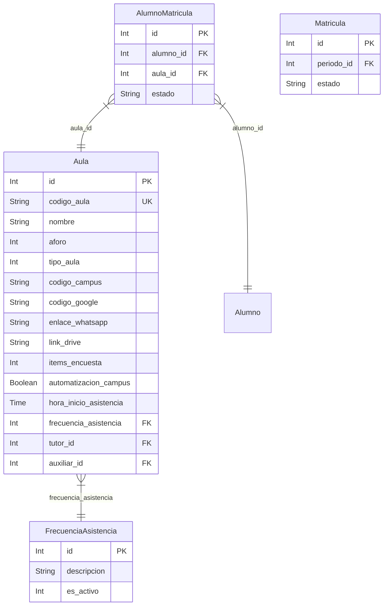

# Data Model Documentation

This document describes the core entities, tables, fields, and relationships used in the **VX Intranet** application, with particular emphasis on the `aula-fusion` modules.

---

## Core Models & Schema Descriptions

### 1. Aula (Table: `aulas`)
Represents an academic classroom (regular or fusion).

**Key Fields:**
- `id`: Unique identifier (Primary Key, integer)
- `codigo_aula`: Unique code (e.g. `SMSAN0326P1A` for regular, ending in `F` like `SMSAN0326P1F` for fusion)
- `nombre`: Name of the classroom
- `aforo`: Maximum student capacity (integer)
- `tipo_aula`: Type of classroom (integer: `0` for Regular, others represent fusion or alternative types)
- `codigo_campus`: External LMS campus code (nullable, string)
- `codigo_google`: Google classroom or integration code (nullable, string)
- `enlace_whatsapp`: Link to the classroom's WhatsApp group (nullable, string)
- `link_drive`: Link to Google Drive folder (nullable, string, *Note: link_drive, not enlace_drive*)
- `items_encuesta`: Number of survey items/questions (nullable, integer, *Note: items_encuesta, singular*)
- `automatizacion_campus`: Flag for automated LMS sync (boolean)
- `hora_inicio_asistencia`: Daily start time for tracking attendance (format: `HH:mm:ss`)
- `frecuencia_asistencia`: Foreign key pointing to `frecuencia_asistencias.id` (integer)
- `tutor_id`: Foreign key pointing to `users.id` (nullable, integer)
- `auxiliar_id`: Foreign key pointing to `users.id` (nullable, integer)

**Relationships:**
- `frecuencia`: Belongs to `FrecuenciaAsistencia`
- `tutor`: Belongs to `User` (tutor)
- `auxiliar`: Belongs to `User` (auxiliar)
- `alumnos`: Many-to-many with `Alumno` through the `alumno_matricula` pivot table

---

### 2. FrecuenciaAsistencia (Table: `frecuencia_asistencias`)
Defines the frequency patterns for taking class attendance.

**Key Fields:**
- `id`: Unique identifier (Primary Key, integer)
- `descripcion`: Description of the frequency (e.g. "Lunes a Viernes")
- `es_activo`: Status flag (integer: `1` for active, `0` for inactive)

---

### 3. AlumnoMatricula (Table: `alumno_matricula` / `alumno_matriculas`)
Represents the relationship matching students to their enrolled classrooms and tracking their current status.

**Key Fields:**
- `id`: Unique identifier (Primary Key, integer)
- `alumno_id`: Foreign key referencing the `alumnos` table
- `aula_id`: Foreign key referencing the `aulas` table
- `estado`: Current enrollment status of the student in this specific classroom (e.g. active, suspended)

**Relationships:**
- `alumno`: Belongs to `Alumno`
- `aula`: Belongs to `Aula`

---

### 4. Matricula (Table: `matriculas`)
Represents the academic period or enrollment session structure.

**Key Fields:**
- `id`: Unique identifier (Primary Key, integer)
- `nombre`: Name of the matricula period
- `periodo_id`: Foreign key pointing to the period descriptor
- `estado`: Status (Active, Finished, etc.)

---

## Entity-Relationship Diagram

