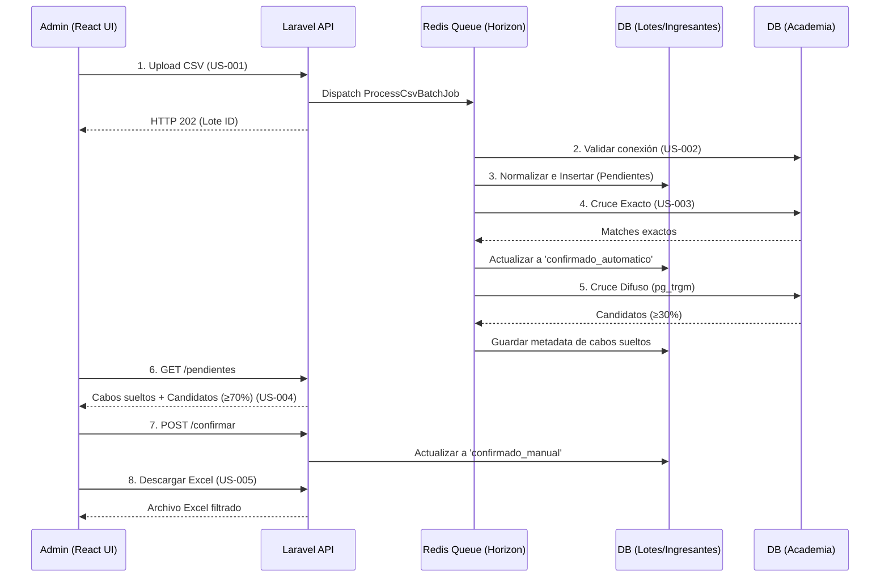

# Plan de Implementación: Motor de Cruce de Ingresantes UNMSM

**Rama**: `feature/motor-cruce-ingresantes` | **Fecha**: 2026-07-03 | **Versión**: 2.7.0 | **Especificación**: [spec.md](spec.md)

## 1. Feature Decomposition

| Feature | Type | Domain Layer | Application Layer | Infrastructure Layer | Justification |
|---------|------|--------------|-------------------|---------------------|---------------|
| US-001 (Carga CSV) | ✨ NEW | LoteCruce, Ingresante | ProcesarCargaCsvAction | Redis Queue, Controlador HTTP | Funcionalidad core aislada; requiere cola asíncrona para SLA (NFR-001). |
| US-002 (Consulta BD) | 🔀 HYBRID | Alumno | RealizarCruceExactoAction | PostgreSQL (`academia`) | Reutiliza BD existente; solo lectura vía PgBouncer. |
| US-003 (Match Engine) | ✨ NEW | Algoritmo Similitud | CalcularSimilitudesCabosAction | `pg_trgm` (PostgreSQL) | Cálculo intensivo delegado a motor BD (NFR-007). |
| US-004 (Validación UI) | ✨ NEW | Estado Match | GuardarCruceConfirmadoAction | React SPA (Vite) | Frontend desacoplado para UX interactiva y rápida. |
| US-005 (Excel) | ✨ NEW | Reporte | ExportarExcelCruceAction | PhpSpreadsheet | Generación de artefactos finales filtrados. |

## 2. Architecture Design

### Flujo de Arquitectura (Secuencia)



### Abordaje de NFRs
- **NFR-001 & NFR-006 (Rendimiento y Colas):** Resuelto mediante el uso de Laravel Horizon y Redis (`ProcessCsvBatchJob`).
- **NFR-002 & NFR-007 (Performance de Búsqueda y UI):** Resuelto delegando la similitud a `pg_trgm` en BD y utilizando paginación con cursores.
- **NFR-003 (Volumen):** Validación vía Magic Bytes/MIME. Procesamiento desacoplado de la petición HTTP.
- **NFR-004 (Seguridad):** Variables inyectadas desde `.env`.
- **NFR-005 (Trazabilidad):** El agregado `LoteCruce` retiene la auditoría de cada fecha procesada.

## 3. Data Model (Conceptual)

```text
Aggregate: LoteCruce
  - id: Identifier
  - fecha_examen: Date
  - totales: TotalsRecord
  - estado: LifecycleState (procesando, completado, pausado, error)

Aggregate: Ingresante (Traces to US-001, US-004)
  - id: Identifier
  - lote_cruce_id: Reference
  - alumno_id: Reference (Nullable, to Academia)
  - datos_csv: JSON
  - estado_match: State (pendiente, confirmado_automatico, confirmado_manual, no_ingresado)
  Business Rules:
    - Se persiste aquí solo si la OBSERVACIÓN normalizada == 'ALCANZO VACANTE'.
    - De lo contrario, va a tabla NoIngresante.

Aggregate: NoIngresante
  - id: Identifier
  - lote_cruce_id: Reference
  - datos_csv: JSON
  - motivo_filtro: String
```

## 4. Synthesis Assessment

### Lens 1 — Generalization
> **Assessment:** El motor de búsqueda difusa y normalización anti-inyección puede extraerse a futuro como un `TextNormalizationService` reutilizable para otros proyectos del grupo.

### Lens 2 — Build-vs-Adopt
> **Assessment:** Para el cálculo de similitud, se adopta de forma nativa la extensión `pg_trgm` de PostgreSQL en lugar de construir un algoritmo Levenshtein costoso a nivel de PHP.

### Lens 3 — Simplification
> **Assessment:** Se ha simplificado la infraestructura descartando AppArmor/WAF, aprovechando una arquitectura monolítica modular (Laravel + SPA local) que cubre al 100% las necesidades del entorno Intranet.

## 5. Task Breakdown & Boundaries

### T001 [P] - Modelos y Migraciones (BD)
_Boundary: Models (LoteCruce, Ingresante, NoIngresante, Alumno), Migrations_
_Depends: None_
**Description:** Crear el esquema base respetando el diseño de persistencia dual de `spec.md` y conectando el modelo `Alumno` a la conexión secundaria `academia`. (US-001, US-002)

### T002 [P] - Infraestructura de Sanitización y Normalización
_Boundary: NormalizarTextoAction, CruceIngresantesController_
_Depends: T001_
**Description:** Implementar el contrato normativo neutralizando inyección CSV y validando MIME. (US-001, NFR-004).  
*Nota Arquitectónica:* Según las reglas del Agente, no se provee código de implementación aquí. La lógica requerida es:
```text
Action: NormalizarTextoAction
  1. Trim y UPPERCASE
  2. Reemplazar Tildes (ÁÉÍÓÚ) y Ñ->N
  3. IF inicia con (=, +, -, @, \t, \r) THEN anteponer "'" (Prevenir CSV Injection)
  4. RETURN cadena sanitizada
```

### T003 [P] - Pipeline Asíncrono de Importación
_Boundary: ProcesarCargaCsvAction, ProcessCsvBatchJob_
_Depends: T002_
**Description:** Orquestar importación de CSV vía Redis. Aplicar filtro `ALCANZO VACANTE` normalizado y persistir en las tablas respectivas. (US-001, NFR-001, NFR-006)

### T004 [P] - Motor de Cruce Exacto
_Boundary: RealizarCruceExactoAction_
_Depends: T003_
**Description:** Búsqueda en `academia` por 2 apellidos exactos + 1 nombre. Asignar `confirmado_automatico`. (US-003)

### T005 [P] - Motor de Cruce Difuso (Fuzzy)
_Boundary: CalcularSimilitudesCabosAction_
_Depends: T004_
**Description:** Búsqueda asíncrona con `pg_trgm` (umbral interno 30%). Preparar endpoint `GET /pendientes` con filtro UI del 70%. (US-003, NFR-002, NFR-007)

### T006 [P] - Interfaz Interactiva React
_Boundary: React (UnmatchedRow.jsx, ExactMatchList.jsx, App.jsx)_
_Depends: T005_
**Description:** Tabla virtualizada (`react-window`). Lógica de colores por rangos inmutables. Endpoint `POST /confirmar`. (US-004)

### T007 [P] - Exportación Excel
_Boundary: ExportarExcelCruceAction_
_Depends: T004, T006_
**Description:** Filtrado exclusivo de registros confirmados sin metadata difusa en archivo final. (US-005)

---
### Fase X: Adaptación de Seguridad Local
_Boundary: Nginx Config, OS Setup_
_Depends: None_
**Description:** Añadir cabeceras X-Content-Type-Options, X-Frame-Options, Rate Limiting y setup de usuario no-root.
